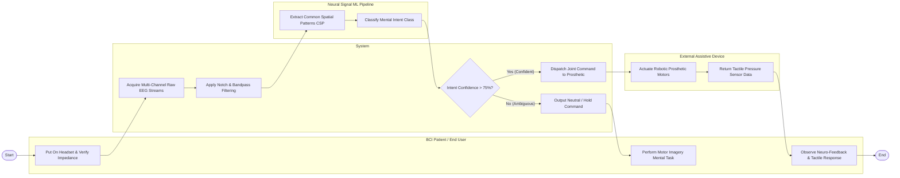

# Swimlane Diagram — Brain-Computer Interface (BCI) Management System

## Mermaid Code

## Flow Description | Mô tả luồng

| Lane | Actor | Role in Flow |
|------|-------|-------------|
| 1 | BCI Patient / End User | Wears BCI headset, performs imagined motor imagery tasks (e.g. imagined hand clench), and observes real-time visual neuro-feedback and tactile responses. |
| 2 | System | Ingests multi-channel raw EEG streams, applies 50 Hz notch filtering and bandpass filters (0.5-40 Hz), evaluates intent decoding confidence scores, dispatches commands, or holds state. |
| 3 | Neural Signal ML Pipeline | Extracts Common Spatial Pattern (CSP) band-power features and runs machine learning classification (SVM/EEGNet) to determine intended class (e.g. Reach Left, Grasp). |
| 4 | External Assistive Device | Receives decoded joint actuation vectors, drives bionic robotic prosthetic motors, and returns real-time tactile gripping pressure sensor feedback. |
