# Action Tree — Brain-Computer Interface (BCI) Management System

## Mermaid Code

```mermaid
graph TD
    Root["Brain-Computer Interface Management System"]

    Root --> M1["BCI Device Onboarding & Channel Mapping"]
    Root --> M2["Neural Signal Ingestion & Filtering"]
    Root --> M3["Calibration & ML Decoder Training"]
    Root --> M4["Real-Time Intent Decoding & Control"]
    Root --> M5["Neuro-Feedback & Clinical Safety"]
    Root --> M6["Ethics Compliance & EHR Integration"]

    M1 --> A11["Register BCI Headset & Array Hardware"]
    M1 --> A12["Map International 10-20 Scalp Positions"]
    M1 --> A13["Monitor Electrode Contact Impedance"]
    M1 --> A14["Pair Lab Streaming Layer LSL Streams"]

    M2 --> A21["Ingest Multi-Channel Raw EEG Streams"]
    M2 --> A22["Apply 50/60 Hz Powerline Notch Filters"]
    M2 --> A23["Apply 0.5-40 Hz Bandpass Signal Filtering"]
    M2 --> A24["Compute Common Average Reference CAR"]

    M3 --> A31["Execute Motor Imagery Trial Paradigm"]
    M3 --> A32["Extract Common Spatial Patterns CSP"]
    M3 --> A33["Train SVM/EEGNet Classifier Models"]
    M3 --> A34["Validate Classification Accuracy Scores"]

    M4 --> A41["Decode Real-Time Mental Intent Classes"]
    M4 --> A42["Dispatch Joint Commands to Prosthetic"]
    M4 --> A43["Execute P300 Speller Keyboard"]
    M4 --> A44["Map Joystick Velocity Vectors"]

    M5 --> A51["Render Real-Time Visual Feedback Cues"]
    M5 --> A52["Detect Epileptiform Seizure Spikes"]
    M5 --> A53["Trigger Clinical Seizure Alarm Protocols"]
    M5 --> A54["Track Patient Cognitive Fatigue Rates"]

    M6 --> A61["Export De-Identified EDF+ Datasets"]
    M6 --> A62["Archive BCI Rehab Logs to Hospital EHR"]
    M6 --> A63["Enforce AES-256 Neural Telemetry Encryption"]
    M6 --> A64["Generate Clinical Recovery Analytics"]
```

## Module Description | Mô tả Module

| # | Module | Description | Actions |
|---|--------|-------------|---------|
| 1 | BCI Device Onboarding & Channel Mapping | Onboards EEG caps and microelectrode arrays, maps international 10-20 electrode positions, checks impedance, and pairs LSL streams. | Register BCI Headset & Array Hardware, Map International 10-20 Scalp Positions, Monitor Electrode Contact Impedance, Pair Lab Streaming Layer LSL Streams |
| 2 | Neural Signal Ingestion & Filtering | Ingests multi-channel bio-amplifier signals, applies 50/60 Hz notch filters, 0.5-40 Hz bandpass filters, and common average referencing. | Ingest Multi-Channel Raw EEG Streams, Apply 50/60 Hz Powerline Notch Filters, Apply 0.5-40 Hz Bandpass Signal Filtering, Compute Common Average Reference CAR |
| 3 | Calibration & ML Decoder Training | Conducts motor imagery calibration trial sessions, extracts Common Spatial Pattern (CSP) features, and trains SVM/EEGNet intent classifiers. | Execute Motor Imagery Trial Paradigm, Extract Common Spatial Patterns CSP, Train SVM/EEGNet Classifier Models, Validate Classification Accuracy Scores |
| 4 | Real-Time Intent Decoding & Control | Decodes user mental intent in real-time (<50ms), dispatches commands to robotic prosthetics, wheelchairs, or P300 speller keyboards. | Decode Real-Time Mental Intent Classes, Dispatch Joint Commands to Prosthetic, Execute P300 Speller Keyboard, Map Joystick Velocity Vectors |
| 5 | Neuro-Feedback & Clinical Safety | Displays visual/audio neuro-feedback, monitors EEG for epileptiform seizure spikes, triggers emergency alarms, and tracks cognitive fatigue. | Render Real-Time Visual Feedback Cues, Detect Epileptiform Seizure Spikes, Trigger Clinical Seizure Alarm Protocols, Track Patient Cognitive Fatigue Rates |
| 6 | Ethics Compliance & EHR Integration | Exports de-identified research datasets (EDF+), syncs rehabilitation progress metrics with hospital EHR systems, and enforces AES-256 neural encryption. | Export De-Identified EDF+ Datasets, Archive BCI Rehab Logs to Hospital EHR, Enforce AES-256 Neural Telemetry Encryption, Generate Clinical Recovery Analytics |
