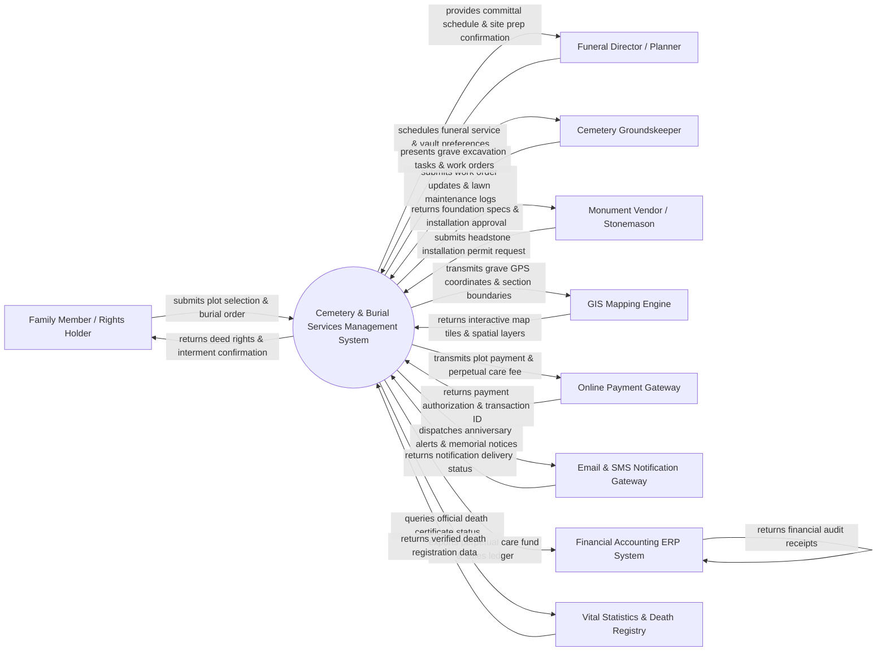

# Context Diagram — Cemetery & Burial Services Management System

## Mermaid Code

## Actor & Interaction Table | Bảng Actor & Tương tác

| # | Actor | Actor Type | Data Sent TO System | Data Received FROM System | Notes |
|---|-------|------------|---------------------|---------------------------|-------|
| 1 | Family Member / Rights Holder | Primary | Plot purchase requests, deceased information, interment instructions, memorial page content, perpetual care payments | Deed of burial rights, grave location maps, memorial page links, anniversary alerts | Family members or legal estate representatives purchasing plots and managing interments. |
| 2 | Funeral Director / Planner | Primary | Burial service schedules, vault specifications, casket dimensions, clergy details, funeral procession times | Service slot confirmation, site preparation status, grave excavation readiness | External funeral home directors coordinating burial logistics with cemetery staff. |
| 3 | Cemetery Groundskeeper | Primary | Grave excavation status, lawn maintenance completions, headstone foundation checks, work order notes | Daily work orders, grave digging depth specs, equipment assignments, grounds maps | On-site cemetery staff managing physical grave digging, landscaping, and maintenance. |
| 4 | Monument Vendor / Stonemason | Primary | Headstone design proofs, permit applications, foundation inspection requests, installation dates | Installation approvals, foundation dimensions, cemetery memorial guidelines | Third-party stone carvers and monument companies installing headstones and plaques. |
| 5 | GIS Mapping Engine | Supporting System | Spatial tile renders, satellite overlays, GPS coordinate bounds, search pin vectors | Grave plot coordinates, cemetery section polygons, deceased search queries | Mapping service (e.g. ArcGIS, Mapbox) rendering interactive 2D/3D cemetery maps. |
| 6 | Online Payment Gateway | Supporting System | Payment settlement tokens, card authorization codes, bank transaction IDs | Plot purchase charges, perpetual care fees, vault opening/closing fee payloads | Commercial payment processor handling online plot sales and maintenance fees. |
| 7 | Email & SMS Notification Gateway | Supporting System | Delivery receipts, SMS carrier status, email bounce codes | Memorial anniversary reminders, work order alerts, plot payment receipts | Messaging service sending death anniversary notices, family alerts, and staff notifications. |
| 8 | Financial Accounting ERP System | Supporting System | Chart of accounts sync, audit confirmations, GL ledger posting receipts | Perpetual care trust fund logs, plot sale revenue, maintenance expense ledgers | Enterprise ERP or accounting platform tracking trust fund balances and plot sales revenue. |
| 9 | Vital Statistics & Death Registry | External System | Verified death certificate details, burial permit authorization numbers, cause of death records | Death certificate verification queries, burial registration payloads | Municipal or state vital statistics office verifying legal death certificates prior to burial. |

## System Boundary Description | Mô tả Phạm vi Hệ thống

The **Cemetery & Burial Services Management System (CBMS)** is an integrated software platform engineered to manage cemetery land inventory, burial right sales, interment logistics, GIS mapping, and perpetual grounds care. Inside the system boundary, CBMS controls grave plot mapping, deed ownership tracking, deceased recordkeeping, funeral service scheduling, work order dispatch, headstone permit approval, digital memorial pages, and perpetual care fund ledgers. External to the system boundary are commercial credit card processors (Online Payment Gateway), GIS map rendering layers (GIS Mapping Engine), third-party monument vendors (Stonemason), message delivery carriers (Notification Gateway), enterprise accounting platforms (Financial Accounting ERP System), and municipal death registries (Vital Statistics Portal).
