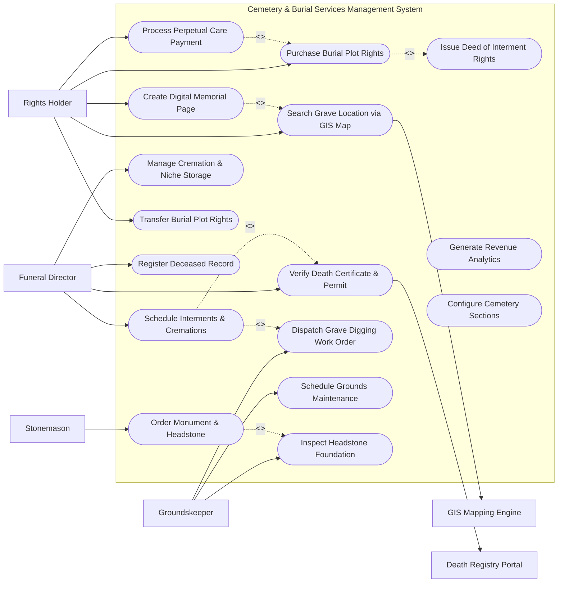

# Use Case Diagram — Cemetery & Burial Services Management System

## Mermaid Code

## Actor Table | Bảng Actor

| # | Actor | Actor Type | Role Description | Related Use Cases |
|---|-------|------------|------------------|-------------------|
| 1 | Rights Holder | Primary | Family member or estate owner purchasing plot rights, paying perpetual fees, and managing memorials. | UC01, UC02, UC08, UC09, UC12 |
| 2 | Funeral Director | Primary | Professional event planner coordinating burial logistics, death permits, and committal services. | UC03, UC04, UC10, UC13 |
| 3 | Groundskeeper | Primary | Cemetery field staff excavating graves, executing maintenance orders, and checking foundations. | UC07, UC11, UC14 |
| 4 | Stonemason | Primary | Monument vendor applying for installation permits and setting headstones/plaques. | UC05 |
| 5 | GIS Mapping Engine | System | Spatial mapping service rendering interactive cemetery plot maps and GPS pins. | UC02 |
| 6 | Death Registry Portal | System | Municipal vital statistics portal confirming legal death certificates and burial permits. | UC04 |

## Use Case Table | Bảng Use Case

| # | UC ID | Use Case Name | Primary Actor | Secondary Actor | Description | Priority |
|---|-------|---------------|---------------|-----------------|-------------|----------|
| 1 | UC01 | Purchase Burial Plot Rights | Rights Holder | None | Selects an available grave plot, mausoleum crypt, or columbarium niche and purchases interment rights. | High |
| 2 | UC02 | Search Grave Location via GIS Map | Rights Holder | GIS Mapping Engine | Locates a deceased loved one's grave plot using interactive GIS maps and GPS walking directions. | High |
| 3 | UC03 | Schedule Interments & Cremations | Funeral Director | Groundskeeper | Schedules burial time slots, committal services, vault placement, and cremation processing. | High |
| 4 | UC04 | Verify Death Certificate & Permit | Funeral Director | Death Registry Portal | Validates official death certificates and government burial/transit permits before interment. | High |
| 5 | UC05 | Order Monument & Headstone | Stonemason | Groundskeeper | Submits headstone installation requests, inscription proofs, and foundation poured specs. | Medium |
| 6 | UC06 | Issue Deed of Interment Rights | Rights Holder | None | Generates and issues official digital Deed of Interment Rights certificate to plot owner. | High |
| 7 | UC07 | Dispatch Grave Digging Work Order | Funeral Director | Groundskeeper | Generates work order instructing groundskeepers to excavate grave according to vault size. | High |
| 8 | UC08 | Create Digital Memorial Page | Rights Holder | None | Publishes an online memorial biography, obituary, photo gallery, and digital candle tributes. | Medium |
| 9 | UC09 | Process Perpetual Care Payment | Rights Holder | None | Collects annual or lump-sum perpetual care trust fees to maintain cemetery grounds. | High |
| 10 | UC10 | Manage Cremation & Niche Storage | Funeral Director | None | Records urn placements in columbarium niches, scattering garden logs, and cremation chain of custody. | Medium |
| 11 | UC11 | Schedule Grounds Maintenance | Groundskeeper | None | Schedules lawn mowing, tree trimming, grave leveling, headstone cleaning, and flower removal. | Medium |
| 12 | UC12 | Transfer Burial Plot Rights | Rights Holder | None | Processes legal transfer or resale of unused burial plot rights to family heirs or new buyers. | Medium |
| 13 | UC13 | Register Deceased Record | Funeral Director | None | Enters full deceased biographical data, date of death, cause of death, and family lineage links. | High |
| 14 | UC14 | Inspect Headstone Foundation | Groundskeeper | Stonemason | Inspects concrete foundation depth and levelness before stonemason mounts headstone. | Medium |
| 15 | UC15 | Generate Revenue Analytics | Rights Holder | None | Exports sales figures for plot inventory, perpetual care trust fund balances, and interment volume. | Medium |
| 16 | UC16 | Configure Cemetery Sections | Rights Holder | None | Configures cemetery garden sections, plot grid coordinates, niche walls, and pricing tiers. | Low |

## Use Case Specification | Đặc tả Use Case

---

### UC01 — Purchase Burial Plot Rights

| Field | Detail |
|-------|--------|
| **UC ID** | UC01 |
| **Use Case Name** | Purchase Burial Plot Rights |
| **Actor(s)** | Primary: Rights Holder / Secondary: None |
| **Description** | Allows a customer (at-need or pre-need) to browse cemetery sections on an interactive GIS map, select an available plot/niche, and purchase the Deed of Interment Rights. |
| **Precondition** | 1. Cemetery sections and plot inventory are configured in the system (UC16).   2. The selected plot status is "Available". |
| **Main Flow** | 1. Actor opens Cemetery Plot Catalog and launches interactive GIS map.   2. System displays color-coded section map (Green = Available, Red = Occupied, Yellow = Reserved).   3. Actor selects a specific plot (e.g. Garden of Peace, Section B, Row 4, Plot 12).   4. System displays plot details: Plot Type (Single In-Ground, Companion Lawn Crypt, Columbarium Niche), Price, and Perpetual Care Fee.   5. Actor selects purchase option (Pre-Need vs. At-Need) and inputs buyer details (UC06).   6. Actor submits payment via payment gateway (or sets up installment plan).   7. System validates payment, updates plot status to "Sold", generates Deed of Interment Rights (UC06), and emails deed PDF to buyer. |
| **Alternative Flow** | **AF1** — Pre-Need Installment Plan: Actor selects "24-Month Payment Plan"; System collects initial deposit and sets plot status to "Reserved under Contract".   **AF2** — Companion Plot Bundle: Actor selects two adjacent plots; System bundles plot rights under a single contract. |
| **Exception Flow** | **EX1** — Plot Sold Concurrently: If another user completes purchase of the same plot while actor is browsing, System alerts "Selected plot was just purchased. Please pick another plot."   **EX2** — Payment Processing Failed: If credit card fails, System holds plot reservation for 15 minutes and prompts for alternative payment. |
| **Postcondition** | A Burial_Contract and Deed of Rights are persisted, locking plot status to "Sold" or "Reserved". |
| **Business Rule** | **BR1**: All plot purchases must include a mandatory 15% contribution allocated to the Perpetual Care Trust Fund. |

---

### UC03 — Schedule Interments & Cremations

| Field | Detail |
|-------|--------|
| **UC ID** | UC03 |
| **Use Case Name** | Schedule Interments & Cremations |
| **Actor(s)** | Primary: Funeral Director / Secondary: Groundskeeper |
| **Description** | Enables a Funeral Director to schedule burial committal service times, request grave excavation, specify vault dimensions, and coordinate cremation/urn placement. |
| **Precondition** | 1. Burial plot rights have been purchased (UC01) or verified.   2. Official death certificate (UC04) is submitted or pending verification. |
| **Main Flow** | 1. Actor opens Funeral Scheduling Portal and selects target plot or niche ID.   2. System displays grave capacity and owner verification status.   3. Actor selects Interment Type (Casket Burial, Cremated Remains Inurnment, Vault Placement).   4. Actor specifies preferred committal date, time slot, vault outer dimensions, and expected attendee count.   5. Actor inputs clergy and funeral procession details.   6. Actor submits scheduling request.   7. System verifies time slot availability, creates Interment_Service record, triggers UC04 (Death Certificate Check), generates UC07 (Grave Digging Work Order) for groundskeepers, and confirms schedule. |
| **Alternative Flow** | **AF1** — Direct Cremation & Niche Placement: For cremated remains, System skips heavy grave excavation and dispatches niche opening work order.   **AF2** — Saturday / Holiday Service Surcharge: If service is scheduled on a weekend/holiday, System applies weekend overtime fee automatically. |
| **Exception Flow** | **EX1** — Committal Schedule Conflict: If chapel or committal shelter is booked at requested time, System alerts "Time slot unavailable. Max 2 simultaneous committals allowed."   **EX2** — Unverified Plot Ownership: If funeral director is not authorized by the deed owner, System blocks scheduling until owner consent form is uploaded. |
| **Postcondition** | An Interment_Service record is scheduled, reserving time slots and queuing excavation work orders for grounds staff. |
| **Business Rule** | **BR1**: Grave excavation orders must be dispatched at least 24 hours prior to scheduled committal service time. |

---

### UC05 — Order Monument & Headstone Installation

| Field | Detail |
|-------|--------|
| **UC ID** | UC05 |
| **Use Case Name** | Order Monument & Headstone Installation |
| **Actor(s)** | Primary: Stonemason / Secondary: Groundskeeper |
| **Description** | Allows a monument vendor or stonemason to submit headstone installation permits, upload inscription proofs, specify foundation requirements, and request inspection. |
| **Precondition** | 1. Deceased record is registered and plot rights verified.   2. Cemetery monument regulations (material, size, height limits) are active. |
| **Main Flow** | 1. Stonemason logs into Vendor Portal and selects target grave plot.   2. System displays section monument rules (e.g., Flat Bronze Plaque only vs. Upright Granite Monument).   3. Stonemason inputs headstone dimensions, stone material, marker type, and uploads inscription layout proof.   4. Stonemason requests concrete foundation pour by cemetery crew (or submits installer credentials).   5. Stonemason submits installation permit application.   6. System validates dimensions against section rules, calculates foundation fee, and sends permit to Cemetery Manager for approval.   7. Upon approval, System triggers UC14 (Foundation Inspection Order) for groundskeeper verification. |
| **Alternative Flow** | **AF1** — Veteran Marker Installation: Stonemason tags "VA Government Issued Plaque"; System waives permit fees according to military policy.   **AF2** — Headstone Modification / Inscription Addition: Stonemason submits request to engrave additional date of death on existing marker in the field. |
| **Exception Flow** | **EX1** — Height Regulation Exceeded: If monument height exceeds section limit (e.g. 42 inches vs 36 inches max), System flags error "Monument height exceeds section regulation".   **EX2** — Unapproved Foundation Inspection: If groundskeeper inspection fails (UC14), System notifies stonemason "Foundation unlevel. Installation halted." |
| **Postcondition** | A Headstone_Monument entity is created in status "Permit Approved - Pending Installation". |
| **Business Rule** | **BR1**: No headstone can be installed until grave settlement period (minimum 60 days post-burial) has elapsed, unless using pre-poured lawn crypts. |

---

### UC08 — Search Grave Location via GIS Map

| Field | Detail |
|-------|--------|
| **UC ID** | UC08 |
| **Use Case Name** | Search Grave Location via GIS Map |
| **Actor(s)** | Primary: Rights Holder / Secondary: GIS Mapping Engine |
| **Description** | Enables family members, genealogists, or cemetery visitors to search for a deceased person by name, view their exact plot location on a GIS map, and get GPS walking navigation directions. |
| **Precondition** | 1. Deceased records and plot GPS coordinates are indexed in the GIS database.   2. Mobile or web search interface is online. |
| **Main Flow** | 1. Visitor accesses public "Grave Finder" search portal.   2. Visitor inputs deceased First Name, Last Name, and optional Year of Birth/Death.   3. System queries deceased database and displays matching search results with birth/death dates and section details.   4. Visitor selects target deceased record.   5. System calls GIS Mapping Engine (UC02) to display high-resolution cemetery map with a pin placed on the exact grave plot.   6. System displays grave plot photos, headstone inscription text, and link to Digital Memorial Page.   7. Visitor clicks "Get Walking Directions"; System uses smartphone GPS to draw walking path from visitor's current location to the grave pin. |
| **Alternative Flow** | **AF1** — Genealogist Multi-Search: User filters search by maiden name, family surname, or burial date range for family history research.   **AF2** — QR Code Grave Scan: Visitor scans physical QR code on headstone/section marker; System opens exact grave bio and map page immediately. |
| **Exception Flow** | **EX1** — Private / Unlisted Record: If family requested private unlisted status, System hides location pin and displays "Record private per family request."   **EX2** — No Matching Record Found: If search query yields no results, System suggests searching alternate spelling or contacting cemetery office. |
| **Postcondition** | Visitor views exact grave location on map and accesses walking navigation route. |
| **Business Rule** | **BR1**: Public grave finder searches must display exact GPS coordinates except for restricted/private family requests. |

---

### UC11 — Schedule Grounds Maintenance & Care

| Field | Detail |
|-------|--------|
| **UC ID** | UC11 |
| **Use Case Name** | Schedule Grounds Maintenance & Care |
| **Actor(s)** | Primary: Groundskeeper / Secondary: None |
| **Description** | Allows cemetery management to generate, schedule, and track routine and special maintenance work orders (mowing, turf care, headstone cleaning, tree trimming, flower removal). |
| **Precondition** | 1. Cemetery sections and plot maintenance schedules exist.   2. Perpetual care fund accounts are active. |
| **Main Flow** | 1. Groundskeeper opens Maintenance Management dashboard.   2. System generates recurring maintenance schedule based on section care tiers (e.g. Weekly Mowing, Monthly Headstone Wash, Seasonal Flower Cleanup).   3. Groundskeeper views assigned daily work orders categorized by cemetery section on GIS map.   4. Groundskeeper performs maintenance tasks (e.g. levels sunken turf at Section C, Plot 45).   5. Groundskeeper uploads completion photo via mobile tablet and marks work order "Completed".   6. System updates Maintenance_Order record, logs maintenance history on plot record, and sends completion update to family if special care was purchased. |
| **Alternative Flow** | **AF1** — Special Purchased Family Care: Family pays for "Annual Wreath Placement & Headstone Polishing"; System creates high-priority custom work order with photo proof delivery.   **AF2** — Storm Damage Repair: Groundskeeper creates emergency work order for fallen tree branch removal. |
| **Exception Flow** | **EX1** — Maintenance Machinery Breakdown: Groundskeeper logs equipment fault; System reassigns work orders to secondary crew.   **EX2** — Damaged Headstone Discovered: Groundskeeper flags headstone as "Tilted / Cracked"; System logs hazard alert and notifies rights holder. |
| **Postcondition** | Maintenance_Order is updated to "Completed", recording grounds care history and generating photo proof for perpetual care auditing. |
| **Business Rule** | **BR1**: Special family-purchased floral or headstone care orders must include photo proof of work uploaded within 24 hours of completion. |
