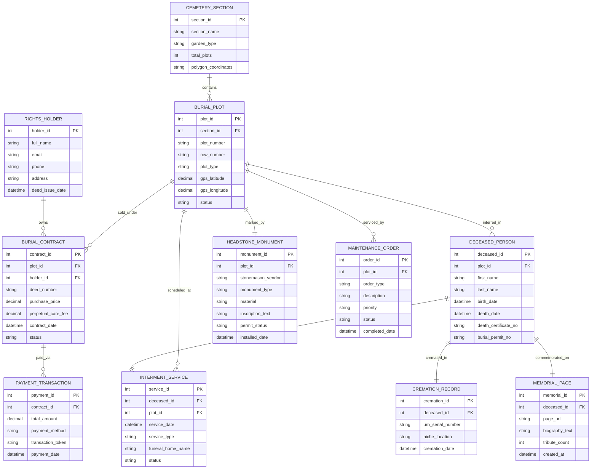

# Conceptual ERD — Cemetery & Burial Services Management System

## Mermaid Code

## Entity Description Table | Bảng mô tả Entity

| # | Entity Name | Vietnamese Name | Description | Key Attributes | Main Relationships |
|---|-------------|-----------------|-------------|----------------|-------------------|
| 1 | CEMETERY_SECTION | Khu vực Nghĩa trang | Represents a specific section, garden, or mausoleum wing within the cemetery grounds. | section_id (PK), section_name, garden_type, total_plots, polygon_coordinates | Contains Burial Plots |
| 2 | BURIAL_PLOT | Mộ phần / Ô lưu tro | Individual ground burial plot, mausoleum crypt, or columbarium niche with GPS coordinates. | plot_id (PK), section_id (FK), plot_number, plot_type, status, gps_latitude | Belongs to Section, sold under Contracts, interred in Deceased, marked by Headstone |
| 3 | RIGHTS_HOLDER | Chủ sở hữu Quyền Sử dụng | Primary contract owner holding the Deed of Burial Rights for one or more plots. | holder_id (PK), full_name, email, phone, address | Owns Burial Contracts |
| 4 | BURIAL_CONTRACT | Hợp đồng Mua đất Mộ | Legal purchase agreement detailing plot rights, purchase price, and perpetual care contributions. | contract_id (PK), plot_id (FK), holder_id (FK), deed_number, purchase_price | Owned by Rights Holder, links to Burial Plot, paid via Payment Transactions |
| 5 | DECEASED_PERSON | Người Quá cố | Record of deceased individual interred in a plot or cremated, including vital statistics. | deceased_id (PK), plot_id (FK), first_name, last_name, birth_date, death_date, death_certificate_no | Interred in Plot, honored in Service, cremated in Cremation Record, commemorated on Memorial Page |
| 6 | INTERMENT_SERVICE | Lễ An táng / Hạ huyệt | Committal service event scheduling grave excavation, vault placement, and funeral service. | service_id (PK), deceased_id (FK), plot_id (FK), service_date, service_type | Honors Deceased Person, scheduled at Burial Plot |
| 7 | HEADSTONE_MONUMENT | Bia mộ / Tượng đài | Physical monument, headstone, flat marker, or bronze plaque installed at a grave plot. | monument_id (PK), plot_id (FK), stonemason_vendor, monument_type, permit_status | Marks Burial Plot |
| 8 | CREMATION_RECORD | Hồ sơ Hỏa táng | Tracking record for cremation processing, urn serial numbers, and niche placement. | cremation_id (PK), deceased_id (FK), urn_serial_number, niche_location | Belongs to Deceased Person |
| 9 | MAINTENANCE_ORDER | Đơn Chăm sóc Grounds | Work order for grave digging, turf repair, headstone cleaning, or perpetual grounds care. | order_id (PK), plot_id (FK), order_type, description, status | Services Burial Plot |
| 10 | PAYMENT_TRANSACTION | Giao dịch Thanh toán | Payment transaction record for plot sales, perpetual care fees, or vault opening fees. | payment_id (PK), contract_id (FK), total_amount, payment_method, transaction_token | Pays Burial Contract |
| 11 | MEMORIAL_PAGE | Trang Tưởng niệm Online | Public digital tribute page displaying biography, photos, obituaries, and online candles. | memorial_id (PK), deceased_id (FK), page_url, biography_text, tribute_count | Commemorates Deceased Person |

## Relationship Description | Mô tả Quan hệ

| # | From Entity | Cardinality | To Entity | Relationship Label | Business Explanation |
|---|-------------|-------------|-----------|-------------------|----------------------|
| 1 | CEMETERY_SECTION | one-to-many | BURIAL_PLOT | contains | A Cemetery Section contains multiple Burial Plots. |
| 2 | RIGHTS_HOLDER | one-to-many | BURIAL_CONTRACT | owns | A Rights Holder owns one or more Burial Contracts. |
| 3 | BURIAL_PLOT | one-to-many | BURIAL_CONTRACT | sold_under | A Burial Plot is sold under a Burial Contract. |
| 4 | BURIAL_PLOT | one-to-many | DECEASED_PERSON | interred_in | A Burial Plot can contain one or more interred Deceased Persons (companion plots). |
| 5 | DECEASED_PERSON | one-to-one | INTERMENT_SERVICE | honored_in | A Deceased Person is honored in an Interment Service event. |
| 6 | BURIAL_PLOT | one-to-many | INTERMENT_SERVICE | scheduled_at | A Burial Plot is the location for scheduled Interment Services. |
| 7 | BURIAL_PLOT | one-to-one | HEADSTONE_MONUMENT | marked_by | A Burial Plot is marked by a Headstone Monument. |
| 8 | DECEASED_PERSON | one-to-one | CREMATION_RECORD | cremated_in | A Deceased Person may have a Cremation Record. |
| 9 | BURIAL_PLOT | one-to-many | MAINTENANCE_ORDER | serviced_by | A Burial Plot is serviced by multiple Maintenance Orders over time. |
| 10 | BURIAL_CONTRACT | one-to-many | PAYMENT_TRANSACTION | paid_via | A Burial Contract is paid via Payment Transactions. |
| 11 | DECEASED_PERSON | one-to-one | MEMORIAL_PAGE | commemorated_on | A Deceased Person is commemorated on a digital Memorial Page. |
