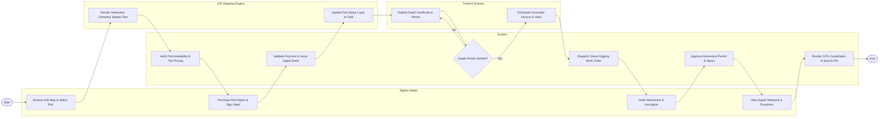

# Swimlane Diagram — Cemetery & Burial Services Management System

## Mermaid Code

## Flow Description | Mô tả luồng

| Lane | Actor | Role in Flow |
|------|-------|-------------|
| 1 | Rights Holder | Browses interactive GIS plot map, selects burial plot, completes payment for deed rights, orders headstone monuments, and accesses online memorial pages. |
| 2 | System | Automates plot inventory status checks, processes payments, issues digital deeds, validates death certificates, dispatches grave excavation work orders, and updates GIS pins. |
| 3 | Funeral Director | Submits verified municipal death certificates, coordinates committal service times, specifies vault dimensions, and oversees burial ceremony logistics. |
| 4 | GIS Mapping Engine | Renders 2D/3D cemetery map layers, updates plot status polygons from "Available" to "Sold", and provides GPS pin navigation for visitors. |
