# Action Tree — Cemetery & Burial Services Management System

## Mermaid Code

```mermaid
graph TD
    Root["Cemetery & Burial Services Management System"]

    Root --> M1["Cemetery Mapping & Plot Sales"]
    Root --> M2["Deceased & Interment Records"]
    Root --> M3["Funeral & Cremation Logistics"]
    Root --> M4["Monument & Memorial Management"]
    Root --> M5["Perpetual Care & Maintenance"]
    Root --> M6["Billing & Regulatory Compliance"]

    M1 --> A11["Browse Interactive GIS Plot Map"]
    M1 --> A12["Purchase Burial Plot Rights"]
    M1 --> A13["Issue Deed of Rights Certificate"]
    M1 --> A14["Transfer Deed Ownership"]

    M2 --> A21["Register Deceased Profile & Lineage"]
    M2 --> A22["Verify Death Certificate & Permit"]
    M2 --> A23["Search Grave via GPS Finder"]
    M2 --> A24["Create Digital Memorial Page"]

    M3 --> A31["Schedule Committal Service"]
    M3 --> A32["Dispatch Grave Excavation Order"]
    M3 --> A33["Manage Cremation & Niche Storage"]
    M3 --> A34["Coordinate Procession & Chapel"]

    M4 --> A41["Apply for Monument Installation Permit"]
    M4 --> A42["Verify Headstone Inscription Proof"]
    M4 --> A43["Inspect Concrete Foundation"]
    M4 --> A44["Record Installed Marker Details"]

    M5 --> A51["Schedule Lawn Care & Mowing"]
    M5 --> A52["Execute Special Family Care Orders"]
    M5 --> A53["Log Sunken Turf Repairs"]
    M5 --> A54["Audit Perpetual Care Trust Fund"]

    M6 --> A61["Process Plot Payment Installments"]
    M6 --> A62["Calculate Perpetual Care Trust Fee"]
    M6 --> A63["Export Municipal Vital Stats"]
    M6 --> A64["Generate Revenue & Inventory Reports"]
```

## Module Description | Mô tả Module

| # | Module | Description | Actions |
|---|--------|-------------|---------|
| 1 | Cemetery Mapping & Plot Sales | Manages GIS mapping, plot inventory availability, deed purchase transactions, and ownership transfers. | Browse Interactive GIS Plot Map, Purchase Burial Plot Rights, Issue Deed of Rights Certificate, Transfer Deed Ownership |
| 2 | Deceased & Interment Records | Handles deceased registration, vital death certificate validation, GIS grave locator searches, and online memorial pages. | Register Deceased Profile & Lineage, Verify Death Certificate & Permit, Search Grave via GPS Finder, Create Digital Memorial Page |
| 3 | Funeral & Cremation Logistics | Coordinates committal ceremony scheduling, grave excavation work orders, cremation processing, and columbarium niche storage. | Schedule Committal Service, Dispatch Grave Excavation Order, Manage Cremation & Niche Storage, Coordinate Procession & Chapel |
| 4 | Monument & Memorial Management | Controls headstone installation permits, inscription proof reviews, concrete foundation inspections, and marker records. | Apply for Monument Installation Permit, Verify Headstone Inscription Proof, Inspect Concrete Foundation, Record Installed Marker Details |
| 5 | Perpetual Care & Maintenance | Manages daily groundskeeping schedules, turf restoration, special family floral orders, and perpetual care trust auditing. | Schedule Lawn Care & Mowing, Execute Special Family Care Orders, Log Sunken Turf Repairs, Audit Perpetual Care Trust Fund |
| 6 | Billing & Regulatory Compliance | Processes plot payment installments, calculates mandatory trust fees, exports vital stats, and generates financial reports. | Process Plot Payment Installments, Calculate Perpetual Care Trust Fee, Export Municipal Vital Stats, Generate Revenue & Inventory Reports |
