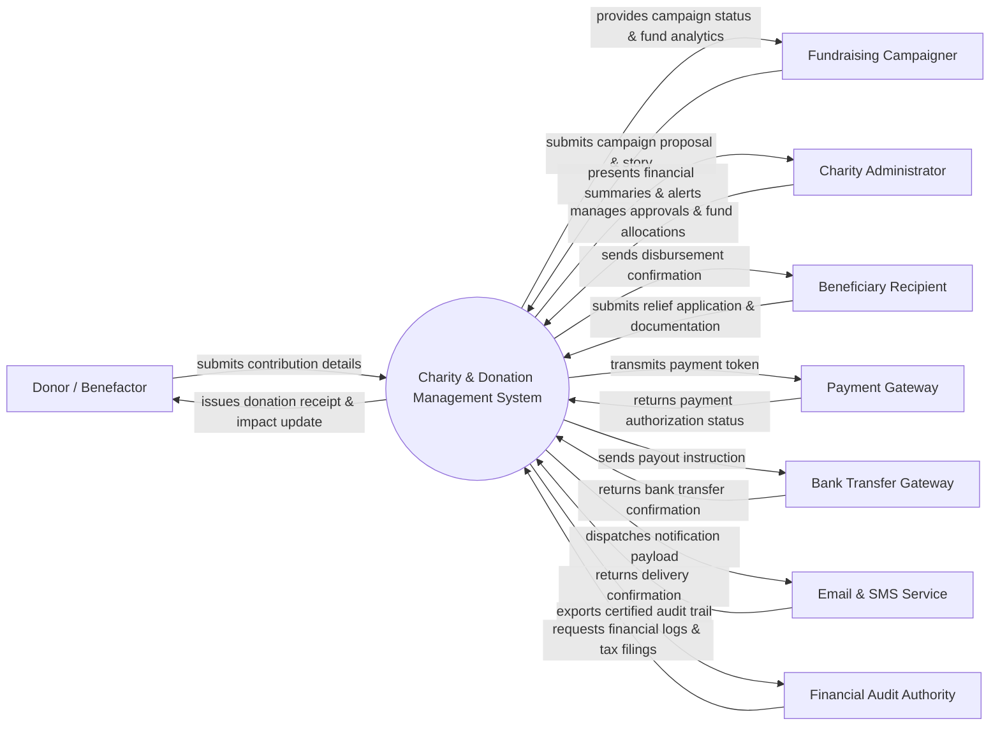

# Context Diagram — Charity & Donation Management System

## Mermaid Code

## Actor & Interaction Table | Bang Actor & Tuong tac

| # | Actor | Actor Type | Data Sent TO System | Data Received FROM System | Notes |
|---|-------|------------|---------------------|---------------------------|-------|
| 1 | Donor / Benefactor | Primary | Donation amounts, payment options, designated campaign preferences, pledge details | Official tax receipts, campaign progress notifications, impact outcome stories | Individuals or corporate sponsors making financial or in-kind contributions. |
| 2 | Fundraising Campaigner | Primary | Campaign titles, financial targets, story descriptions, campaign media, budget estimates | Campaign approval status, real-time donation tallies, donor list summaries | Individuals or partner non-profits initiating fundraising causes. |
| 3 | Charity Administrator | Primary | Campaign approval decisions, fund withdrawal approvals, verification statuses, site settings | Organizational financial dashboards, fraud risk alerts, pending application queues | Internal staff managing platform operations, campaign vetting, and compliance. |
| 4 | Beneficiary Recipient | Primary | Aid applications, personal identity proof, hardship evidence, bank account details | Aid approval notices, scheduled fund disbursement details, status updates | Individuals or community groups receiving financial or material relief. |
| 5 | Payment Gateway | Supporting System | Payment authorization codes, card settlement tokens, failure codes | Encrypted credit card/e-wallet donation request payloads | Third-party payment processors handling online credit card and e-wallet gifts. |
| 6 | Bank Transfer Gateway | Supporting System | Wire settlement confirmations, bank transfer receipt codes, failed payout alerts | Automated fund payout files, beneficiary bank transfer instructions | Banking system handling direct bank payouts to approved beneficiaries. |
| 7 | Email & SMS Service | Supporting System | Delivery logs, bounce error codes, carrier status updates | Email/SMS notification messages, receipt attachments, security OTP tokens | Messaging gateway used for donor engagement and security alerts. |
| 8 | Financial Audit Authority | Regulatory System | Audit inquiries, legal compliance rules, regulatory inspection parameters | Transparent financial audit logs, tax exemption summaries, fund usage reports | Government tax agencies and independent auditors enforcing charity financial transparency. |

## System Boundary Description | Mo ta Pham vi He thong

The **Charity & Donation Management System (CDMS)** is an integrated digital platform designed to manage public fundraising campaigns, process financial donations, track in-kind material aid, disburse relief funds to verified beneficiaries, and ensure complete financial transparency. Inside the system boundary, CDMS handles campaign publishing, donor user profiles, automated tax receipt generation, beneficiary vetting workflows, and ledger accounting. External to the system boundary are credit card processing infrastructure (Payment Gateway), bank clearing houses (Bank Transfer Gateway), message delivery carriers (Email & SMS Service), and external regulatory tax enforcement agencies (Financial Audit Authority).
