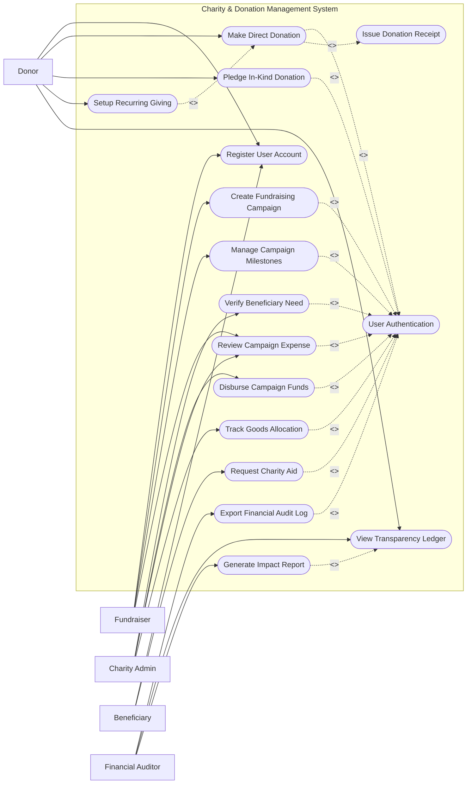

# Use Case Diagram — Charity & Donation Management System

## Mermaid Code

## Actor Table | Bang Actor

| # | Actor | Actor Type | Role Description | Related Use Cases |
|---|-------|------------|------------------|-------------------|
| 1 | Donor | Primary | Contributes financial funds or physical in-kind goods, configures recurring giving subscriptions, and inspects public transparency ledgers. | UC01, UC02, UC04, UC05, UC06, UC07, UC15 |
| 2 | Fundraiser | Primary | Initiates charity campaigns, manages project milestone updates, uploads story media, and logs operational project costs. | UC01, UC02, UC03, UC11, UC12 |
| 3 | Beneficiary | Primary | Submits assistance applications for medical, disaster, or educational relief and receives disbursed funds. | UC01, UC02, UC08 |
| 4 | Charity Admin | Primary | Reviews and approves new campaigns, verifies beneficiary eligibility, approves disbursement releases, and tracks in-kind logistics. | UC02, UC09, UC10, UC12, UC13 |
| 5 | Financial Auditor | Primary | Inspects financial ledgers, verifies donation-to-payout ratios, exports audit logs, and certifies compliance reports. | UC02, UC14, UC15, UC16 |
| 6 | Payment Gateway | Supporting System | Handles online card and e-wallet tokenization and settles donation funds. | UC04, UC06 |

## Use Case Table | Bang Use Case

| # | UC ID | Use Case Name | Primary Actor | Secondary Actor | Description | Priority |
|---|-------|---------------|---------------|-----------------|-------------|----------|
| 1 | UC01 | Register User Account | All Actors | None | Creates a new user profile with identity verification and contact details. | High |
| 2 | UC02 | User Authentication | All Actors | None | Authenticates users using credentials and role-based permissions. | High |
| 3 | UC03 | Create Fundraising Campaign | Fundraiser | Charity Admin | Configures a new charitable campaign with target goals, story, and budget breakdown. | High |
| 4 | UC04 | Make Direct Donation | Donor | Payment Gateway | Processes a one-time online financial gift toward a specific campaign. | High |
| 5 | UC05 | Pledge In-Kind Donation | Donor | Charity Admin | Logs physical item pledges (food, clothing, medical supplies) for pickup/dropoff. | Medium |
| 6 | UC06 | Setup Recurring Giving | Donor | Payment Gateway | Establishes automated monthly or annual recurring donation billing schedules. | Medium |
| 7 | UC07 | Issue Donation Receipt | System | Donor | Automatically produces tax-deductible PDF receipts with digital transaction signatures. | High |
| 8 | UC08 | Request Charity Aid | Beneficiary | Charity Admin | Submits a formal request for emergency financial relief or material assistance. | High |
| 9 | UC09 | Verify Beneficiary Need | Charity Admin | Beneficiary | Evaluates beneficiary application documentation and verifies hardship eligibility. | High |
| 10 | UC10 | Disburse Campaign Funds | Charity Admin | Banking System | Authorizes and executes fund payouts to verified beneficiaries or suppliers. | High |
| 11 | UC11 | Manage Campaign Milestones | Fundraiser | None | Updates project progress stages, publishes news updates, and posts photo evidence. | Medium |
| 12 | UC12 | Review Campaign Expense | Charity Admin | Fundraiser | Validates expense receipts uploaded by fundraisers against approved campaign budgets. | High |
| 13 | UC13 | Track Goods Allocation | Charity Admin | Donor | Tracks intake, warehousing, and distribution of donated physical goods. | Medium |
| 14 | UC14 | Export Financial Audit Log | Financial Auditor | Audit Authority | Compiles certified financial transaction trails and compliance disclosures. | High |
| 15 | UC15 | View Transparency Ledger | Donor / Auditor | None | Provides public read-only access to campaign contribution and expenditure ledgers. | High |
| 16 | UC16 | Generate Impact Report | Financial Auditor | Fundraiser | Visualizes community outcomes, donor metrics, and dollar-to-impact ratios. | Medium |

## Use Case Specification | Dac ta Use Case

---

### UC03 — Create Fundraising Campaign

| Field | Detail |
|-------|--------|
| **UC ID** | UC03 |
| **Use Case Name** | Create Fundraising Campaign |
| **Actor(s)** | Primary: Fundraiser   Secondary: Charity Admin |
| **Description** | Enables a fundraiser or partner organization to draft and submit a new charitable cause campaign for administrative vetting and public publishing. |
| **Precondition** | 1. Fundraiser must have a verified user account.   2. Campaign target cause category must exist in the platform taxonomy. |
| **Main Flow** | 1. Fundraiser selects "Start a Campaign" from the dashboard.   2. System presents campaign creation wizard requesting title, goal amount, end date, cause category, and detailed story.   3. Fundraiser inputs target funding goal, uploads campaign banner images, and specifies itemized budget proposal.   4. Fundraiser submits campaign for administrative review.   5. System sets campaign status to "Pending Approval" and routes notification to Charity Admin queue.   6. System sends submission confirmation receipt email to fundraiser. |
| **Alternative Flow** | **AF1** — Fast-Track Disaster Relief: If campaign category is tagged "Emergency Disaster", system flags request for expedited 4-hour admin review.   **AF2** — Save Draft: Fundraiser clicks "Save Draft" to store incomplete campaign parameters without initiating review. |
| **Exception Flow** | **EX1** — Excessive Goal Amount: Proposed goal exceeds category limit without prior board clearance. System prompts fundraiser for special approval documentation before submission.   **EX2** — Missing Budget Breakdown: Itemized expenditure budget is blank. System halts submission and highlights required budget fields. |
| **Postcondition** | Campaign is saved in database with status "Pending Approval" and assigned to admin evaluation queue. |
| **Business Rule** | **BR1**: All campaigns created by non-verified individual fundraisers require mandatory identity verification (ID upload).   **BR2**: Campaign duration cannot exceed 180 consecutive days. |

---

### UC04 — Make Direct Donation

| Field | Detail |
|-------|--------|
| **UC ID** | UC04 |
| **Use Case Name** | Make Direct Donation |
| **Actor(s)** | Primary: Donor   Secondary: Payment Gateway, Email Service |
| **Description** | Processes a one-time monetary donation using credit card, debit card, or e-wallet for a selected charity campaign. |
| **Precondition** | 1. The campaign must be active and in "Published" state.   2. Payment gateway integrations must be healthy. |
| **Main Flow** | 1. Donor clicks "Donate Now" on a campaign page.   2. System prompts donor to select donation amount ($25, $50, $100, or custom) and tipping contribution for platform overhead.   3. Donor enters payment credentials and optional message of encouragement.   4. System validates form fields and sends encrypted payment request to Payment Gateway.   5. Payment Gateway processes transaction and returns approval code and settlement token.   6. System credits campaign total, generates UC07 (Issue Donation Receipt), displays thank-you screen, and emails receipt. |
| **Alternative Flow** | **AF1** — Anonymous Giving: Donor checks "Donate Anonymously". System suppresses donor name on public donor roll while retaining audit records.   **AF2** — Memorial Donation: Donor selects "In Honor/Memory of". System presents fields for memorial recipient details. |
| **Exception Flow** | **EX1** — Gateway Rejection: Card issuer rejects transaction (e.g. card expired, insufficient funds). System displays detailed failure notice and allows donor to retry.   **EX2** — Campaign Closed Concurrently: Campaign reaches deadline or goal while donor is on payment screen. System accepts payment, credits over-funding bucket, and alerts donor. |
| **Postcondition** | Financial transaction is recorded in donation ledger, campaign total is updated, and tax receipt is dispatched. |
| **Business Rule** | **BR1**: 100% of designated campaign gifts must be tracked separately from platform operational tip amounts.   **BR2**: Minimum online donation threshold is $1.00. |

---

### UC08 — Request Charity Aid

| Field | Detail |
|-------|--------|
| **UC ID** | UC08 |
| **Use Case Name** | Request Charity Aid |
| **Actor(s)** | Primary: Beneficiary   Secondary: Charity Admin |
| **Description** | Allows an individual in need or community representative to submit a formal application for financial grant assistance or relief goods. |
| **Precondition** | 1. Beneficiary must hold an active registered account in the system.   2. Target relief program must be accepting applications. |
| **Main Flow** | 1. Beneficiary navigates to "Request Assistance" portal.   2. System presents aid application form requesting hardship description, requested fund/material details, and contact info.   3. Beneficiary uploads required documentation (government ID, proof of income/hardship, medical bills or damage photos).   4. System verifies document upload completion and generates unique Aid Application Ticket.   5. System assigns ticket to Charity Admin review queue and notifies beneficiary via SMS/Email. |
| **Alternative Flow** | **AF1** — In-Kind Material Request: Beneficiary selects "Food/Clothing Aid" instead of cash grant. System routes request to logistics warehousing queue.   **AF2** — Social Worker Submission: Certified social worker submits application on behalf of a minor or elderly beneficiary. |
| **Exception Flow** | **EX1** — Unreadable File Upload: Uploaded document file is corrupted or unreadable. System rejects file attachment and requests re-upload.   **EX2** — Active Existing Application: Beneficiary already has an active pending application for the same cause. System blocks duplicate application and provides link to active status. |
| **Postcondition** | Aid application is stored with status "Pending Evaluation" and ticket is dispatched. |
| **Business Rule** | **BR1**: Financial aid applications exceeding $5,000 require two independent admin reviews before approval.   **BR2**: Beneficiary personal identification documents must be stored in encrypted format. |

---

### UC10 — Disburse Campaign Funds

| Field | Detail |
|-------|--------|
| **UC ID** | UC10 |
| **Use Case Name** | Disburse Campaign Funds |
| **Actor(s)** | Primary: Charity Admin   Secondary: Banking System, Beneficiary |
| **Description** | Executes fund payout transfers from accumulated campaign donations to verified beneficiary bank accounts or approved project vendors. |
| **Precondition** | 1. Campaign must have accumulated available unallocated donation funds.   2. Beneficiary bank account details must be verified by admin. |
| **Main Flow** | 1. Charity Admin accesses "Disbursement Management" module and selects approved aid application/campaign payout.   2. System displays available campaign balance, approved payout quota, and beneficiary bank account details.   3. Admin inputs payout amount, attaches authorization memo, and enters 2-factor authentication PIN.   4. System validates available balance and submits payout instruction payload to Bank Transfer Gateway.   5. Banking System executes bank wire transfer and returns transaction reference code.   6. System updates disbursement ledger, updates campaign net balance, and sends SMS payout notice to beneficiary. |
| **Alternative Flow** | **AF1** — Tranche-Based Disbursement: Admin schedules recurring partial payouts tied to project milestone completions.   **AF2** — Direct Vendor Payment: Admin selects "Pay Vendor Directly" (e.g. hospital, construction contractor) to fulfill aid commitment. |
| **Exception Flow** | **EX1** — Insufficient Unallocated Balance: Available campaign balance is less than requested payout. System blocks transfer and alerts admin.   **EX2** — Banking Gateway Wire Error: Invalid IBAN/routing number returns wire bounce code. System flags transaction as "Failed Payout", restores balance, and notifies admin. |
| **Postcondition** | Fund disbursement ledger is updated, bank transaction reference is stored, and beneficiary balance is credited. |
| **Business Rule** | **BR1**: Disbursement payouts can never exceed verified available campaign net funds.   **BR2**: High-value payouts exceeding $20,000 require dual-signature administrative authorization. |

---

### UC14 — Export Financial Audit Log

| Field | Detail |
|-------|--------|
| **UC ID** | UC14 |
| **Use Case Name** | Export Financial Audit Log |
| **Actor(s)** | Primary: Financial Auditor   Secondary: Audit Authority |
| **Description** | Generates tamper-evident financial audit reports detailing all incoming donations, administrative expenses, and beneficiary disbursements for regulatory compliance. |
| **Precondition** | 1. Financial Auditor must possess authorized audit-level system credentials.   2. Target audit period transactions must be closed or reconciled. |
| **Main Flow** | 1. Auditor opens "Audit & Compliance" portal and selects "Export Financial Audit Log".   2. System displays filter options (fiscal year, date range, campaign ID, transaction type).   3. Auditor selects parameters and chooses output format (PDF with digital signature, CSV, or SAF-T XML).   4. System compiles immutable ledger records, verifies cryptographic block hashes, and calculates total incoming/outgoing financial balances.   5. System generates watermarked audit document and provides secure download token.   6. Auditor downloads package or transmits directly to Financial Audit Authority API. |
| **Alternative Flow** | **AF1** — Single-Campaign Audit: Auditor filters specifically by single campaign ID to evaluate specific project budget compliance.   **AF2** — Automated Monthly Export: System automatically compiles monthly ledger export and places file in secure auditor cloud repository. |
| **Exception Flow** | **EX1** — Hash Verification Mismatch: System detects corrupted or altered ledger record during compile. System halts report generation, raises red-flag security alarm, and logs incident.   **EX2** — Query Timeout: Audit request covers multi-year dataset exceeding execution buffer. System converts process to background batch task and emails auditor download link. |
| **Postcondition** | Audit log generation event is recorded in system security log with auditor ID and timestamp. |
| **Business Rule** | **BR1**: Audit logs must include immutable cryptographic SHA-256 hashes for every financial transaction entry.   **BR2**: Exported audit files must be retained in platform archives for a minimum of 7 years. |
