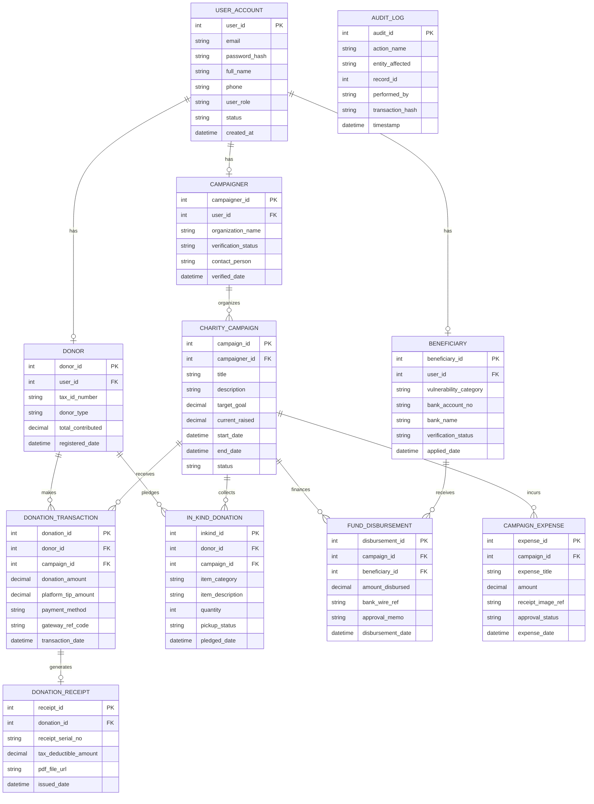

# Conceptual ERD — Charity & Donation Management System

## Mermaid Code

## Entity Description Table | Bang mo ta Entity

| # | Entity Name | Vietnamese Name | Description | Key Attributes | Main Relationships |
|---|-------------|-----------------|-------------|----------------|-------------------|
| 1 | USER_ACCOUNT | Tai khoan nguoi dung | Central user credential and profile entity storing user identity, roles, and authentication status. | user_id, email, password_hash, user_role | Has optional Donor, Campaigner, or Beneficiary extension profiles. |
| 2 | DONOR | Nha tai tro | Stores donor-specific tax identifiers, contribution totals, and donor classification types. | donor_id, user_id, tax_id_number, donor_type | Belongs to User Account; makes Donations and In-Kind Pledges. |
| 3 | CAMPAIGNER | Nguoi/To chuc tao quy | Profile for campaign creators, storing organizational verification badges and background credentials. | campaigner_id, user_id, organization_name | Belongs to User Account; organizes Charity Campaigns. |
| 4 | BENEFICIARY | Nguoi thu huong | Profile representing aid recipients, storing vulnerability category and verified bank payout details. | beneficiary_id, user_id, vulnerability_category, bank_account_no | Belongs to User Account; receives Fund Disbursements. |
| 5 | CHARITY_CAMPAIGN | Chien dich tu thien | Represents a fundraising project with target goal amounts, descriptions, timelines, and current raised balances. | campaign_id, campaigner_id, title, target_goal, current_raised | Organizes by Campaigner; receives Donations; finances Disbursements and Expenses. |
| 6 | DONATION_TRANSACTION | Giao dich quyen gop | Financial ledger entry recording monetary gifts, payment gateway tokens, donation amounts, and tips. | donation_id, donor_id, campaign_id, donation_amount | Belongs to Donor and Campaign; generates Donation Receipt. |
| 7 | IN_KIND_DONATION | Quyen gop hien vat | Record tracking pledged non-monetary physical goods (food, clothes, medical gear) and pickup logistics. | inkind_id, donor_id, campaign_id, item_category, quantity | Belongs to Donor and Campaign. |
| 8 | DONATION_RECEIPT | Hoa don quyen gop | Official tax receipt document issued to donors containing unique serial numbers and deductible totals. | receipt_id, donation_id, receipt_serial_no, tax_deductible_amount | Belongs to one Donation Transaction. |
| 9 | FUND_DISBURSEMENT | Giai ngan quy tu thien | Financial transfer record tracking payouts sent from campaign funds to approved beneficiaries. | disbursement_id, campaign_id, beneficiary_id, amount_disbursed | Belongs to Campaign and Beneficiary. |
| 10 | CAMPAIGN_EXPENSE | Chi phi chien dich | Operating cost record tracking project expenses, receipt images, and admin approvals. | expense_id, campaign_id, expense_title, amount | Belongs to Charity Campaign. |
| 11 | AUDIT_LOG | Nhat ky kiem toan | Immutable security log recording system events, administrative approvals, and SHA-256 transaction hashes. | audit_id, action_name, record_id, transaction_hash | Independent system audit record. |

## Relationship Description | Mo ta Quan he

| # | From Entity | Cardinality | To Entity | Relationship Label | Business Explanation |
|---|-------------|-------------|-----------|-------------------|----------------------|
| 1 | USER_ACCOUNT | one-to-one (optional) | DONOR | has | Mot tai khoan co the mo rong thanh ho so nha tai tro. |
| 2 | USER_ACCOUNT | one-to-one (optional) | CAMPAIGNER | has | Mot tai khoan co the mo rong thanh ho so nguoi tao chien dich tu thien. |
| 3 | USER_ACCOUNT | one-to-one (optional) | BENEFICIARY | has | Mot tai khoan co the mo rong thanh ho so nguoi thu huong tro cap. |
| 4 | CAMPAIGNER | one-to-many | CHARITY_CAMPAIGN | organizes | Mot nguoi tao quy co the khoi xuong nhieu chien dich tu thien. |
| 5 | DONOR | one-to-many | DONATION_TRANSACTION | makes | Mot nha tai tro co the thuc hien nhieu giao dich quyen gop tien. |
| 6 | DONOR | one-to-many | IN_KIND_DONATION | pledges | Mot nha tai tro co the dang ky quyen gop nhieu dot hien vat. |
| 7 | CHARITY_CAMPAIGN | one-to-many | DONATION_TRANSACTION | receives | Mot chien dich tu thien tiep nhan nhieu luot quyen gop tai chinh. |
| 8 | CHARITY_CAMPAIGN | one-to-many | IN_KIND_DONATION | collects | Mot chien dich tiep nhan va thu gom cac loat hien vat quyen gop. |
| 9 | DONATION_TRANSACTION | one-to-one (optional) | DONATION_RECEIPT | generates | Moi giao dich quyen gop thanh cong tao ra mot hoa don thue chinh thuc. |
| 10 | CHARITY_CAMPAIGN | one-to-many | FUND_DISBURSEMENT | finances | Mot chien dich cap ngan sach de giai ngan cho nhieu nguoi thu huong. |
| 11 | BENEFICIARY | one-to-many | FUND_DISBURSEMENT | receives | Mot nguoi thu huong co thể nhan nhieu dot giai ngan theo tin do. |
| 12 | CHARITY_CAMPAIGN | one-to-many | CAMPAIGN_EXPENSE | incurs | Mot chien dich phat sinh cac khoản chi phi van hanh va thuc hien. |
