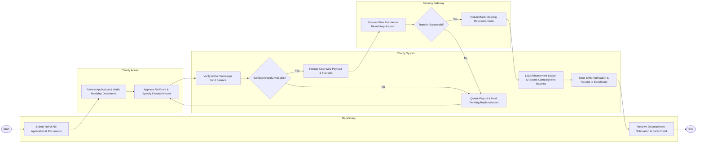

# Swimlane Diagram — Charity & Donation Management System

## Mermaid Code

## Flow Description | Mo ta luong

| Lane | Actor | Role in Flow |
|------|-------|-------------|
| 1 | Beneficiary | Initiates aid request by submitting medical/hardship documentation and receives SMS notification and bank credit upon successful payout. |
| 2 | Charity Admin | Reviews beneficiary applications, verifies document authenticity, and signs off on aid grant approvals and payout amounts. |
| 3 | Charity System | Checks available unallocated campaign balances, formats automated bank wire payloads, updates financial ledgers, and dispatches notices. |
| 4 | Banking Gateway | External banking integration that executes direct bank wire transfers to beneficiary accounts and returns transaction settlement references. |
