# Action Tree — Charity & Donation Management System

## Mermaid Code

```mermaid
graph TD
    Root["Charity & Donation Management System"]

    Root --> M1["Fundraising & Campaign Management"]
    Root --> M2["Donation & Giving Operations"]
    Root --> M3["In-Kind Goods & Logistics"]
    Root --> M4["Beneficiary & Fund Disbursement"]
    Root --> M5["Financial Accounting & Expense"]
    Root --> M6["Transparency & Audit Compliance"]

    M1 --> A11["Create Campaign Proposal"]
    M1 --> A12["Approve Campaign Listing"]
    M1 --> A13["Publish Project Story"]
    M1 --> A14["Update Milestone Progress"]
    M1 --> A15["Close Completed Campaign"]

    M2 --> A21["Process Direct Donation"]
    M2 --> A22["Setup Monthly Recurring Giving"]
    M2 --> A23["Issue Tax Deductible Receipt"]
    M2 --> A24["Manage Donor Preferences"]
    M2 --> A25["Process Tribute Gift"]

    M3 --> A31["Pledge Material Goods"]
    M3 --> A32["Schedule Pickup Logistics"]
    M3 --> A33["Inspect Inventory Quality"]
    M3 --> A34["Allocate Goods to Beneficiaries"]

    M4 --> A41["Submit Aid Application"]
    M4 --> A42["Verify Hardship Documentation"]
    M4 --> A43["Approve Financial Grant"]
    M4 --> A44["Execute Bank Wire Disbursement"]

    M5 --> A51["Record Campaign Expense"]
    M5 --> A52["Verify Expense Invoice Receipts"]
    M5 --> A53["Reconcile Gateway Settlements"]
    M5 --> A54["Allocate Administrative Overhead"]

    M6 --> A61["Export Certified Audit Log"]
    M6 --> A62["Publish Public Transparency Ledger"]
    M6 --> A63["Verify Cryptographic SHA Hash"]
    M6 --> A64["Generate Annual Impact Report"]
```

## Module Description | Mo ta Module

| # | Module | Description | Actions |
|---|--------|-------------|---------|
| 1 | Fundraising & Campaign Management | Controls campaign drafting, admin approval workflows, story media updates, project milestone tracking, and campaign closure. | Create Campaign Proposal, Approve Campaign Listing, Publish Project Story, Update Milestone Progress, Close Completed Campaign |
| 2 | Donation & Giving Operations | Handles credit card/e-wallet processing, recurring gift subscriptions, automated PDF tax receipts, donor privacy settings, and tribute gifts. | Process Direct Donation, Setup Monthly Recurring Giving, Issue Tax Deductible Receipt, Manage Donor Preferences, Process Tribute Gift |
| 3 | In-Kind Goods & Logistics | Oversees physical non-monetary donations, logistics pickup scheduling, warehouse inventory checks, and physical aid allocation. | Pledge Material Goods, Schedule Pickup Logistics, Inspect Inventory Quality, Allocate Goods to Beneficiaries |
| 4 | Beneficiary & Fund Disbursement | Manages aid applications, document verification, grant approval sign-offs, and bank wire transfers to verified recipients. | Submit Aid Application, Verify Hardship Documentation, Approve Financial Grant, Execute Bank Wire Disbursement |
| 5 | Financial Accounting & Expense | Tracks project expenditures, vendor receipt verification, payment gateway reconciliation, and overhead cost accounting. | Record Campaign Expense, Verify Expense Invoice Receipts, Reconcile Gateway Settlements, Allocate Administrative Overhead |
| 6 | Transparency & Audit Compliance | Enables tamper-evident audit logging, public ledger publishing, SHA-256 hash checks, and annual regulatory compliance reports. | Export Certified Audit Log, Publish Public Transparency Ledger, Verify Cryptographic SHA Hash, Generate Annual Impact Report |
