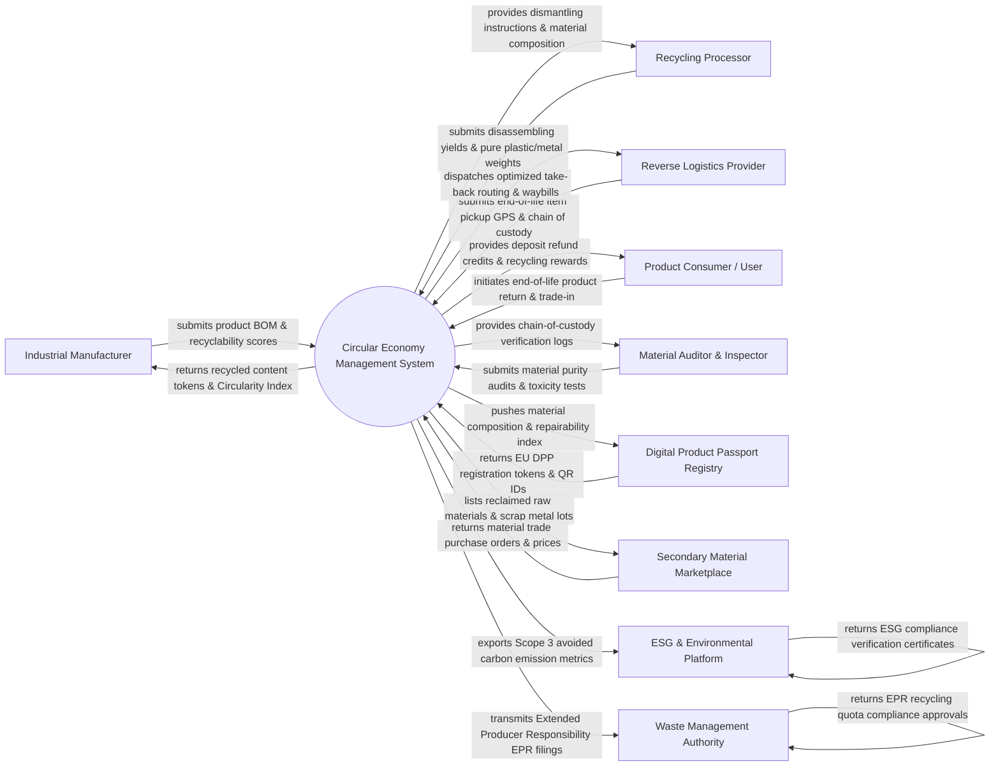

# Context Diagram — Circular Economy Management System

## Mermaid Code

## Actor & Interaction Table | Bảng Actor & Tương tác

| # | Actor | Actor Type | Data Sent TO System | Data Received FROM System | Notes |
|---|-------|------------|---------------------|---------------------------|-------|
| 1 | Industrial Manufacturer | Primary | Bill of Materials (BOM), virgin vs. recycled material ratios, product disassembly manuals, design for recyclability scores | Recycled content verification tokens, Material Circularity Indicator (MCI) ratings, secondary material sourcing quotes | OEMs and industrial product manufacturers designing products for circularity and remanufacturing. |
| 2 | Recycling Processor & Disassembler | Primary | Material recovery rates, reclaimed scrap metal/plastic weights, chemical purity grades, hazardous waste residue logs | Product disassembly 3D schematics, hazardous material warnings, target buyer material specs | E-waste shredders, battery recyclers, and textile deconstruction facilities processing returned items. |
| 3 | Reverse Logistics Provider | Primary | End-of-life item pickup GPS tracking, pallet weight receipts, chain-of-custody transfer signatures | Optimized take-back route manifests, consolidation hub dispatch orders, return shipping labels | Specialized third-party logistics (3PL) carriers executing reverse logistics and return pick-ups. |
| 4 | Product Consumer / Business User | Primary | End-of-life product return requests, device serial number scans, product condition declarations | Take-back deposit refund credits, eco-reward points, prepaid return shipping QR codes, carbon reduction badges | End consumers or enterprise business users returning used electronics, batteries, or industrial assets. |
| 5 | Material Auditor & Compliance Inspector | Primary | On-site material audit reports, chemical toxicity lab test results (RoHS/REACH), chain-of-custody verifications | Verified material origin audit trails, mass-balance accounting logs, tamper-evident audit tokens | Independent environmental auditors verifying material provenance and recycling claim authenticity. |
| 6 | Digital Product Passport (DPP) Registry | Supporting System | EU DPP registration tokens, QR code identifier links, standardized product environmental footprints | Product material composition schemas, carbon footprint per kg, repairability indices, recycling instructions | European Union and global Digital Product Passport (DPP) registries enforcing product data transparency. |
| 7 | Secondary Material Marketplace | Supporting System | B2B material purchase orders, spot prices for recycled plastics/metals, material quality bids | Available reclaimed raw material listings (e.g. 50 tons rPET plastic pellets), purity lab certs | B2B commodity trading platform facilitating the sale of recycled secondary raw materials. |
| 8 | ESG & Environmental Reporting Platform | Supporting System | Corporate ESG reporting templates, Scope 3 emission calculation factors, GRI/SASB standards | Scope 3 avoided carbon emission metrics, landfill diversion percentages, circularity audit metrics | Enterprise sustainability platforms (Salesforce Net Zero, SAP Sustainability) aggregating corporate ESG data. |
| 9 | Waste Management & Regulatory Authority | Regulatory System | Extended Producer Responsibility (EPR) compliance targets, hazardous waste disposal regulations | Annual EPR recycling volume filings, waste diversion audit reports, hazardous material tracking manifests | Municipal and national environmental protection agencies (EPA) enforcing recycling quotas and EPR laws. |

## System Boundary Description | Mô tả Phạm vi Hệ thống

The **Circular Economy Management System (CEMS)** is an enterprise platform managing closed-loop product life cycles, reverse logistics, and secondary raw material marketplaces. Inside the system boundary, CEMS manages Digital Product Passport (DPP) creation, end-of-life take-back scheduling, reverse logistics routing, disassembly instruction matching, material sorting & purity inspection, secondary material trading, Extended Producer Responsibility (EPR) compliance tracking, and Life Cycle Assessment (LCA) avoided carbon accounting. External to the system boundary are physical manufacturing plants (Industrial Manufacturer), recycling/shredding plants (Recycling Processor), reverse logistics carriers (Reverse Logistics Provider), official product passport registries (DPP Registry), B2B secondary material exchanges (Secondary Material Marketplace), corporate ESG reporting tools (ESG Platform), and environmental regulators (Waste Management Authority).
