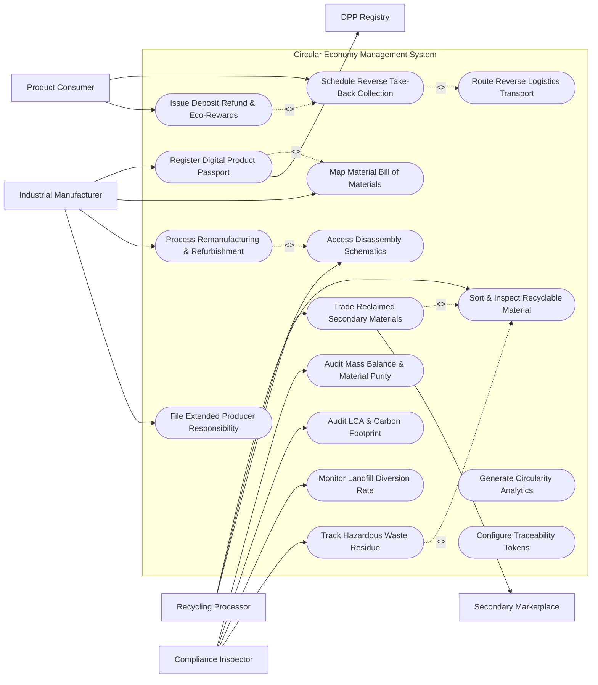

# Use Case Diagram — Circular Economy Management System

## Mermaid Code

## Actor Table | Bảng Actor

| # | Actor | Actor Type | Role Description | Related Use Cases |
|---|-------|------------|------------------|-------------------|
| 1 | Industrial Manufacturer | Primary | Product manufacturer registering Digital Product Passports, mapping BOMs, and filing EPR compliance reports. | UC01, UC02, UC07, UC12 |
| 2 | Product Consumer | Primary | Product user or business customer scheduling product returns, trading in used goods, and claiming eco-rewards. | UC03, UC09 |
| 3 | Recycling Processor | Primary | Recycling plant operator inspecting returned goods, accessing disassembly schematics, and trading reclaimed raw materials. | UC05, UC06, UC08 |
| 4 | Compliance Inspector | Primary | Environmental auditor verifying material purity, conducting Life Cycle Assessments (LCA), and auditing landfill diversion. | UC10, UC11, UC13, UC14 |
| 5 | DPP Registry | System | External Digital Product Passport (DPP) registry storing standardized EU product environmental footprint data. | UC01 |
| 6 | Secondary Marketplace | System | B2B raw material exchange platform matching reclaimed secondary material supplies with industrial buyer demand. | UC08 |

## Use Case Table | Bảng Use Case

| # | UC ID | Use Case Name | Primary Actor | Secondary Actor | Description | Priority |
|---|-------|---------------|---------------|-----------------|-------------|----------|
| 1 | UC01 | Register Digital Product Passport | Industrial Manufacturer | DPP Registry | Creates a unique Digital Product Passport (DPP) QR ID tracking material composition, recycled content, and repairability. | High |
| 2 | UC02 | Map Material Bill of Materials | Industrial Manufacturer | None | Maps detailed Bill of Materials (BOM) declaring virgin vs. recycled polymers, precious metals, and hazardous substances (RoHS). | High |
| 3 | UC03 | Schedule Reverse Take-Back Collection | Product Consumer | None | Schedules courier pick-up or drop-off for end-of-life products, generating prepaid return shipping labels and QR tokens. | High |
| 4 | UC04 | Route Reverse Logistics Transport | Product Consumer | None | Consolidates end-of-life product returns across regional collection hubs and dispatches optimal reverse logistics routing. | High |
| 5 | UC05 | Sort & Inspect Recyclable Material | Recycling Processor | None | Scans incoming returned items, conducts NIR spectroscopy sensor sorting, and inspects material purity grades. | High |
| 6 | UC06 | Access Disassembly Schematics | Recycling Processor | None | Retrieves 3D CAD step-by-step disassembly guides, fastener removal instructions, and battery extraction procedures. | High |
| 7 | UC07 | Process Remanufacturing & Refurbishment | Industrial Manufacturer | None | Replaces worn components on returned products, tests functional quality, and re-certifies items for secondary market resale. | High |
| 8 | UC08 | Trade Reclaimed Secondary Materials | Recycling Processor | Secondary Marketplace | Lists purified scrap metal, rPET pellets, or shredded battery black mass on B2B marketplace for industrial procurement. | High |
| 9 | UC09 | Issue Deposit Refund & Eco-Rewards | Product Consumer | None | Automatically credits consumer deposit refunds or eco-reward points upon verified return scan at recycling center. | Medium |
| 10 | UC10 | Audit Mass Balance & Material Purity | Compliance Inspector | None | Conducts mass-balance accounting auditing total material inputs vs. outputs to verify 100% material traceability. | High |
| 11 | UC11 | Audit LCA & Carbon Footprint | Compliance Inspector | None | Calculates Life Cycle Assessment (LCA) avoided Scope 3 carbon emissions achieved by substituting virgin materials. | High |
| 12 | UC12 | File Extended Producer Responsibility | Industrial Manufacturer | None | Compiles and files annual Extended Producer Responsibility (EPR) recycling compliance reports to environmental authorities. | High |
| 13 | UC13 | Monitor Landfill Diversion Rate | Compliance Inspector | None | Calculates percentage of total product mass diverted from municipal landfills to recycling and remanufacturing streams. | Medium |
| 14 | UC14 | Track Hazardous Waste Residue | Compliance Inspector | None | Tracks safe extraction, treatment, and disposal manifests for hazardous substances (lead, cadmium, electrolyte fluids). | Medium |
| 15 | UC15 | Generate Circularity Analytics | Compliance Inspector | None | Exports Material Circularity Indicator (MCI) ratings, resource loop closure percentages, and secondary material cost savings. | Medium |
| 16 | UC16 | Configure Traceability Tokens | Industrial Manufacturer | None | Provisions blockchain/cryptographic tamper-evident material provenance tokens for high-value recycled metals (Gold, Cobalt). | Low |

## Use Case Specification | Đặc tả Use Case

---

### UC01 — Register Digital Product Passport

| Field | Detail |
|-------|--------|
| **UC ID** | UC01 |
| **Use Case Name** | Register Digital Product Passport |
| **Actor(s)** | Primary: Industrial Manufacturer / Secondary: DPP Registry |
| **Description** | Generates a standardized Digital Product Passport (DPP) assigned to a unique product QR code/RFID tag, storing material composition, recycled content percentage, repairability score, and end-of-life recycling instructions. |
| **Precondition** | 1. Manufacturer is registered and authenticated in the platform.   2. Product model Bill of Materials (BOM) has been mapped (UC02). |
| **Main Flow** | 1. Actor selects "Register New Digital Product Passport".   2. System presents DPP registration form requesting Product Model, Serial Number / Batch GTIN, Manufacturing Location, and Date of Manufacture.   3. System imports mapped BOM (UC02) detailing Material Composition: Virgin Plastic %, Recycled Plastic (rPET/rHDPE) %, Recycled Metal %, Precious Metals (Gold, Silver, Copper grams), and Substance of Very High Concern (SVHC) declarations.   4. Actor enters Product Circularity Metrics: Repairability Index score (e.g. 8.4/10), Expected Lifespan (years), Dismantling Time (mins), and Spare Part Availability link.   5. System computes Material Circularity Indicator (MCI) rating and Product Carbon Footprint (kg CO2e).   6. System dispatches registration payload to external EU DPP Registry, receiving a globally unique DPP Token URL and QR code identifier.   7. System stores Product_Material_Passport entity and generates laser-engravable QR code for product labeling. |
| **Alternative Flow** | **AF1** — Bulk Automated Production Line Registration: System connects via OPC-UA to factory packaging line; auto-registers 5,000 DPP QR codes per hour for outgoing products.   **AF2** — Battery Passport Registration: Registration complies specifically with EU Battery Regulation standards, including state-of-health (SOH) tracking endpoints. |
| **Exception Flow** | **EX1** — Undeclared Hazardous Material (RoHS Violation): If BOM contains restricted hazardous substances exceeding legal thresholds without exemption certificate, System halts registration with error "RoHS Threshold Exceeded."   **EX2** — DPP Registry API Timeout: If official registry is unreachable, System stores passport locally in pending state and auto-syncs when registry reconnects. |
| **Postcondition** | A Product_Material_Passport entity is created and linked to an official DPP Registry token and printable QR identifier. |
| **Business Rule** | **BR1**: Every Digital Product Passport must disclose the exact percentage of post-consumer recycled (PCR) content verified by third-party audit certificates. |

---

### UC03 — Schedule Reverse Take-Back Collection

| Field | Detail |
|-------|--------|
| **UC ID** | UC03 |
| **Use Case Name** | Schedule Reverse Take-Back Collection |
| **Actor(s)** | Primary: Product Consumer / Secondary: None |
| **Description** | Allows a consumer or business customer to initiate the return of an end-of-life product, generating prepaid return shipping labels, scheduling courier pick-up, and calculating deposit refunds. |
| **Precondition** | 1. Consumer scans the Digital Product Passport (DPP) QR code (UC01) on the product or opens return portal.   2. Product has reached end-of-life or trade-in eligibility. |
| **Main Flow** | 1. Actor scans DPP QR code using smartphone camera and selects "Return Product for Recycling / Trade-In".   2. System retrieves product identity, original deposit amount (e.g. $25.00 deposit refund), and trade-in value quote based on declared product condition (Working, Damaged, Non-Functional).   3. Actor selects Return Method: Home Courier Pick-Up, Drop-Off at Retail Store, or Smart Recycling Kiosk Drop.   4. Actor enters pick-up address and preferred date/time slot.   5. System verifies pick-up location, dispatches reverse logistics transport booking (UC04) to carrier API, and generates a prepaid PDF Return Shipping Label with barcoded tracking ID.   6. System creates Reverse_Takeback_Request entity, setting status to "Scheduled - Pending Courier Pick-Up".   7. System emails return label and QR code to consumer and dispatches notification reminder. |
| **Alternative Flow** | **AF1** — Enterprise B2B Pallet Take-Back: Enterprise customer schedules bulk reverse logistics pick-up for 200 decommissioned laptop servers; System dispatches freight truck with palletized chain-of-custody forms.   **AF2** — Retail Kiosk Scan & Instant Refund: Consumer scans QR code at smart retail kiosk, deposits item into chute; Kiosk immediately issues cash refund (UC09). |
| **Exception Flow** | **EX1** — Stolen / Blacklisted Serial Number: If scanned product serial number matches a reported stolen device database, System flags "Device Locked - Return Suspended" and alerts support.   **EX2** — Hazardous Battery Damaged Alert: If consumer selects "Swollen / Leaking Lithium Battery", System halts standard shipping and prompts "Damaged Lithium Battery requires specialized Hazmat shipping box." |
| **Postcondition** | A Reverse_Takeback_Request is created, reverse logistics courier is dispatched, and consumer receives return shipping labels. |
| **Business Rule** | **BR1**: Reverse logistics routing must automatically consolidate individual consumer returns into regional sorting hubs to minimize return transport carbon footprint. |

---

### UC05 — Sort & Inspect Recyclable Material

| Field | Detail |
|-------|--------|
| **UC ID** | UC05 |
| **Use Case Name** | Sort & Inspect Recyclable Material |
| **Actor(s)** | Primary: Recycling Processor / Secondary: None |
| **Description** | Scans incoming returned items at recycling facilities, conducts Near-Infrared (NIR) optical spectroscopy sorting, verifies material composition, and grades purity levels. |
| **Precondition** | 1. Returned products have arrived at recycling facility consolidation dock via reverse logistics (UC04).   2. Automated conveyor NIR optical sorter and barcode scanner are operational. |
| **Main Flow** | 1. Recycling operator scans return shipping barcode on incoming item box.   2. System queries Reverse_Takeback_Request database, verifying item identity against Digital Product Passport (UC01).   3. Item is placed onto automated sorting conveyor line.   4. System triggers Near-Infrared (NIR) optical spectroscopy sensors and X-Ray Fluorescence (XRF) analyzers to scan item material stream.   5. NIR/XRF sensors identify polymer resin types (PET, HDPE, ABS, Polycarbonate) and metal alloys (Aluminum 6061, Copper, Stainless Steel), comparing detected signatures against the DPP declared BOM (UC02).   6. System determines processing route: Path A (Direct Refurbishment / Remanufacturing UC07), Path B (Manual Component Disassembly UC06), Path C (Mechanical Shredding & Pelletizing).   7. Operator conducts manual purity check, confirms material grade (e.g. 99.2% Pure rPET Plastic), and enters output batch weight (kg).   8. System updates item status to "Processed", logs Recycling_Processing_Batch record, and generates Reclaimed_Material_Item inventory lot for trading (UC08). |
| **Alternative Flow** | **AF1** — Robotic AI Sorting Arm: High-speed robotic arm equipped with computer vision automatically picks aluminum cans and circuit boards off conveyor at 80 picks/minute based on system classification.   **AF2** — Battery Black Mass Extraction: EV battery pack is safely discharged, shredded under inert nitrogen gas, and processed into high-purity Nickel-Cobalt-Lithium "Black Mass". |
| **Exception Flow** | **EX1** — Material Contamination Warning: If XRF analyzer detects heavy metal contamination (Brominated Flame Retardants >0.1%), System flags "Contaminated Batch" and routes item to hazardous waste treatment (UC14).   **EX2** — Missing DPP QR Code: Unlabeled scrap item arrives; Operator manually triggers NIR spectroscopy scan to identify unknown resin type. |
| **Postcondition** | Returned products are sorted, material composition and purity grades verified, and reclaimed raw material inventory lots created for secondary trading. |
| **Business Rule** | **BR1**: Reclaimed material lots must undergo verified spectral purity testing before being listed as industrial-grade secondary raw materials. |

---

### UC08 — Trade Reclaimed Secondary Materials

| Field | Detail |
|-------|--------|
| **UC ID** | UC08 |
| **Use Case Name** | Trade Reclaimed Secondary Materials |
| **Actor(s)** | Primary: Recycling Processor / Secondary: Secondary Marketplace |
| **Description** | Lists purified reclaimed raw materials (recycled plastic pellets, scrap copper, crushed glass cullet) on a B2B circular marketplace, facilitating sales to industrial manufacturers. |
| **Precondition** | 1. Reclaimed material lot has been processed, weighed, and purity-certified (UC05).   2. Processor holds verified seller account on secondary material marketplace. |
| **Main Flow** | 1. Actor selects "List New Reclaimed Material Lot".   2. System populates listing template using verified data from Recycling_Processing_Batch: Material Type (e.g. rPET Flakes - Post Consumer), Purity Grade (99.5% pure, clear), Available Quantity (25,000 kg), Packaging (1-ton Super Sacks), and Storage Location.   3. System attaches digital lab purity certificate, NIR spectral report, and LCA Scope 3 avoided carbon calculation (UC11).   4. Actor enters Asking Price ($/kg) or selects "Enable B2B Auction Bidding".   5. System dispatches listing payload to Secondary Material Marketplace API.   6. Industrial Buyers browse marketplace, view verified DPP material provenance trail, and submit Purchase Order (PO) bid.   7. Actor accepts PO bid; System generates B2B sales contract, reserves material lot inventory, and dispatches freight pickup transport.   8. Upon freight pickup verification, System updates Marketplace_Listing state to "Sold" and credits processor account. |
| **Alternative Flow** | **AF1** — Closed-Loop Offtake Agreement: System automatically fulfills a standing long-term contract supplying 10 tons of recycled ocean plastic monthly directly to an athletic footwear manufacturer.   **AF2** — Automated Commodity Price Index Adjustment: Listing asking price automatically floats relative to London Metal Exchange (LME) or ICIS recycled plastic spot index. |
| **Exception Flow** | **EX1** — Buyer Quality Rejection: Industrial buyer receives shipment and claims purity is below specification; System triggers independent material audit inspection (UC10) and holds escrow funds.   **EX2** — Cross-Border Scrap Trade Restriction: If material export violates Basel Convention waste trade laws, System blocks international transaction. |
| **Postcondition** | Reclaimed raw material inventory lot is listed, traded, and delivered to industrial manufacturers, closing the material loop. |
| **Business Rule** | **BR1**: Secondary material marketplace listings must provide transparent, tamper-evident digital proof of material origin and chemical purity certificates. |

---

### UC11 — Audit LCA & Carbon Footprint

| Field | Detail |
|-------|--------|
| **UC ID** | UC11 |
| **Use Case Name** | Audit LCA & Carbon Footprint |
| **Actor(s)** | Primary: Compliance Inspector / Secondary: None |
| **Description** | Calculates Life Cycle Assessment (LCA) avoided Scope 3 greenhouse gas emissions, energy savings, and water savings achieved by substituting virgin materials with reclaimed secondary materials. |
| **Precondition** | 1. Product material compositions (UC01) and recycled material processing weights (UC05) are recorded.   2. ISO 14040/14044 LCA emission factor databases (Ecoinvent, GaBi) are integrated. |
| **Main Flow** | 1. Actor selects "Execute Circular LCA & Carbon Audit".   2. System prompts audit scope parameters: selects Product Line, Time Period (Q1 2026), and Material Category (e.g., Recycled Aluminum vs Virgin Primary Aluminum).   3. System retrieves mass balance input data (kg of secondary material reclaimed via UC05) and reverse logistics transport fuel consumption data (UC04).   4. System executes LCA calculation engine using ISO 14044 cradle-to-cradle methodology:   &nbsp;&nbsp;&nbsp;&nbsp;a. Calculates Virgin Baseline Footprint (e.g. 100 tons primary aluminum = 1,400 tons CO2e).   &nbsp;&nbsp;&nbsp;&nbsp;b. Calculates Circular Recovery Footprint (Recycling process energy + Reverse logistics transport = 70 tons CO2e).   &nbsp;&nbsp;&nbsp;&nbsp;c. Computes Net Avoided Carbon Emissions (1,330 tons CO2e saved, 95% energy reduction).   5. System generates audit-ready Life Cycle Assessment (LCA) report detailing global warming potential (GWP), abiotic depletion, and water stress metrics.   6. Inspector reviews calculations, attaches digital signature seal, and publishes audit report to ESG_Compliance_Certificate table.   7. System exports verified Scope 3 emission reduction tokens to corporate ESG Reporting Platform (UC11). |
| **Alternative Flow** | **AF1** — Product-Level Carbon Footprint Labeling: System calculates exact carbon footprint per unit (e.g. 2.1 kg CO2e per recycled jacket) and updates Digital Product Passport QR display (UC01).   **AF2** — Carbon Credit Monetization: Verified avoided emissions are bundled into certified carbon offsets and listed on carbon credit registries. |
| **Exception Flow** | **EX1** — Missing Transport Fuel Data: If reverse logistics carrier failed to log truck fuel metrics, System applies conservative default GHG protocol emission factors based on ton-kilometers.   **EX2** — Discrepancy in Mass Balance: Input weights do not match output weights by >3%; System flags audit discrepancy and requests physical material re-weighing. |
| **Postcondition** | Verified LCA carbon footprint and avoided Scope 3 emission reports are generated, signed, and published for ESG compliance and regulatory filings. |
| **Business Rule** | **BR1**: Avoided carbon emission calculations must strictly adhere to ISO 14040/14044 Life Cycle Assessment standards and undergo independent third-party audit verification. |
