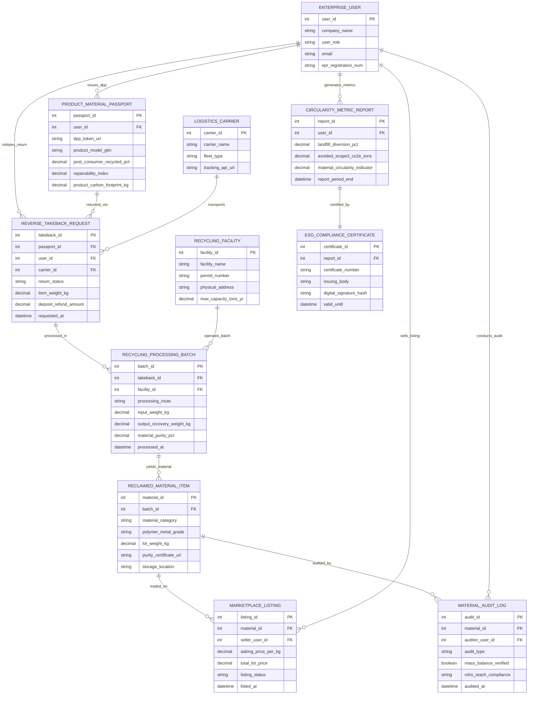

# Conceptual ERD — Circular Economy Management System

## Mermaid Code

## Entity Description Table | Bảng mô tả Entity

| # | Entity Name | Vietnamese Name | Description | Key Attributes | Main Relationships |
|---|-------------|-----------------|-------------|----------------|-------------------|
| 1 | ENTERPRISE_USER | Doanh nghiệp / Người dùng | Industrial manufacturer, recycler, auditor, or consumer enterprise profile. | user_id (PK), company_name, user_role, epr_registration_num | Issues Passports, initiates Take-backs, conducts Audits, generates Reports |
| 2 | RECYCLING_FACILITY | Cơ sở Tái chế | Industrial sorting, shredding, and remanufacturing facility location and permit record. | facility_id (PK), facility_name, permit_number, max_capacity_tons_yr | Operates Recycling Processing Batches |
| 3 | LOGISTICS_CARRIER | Nhà vận tải Logisics | Reverse logistics 3PL transport provider executing pick-up and consolidation freight. | carrier_id (PK), carrier_name, fleet_type, tracking_api_url | Transports Reverse Take-Back Requests |
| 4 | PRODUCT_MATERIAL_PASSPORT | Passport Vật liệu Sản phẩm | Digital Product Passport (DPP) storing material composition, recycled %, and carbon footprint. | passport_id (PK), user_id (FK), dpp_token_url, product_model_gtin, post_consumer_recycled_pct | Issued by Enterprise User, returned via Reverse Take-Back |
| 5 | REVERSE_TAKEBACK_REQUEST | Yêu cầu Thu hồi | Take-back request tracking end-of-life item pick-up, deposit refunds, and carrier routing. | takeback_id (PK), passport_id (FK), user_id (FK), carrier_id (FK), deposit_refund_amount | Initiated by User, linked to Passport & Carrier, processed in Batch |
| 6 | RECYCLING_PROCESSING_BATCH | Lô Xử lý Tái chế | Processing batch tracking disassembly, sorting yields, input weights, and purity percentages. | batch_id (PK), takeback_id (FK), facility_id (FK), input_weight_kg, material_purity_pct | Processed from Take-Back, operated by Facility, yields Reclaimed Material |
| 7 | RECLAIMED_MATERIAL_ITEM | Lô Vật liệu Thu hồi | Purified secondary raw material inventory lot (rPET pellets, scrap copper, aluminum cullet). | material_id (PK), batch_id (FK), material_category, polymer_metal_grade, lot_weight_kg | Yielded from Batch, traded on Marketplace, audited in Audit Log |
| 8 | MARKETPLACE_LISTING | Niêm yết Chợ Vật liệu | B2B secondary raw material marketplace listing specifying prices and trade quantities. | listing_id (PK), material_id (FK), seller_user_id (FK), asking_price_per_kg, listing_status | Trades Reclaimed Material Item, sold by Enterprise User |
| 9 | MATERIAL_AUDIT_LOG | Nhật ký Kiểm toán Vật liệu | Independent environmental audit log verifying mass balance, RoHS/REACH compliance, and purity. | audit_id (PK), material_id (FK), auditor_user_id (FK), mass_balance_verified, audited_at | Audits Reclaimed Material Item, conducted by Enterprise User |
| 10 | CIRCULARITY_METRIC_REPORT | Báo cáo Chỉ số Tuần hoàn | Annual corporate metric report tracking landfill diversion %, avoided Scope 3 CO2, and MCI. | report_id (PK), user_id (FK), landfill_diversion_pct, avoided_scope3_co2e_tons | Generated by Enterprise User, certified by ESG Certificate |
| 11 | ESG_COMPLIANCE_CERTIFICATE | Chứng nhận Tuân thủ ESG | Verified ESG compliance certificate with digital signature for regulatory EPR compliance filings. | certificate_id (PK), report_id (FK), certificate_number, issuing_body, digital_signature_hash | Certifies Circularity Metric Report |

## Relationship Description | Mô tả Quan hệ

| # | From Entity | Cardinality | To Entity | Relationship Label | Business Explanation |
|---|-------------|-------------|-----------|-------------------|----------------------|
| 1 | ENTERPRISE_USER | one-to-many | PRODUCT_MATERIAL_PASSPORT | issues_dpp | An Enterprise User (Manufacturer) issues multiple Product Material Passports. |
| 2 | ENTERPRISE_USER | one-to-many | REVERSE_TAKEBACK_REQUEST | initiates_return | An Enterprise User (Consumer/Business) initiates multiple Reverse Take-back Requests. |
| 3 | PRODUCT_MATERIAL_PASSPORT | one-to-many | REVERSE_TAKEBACK_REQUEST | returned_via | A Product Material Passport is returned via multiple Reverse Take-back Requests. |
| 4 | LOGISTICS_CARRIER | one-to-many | REVERSE_TAKEBACK_REQUEST | transports | A Logistics Carrier transports multiple Reverse Take-back Requests. |
| 5 | REVERSE_TAKEBACK_REQUEST | one-to-many | RECYCLING_PROCESSING_BATCH | processed_in | Reverse Take-back Requests are processed in Recycling Processing Batches. |
| 6 | RECYCLING_FACILITY | one-to-many | RECYCLING_PROCESSING_BATCH | operates_batch | A Recycling Facility operates multiple Recycling Processing Batches. |
| 7 | RECYCLING_PROCESSING_BATCH | one-to-many | RECLAIMED_MATERIAL_ITEM | yields_material | A Recycling Processing Batch yields multiple Reclaimed Material Items. |
| 8 | RECLAIMED_MATERIAL_ITEM | one-to-many | MARKETPLACE_LISTING | traded_on | A Reclaimed Material Item is traded on multiple Marketplace Listings. |
| 9 | ENTERPRISE_USER | one-to-many | MARKETPLACE_LISTING | sells_listing | An Enterprise User sells multiple Marketplace Listings. |
| 10 | RECLAIMED_MATERIAL_ITEM | one-to-many | MATERIAL_AUDIT_LOG | audited_by | A Reclaimed Material Item is audited by multiple Material Audit Logs. |
| 11 | ENTERPRISE_USER | one-to-many | MATERIAL_AUDIT_LOG | conducts_audit | An Enterprise User (Auditor) conducts multiple Material Audit Logs. |
| 12 | ENTERPRISE_USER | one-to-many | CIRCULARITY_METRIC_REPORT | generates_metrics | An Enterprise User generates multiple Circularity Metric Reports. |
| 13 | CIRCULARITY_METRIC_REPORT | one-to-one | ESG_COMPLIANCE_CERTIFICATE | certified_by | A Circularity Metric Report is certified by an ESG Compliance Certificate. |
