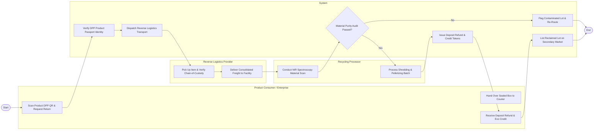

# Swimlane Diagram — Circular Economy Management System

## Mermaid Code

## Flow Description | Mô tả luồng

| Lane | Actor | Role in Flow |
|------|-------|-------------|
| 1 | Product Consumer / Enterprise | Scans Digital Product Passport (DPP) QR code, submits take-back return request, hands over packaged item to carrier, and receives deposit refunds and eco-credits. |
| 2 | System | Validates DPP identity tokens, dispatches reverse logistics pick-up orders, checks material purity audit results, issues deposit refunds, and lists reclaimed secondary materials on the B2B marketplace. |
| 3 | Reverse Logistics Provider | Executes pick-up, verifies chain-of-custody signatures, consolidates return shipments at regional hubs, and delivers freight to recycling facilities. |
| 4 | Recycling Processor | Scans incoming items using NIR spectroscopy, verifies polymer/metal purity grades, and executes mechanical shredding, sorting, and pelletizing into secondary raw materials. |
