# Action Tree — Circular Economy Management System

## Mermaid Code

```mermaid
graph TD
    Root["Circular Economy Management System"]

    Root --> M1["Digital Product Passport & Material Tracking"]
    Root --> M2["Reverse Logistics & Take-Back Management"]
    Root --> M3["Material Inspection & Sorting Control"]
    Root --> M4["Secondary Material Marketplace & Trading"]
    Root --> M5["Life Cycle Assessment LCA & Carbon Accounting"]
    Root --> M6["Regulatory Compliance & ESG Reporting"]

    M1 --> A11["Register Digital Product Passport DPP QR Codes"]
    M1 --> A12["Map Recycled Content & Material BOM"]
    M1 --> A13["Compute Product Repairability Index Scores"]
    M1 --> A14["Provision Cryptographic Traceability Tokens"]

    M2 --> A21["Schedule Consumer & B2B Take-Back Collection"]
    M2 --> A22["Generate Prepaid Return Shipping QR Labels"]
    M2 --> A23["Optimize Reverse Logistics Consolidation Hubs"]
    M2 --> A24["Issue Deposit Refunds & Eco-Reward Credits"]

    M3 --> A31["Scan Incoming Items via NIR Spectroscopy"]
    M3 --> A32["Retrieve 3D Step-by-Step Disassembly Guides"]
    M3 --> A33["Inspect Polymer & Metal Alloy Purity Grades"]
    M3 --> A34["Extract & Treat Hazardous Battery Residue"]

    M4 --> A41["List Reclaimed rPET & Metal Lots on Marketplace"]
    M4 --> A42["Facilitate B2B Secondary Material Bidding"]
    M4 --> A43["Attach Digital Material Lab Purity Certs"]
    M4 --> A44["Execute Long-Term Offtake Trade Contracts"]

    M5 --> A51["Calculate ISO 14044 Life Cycle Assessment LCA"]
    M5 --> A52["Measure Avoided Scope 3 Greenhouse Gas Emissions"]
    M5 --> A53["Calculate Material Circularity Indicator MCI"]
    M5 --> A54["Track Product Landfill Diversion Percentages"]

    M6 --> A61["Compile Extended Producer Responsibility EPR Filings"]
    M6 --> A62["Verify Mass Balance Accounting Audit Logs"]
    M6 --> A63["Export ESG Scope 3 Compliance Certificates"]
    M6 --> A64["Enforce RoHS/REACH Chemical Safety Audits"]
```

## Module Description | Mô tả Module

| # | Module | Description | Actions |
|---|--------|-------------|---------|
| 1 | Digital Product Passport & Material Tracking | Registers EU Digital Product Passports (DPP), maps recycled vs. virgin material BOMs, computes repairability scores, and issues tokens. | Register Digital Product Passport DPP QR Codes, Map Recycled Content & Material BOM, Compute Product Repairability Index Scores, Provision Cryptographic Traceability Tokens |
| 2 | Reverse Logistics & Take-Back Management | Manages consumer take-back scheduling, generates prepaid shipping QR labels, optimizes reverse logistics routing, and credits deposit refunds. | Schedule Consumer & B2B Take-Back Collection, Generate Prepaid Return Shipping QR Labels, Optimize Reverse Logistics Consolidation Hubs, Issue Deposit Refunds & Eco-Reward Credits |
| 3 | Material Inspection & Sorting Control | Executes NIR spectroscopy sorting, retrieves 3D disassembly guides, inspects polymer/metal purity grades, and isolates hazardous materials. | Scan Incoming Items via NIR Spectroscopy, Retrieve 3D Step-by-Step Disassembly Guides, Inspect Polymer & Metal Alloy Purity Grades, Extract & Treat Hazardous Battery Residue |
| 4 | Secondary Material Marketplace & Trading | Lists reclaimed secondary raw material lots, facilitates B2B procurement bidding, attaches digital lab purity certs, and executes trade contracts. | List Reclaimed rPET & Metal Lots on Marketplace, Facilitate B2B Secondary Material Bidding, Attach Digital Material Lab Purity Certs, Execute Long-Term Offtake Trade Contracts |
| 5 | Life Cycle Assessment LCA & Carbon Accounting | Calculates ISO 14044 LCA metrics, quantifies avoided Scope 3 carbon emissions, computes MCI ratings, and tracks landfill diversion rates. | Calculate ISO 14044 Life Cycle Assessment LCA, Measure Avoided Scope 3 Greenhouse Gas Emissions, Calculate Material Circularity Indicator MCI, Track Product Landfill Diversion Percentages |
| 6 | Regulatory Compliance & ESG Reporting | Compiles Extended Producer Responsibility (EPR) compliance filings, verifies mass balance accounting, exports ESG certificates, and audits chemical safety. | Compile Extended Producer Responsibility EPR Filings, Verify Mass Balance Accounting Audit Logs, Export ESG Scope 3 Compliance Certificates, Enforce RoHS/REACH Chemical Safety Audits |
