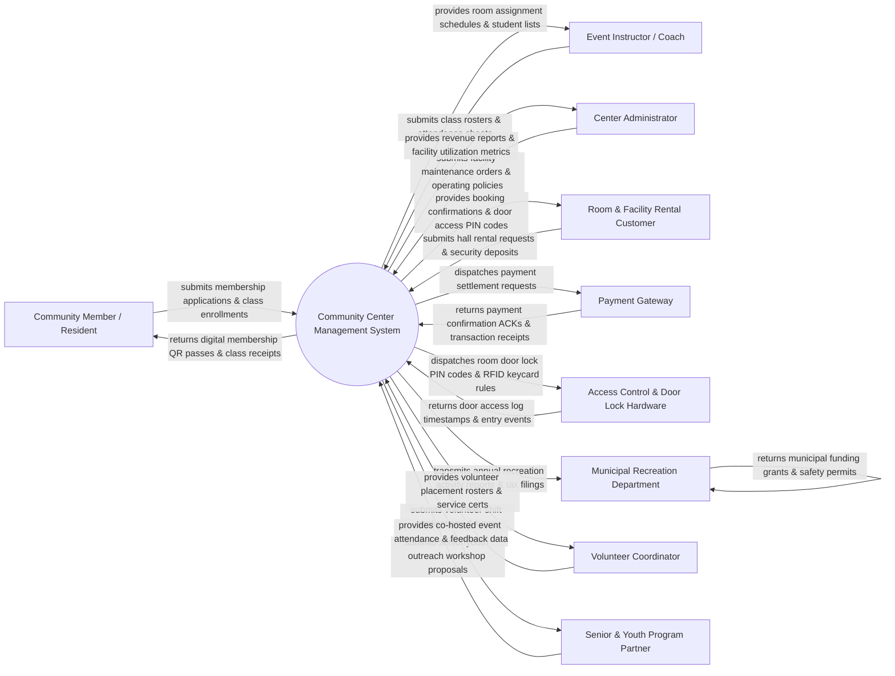

# Context Diagram — Community Center Management System

## Mermaid Code

## Actor & Interaction Table | Bảng Actor & Tương tác

| # | Actor | Actor Type | Data Sent TO System | Data Received FROM System | Notes |
|---|-------|------------|---------------------|---------------------------|-------|
| 1 | Community Member / Resident | Primary | Household profile details, class registrations, gym membership passes, equipment loans | Membership QR passes, course enrollment receipts, facility schedule alerts | Local town or city residents utilizing community center programs and gym facilities. |
| 2 | Event Instructor / Coach | Primary | Course syllabi, attendance sheets, class material requisitions, instructor availability | Class rosters, room assignment schedules, instructor payout summaries | External or staff instructors teaching swimming, yoga, senior art, or youth sports. |
| 3 | Center Administrator | Primary | Facility maintenance work orders, room rental pricing rules, operating policies, user roles | Daily revenue reports, facility utilization heatmaps, maintenance logs, security audits | Executive administrative staff overseeing center operations, staff, and budgets. |
| 4 | Room & Facility Rental Customer | Primary | Banquet hall rental requests, athletic field bookings, security deposit payments, event insurance | Room reservation confirmations, temporary door access PIN codes, invoice receipts | Individuals or local organizations renting community rooms, gymnasiums, or fields. |
| 5 | Payment Gateway | Supporting System | Payment transaction receipts, refund processing ACKs, credit card authorization codes | Credit card charge requests, recurring membership debit payloads, deposit refunds | Payment processor (Stripe, Square) clearing credit card and membership fee payments. |
| 6 | Access Control & Door Lock Hardware | Supporting System | Door keycard scan events, keypad PIN entry attempts, turnstile scan timestamps | Validated PIN codes, active RFID keycard access permissions, door unlock signals | Physical smart door locks, RFID keycard readers, and turnstiles securing rooms and gyms. |
| 7 | Municipal Recreation Department | Regulatory System | City recreation grants, facility operating guidelines, municipal safety permits | Annual recreation activity filings, subsidy usage reports, facility audit logs | Local municipal government department regulating public community and park assets. |
| 8 | Volunteer Coordinator | Primary | Volunteer applications, availability preferences, logged community service hours | Volunteer shift placement rosters, service hour verification certificates | Staff member or lead volunteer organizing community service activities and helpers. |
| 9 | Senior & Youth Program Partner | Supporting System | Senior meal program schedules, youth STEM workshop proposals, partner funding | Co-hosted event attendance counts, program outcome metrics, room allocations | Non-profit or government partners co-sponsoring specialized senior or youth programs. |

## System Boundary Description | Mô tả Phạm vi Hệ thống

The **Community Center Management System (CCMS)** is a comprehensive municipal recreation, facility booking, and membership management platform. Inside the system boundary, CCMS manages household membership profiles, recreation class/workshop enrollment, room & athletic facility rental reservations, smart keycard/PIN door access control, sports equipment lending, volunteer hours tracking, and municipal financial reporting. External to the system boundary are local residents (Community Member), room rental clients (Facility Customer), credit card payment gateways (Payment Gateway), smart door lock hardware (Access Control Hardware), municipal city council (Municipal Recreation Department), and community non-profit partners (Program Partner).
