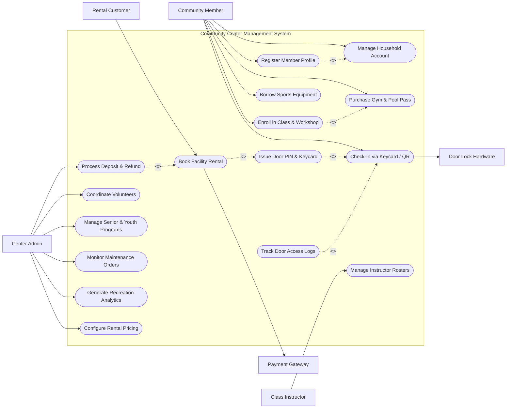

# Use Case Diagram — Community Center Management System

## Mermaid Code

## Actor Table | Bảng Actor

| # | Actor | Actor Type | Role Description | Related Use Cases |
|---|-------|------------|------------------|-------------------|
| 1 | Community Member | Primary | Resident registering a household profile, enrolling in classes, buying gym passes, borrowing equipment, and checking in. | UC01, UC02, UC03, UC04, UC07, UC08 |
| 2 | Rental Customer | Primary | External event planner or resident renting banquet rooms, basketball courts, or community halls. | UC05 |
| 3 | Class Instructor | Primary | Instructor or coach accessing course rosters, logging attendance, and managing student schedules. | UC09 |
| 4 | Center Admin | Primary | Administrative staff managing deposits, volunteer hours, senior programs, facility maintenance, and pricing tiers. | UC10, UC11, UC12, UC13, UC15, UC16 |
| 5 | Door Lock Hardware | System | Smart electronic door locks and turnstiles validating PIN codes and RFID keycards at facility entrances. | UC08 |
| 6 | Payment Gateway | System | Merchant payment processor clearing credit card payments for class enrollments, memberships, and facility rentals. | UC05 |

## Use Case Table | Bảng Use Case

| # | UC ID | Use Case Name | Primary Actor | Secondary Actor | Description | Priority |
|---|-------|---------------|---------------|-----------------|-------------|----------|
| 1 | UC01 | Register Member Profile | Community Member | None | Onboards a new community resident, verifying local address residency for discounted municipal rates. | High |
| 2 | UC02 | Manage Household Account | Community Member | None | Links family members (children, spouse, seniors) under a single household account for group class sign-ups. | High |
| 3 | UC03 | Enroll in Class & Workshop | Community Member | None | Enrolls in swimming lessons, yoga, art workshops, or youth sports leagues with automated capacity management. | High |
| 4 | UC04 | Purchase Gym & Pool Pass | Community Member | None | Purchases monthly/annual fitness gym, swimming pool, or tennis court access passes. | High |
| 5 | UC05 | Book Facility Rental | Rental Customer | Payment Gateway | Reserves community banquet halls, meeting rooms, or soccer fields, processing rental fees and deposits. | High |
| 6 | UC06 | Issue Door PIN & Keycard | Rental Customer | None | Generates time-restricted electronic door PIN codes or programs RFID keycards active only during rental hours. | High |
| 7 | UC07 | Borrow Sports Equipment | Community Member | None | Checks out basketballs, tennis racquets, or camping gear, tracking return due dates and damage fees. | Medium |
| 8 | UC08 | Check-In via Keycard / QR | Community Member | Door Lock Hardware | Validates member RFID keycard or app QR code at gym turnstiles or room doors, logging attendance. | High |
| 9 | UC09 | Manage Instructor Rosters | Class Instructor | None | Provides instructors with student rosters, emergency contact forms, and automated attendance tracking tools. | High |
| 10 | UC10 | Process Deposit & Refund | Center Admin | None | Manages security deposit holds for facility rentals and processes refunds after post-event damage inspection. | High |
| 11 | UC11 | Coordinate Volunteers | Center Admin | None | Registers volunteers, schedules community service shifts (food bank, park cleanup), and issues service certificates. | Medium |
| 12 | UC12 | Manage Senior & Youth Programs | Center Admin | None | Coordinates subsidized senior meal delivery programs, youth after-school tutoring, and summer day camps. | High |
| 13 | UC13 | Monitor Maintenance Orders | Center Admin | None | Logs facility maintenance work orders (HVAC repair, pool chlorination, plumbing) and tracks contractor progress. | Medium |
| 14 | UC14 | Track Door Access Logs | Center Admin | None | Monitors door access logs in real-time, detecting unauthorized entry attempts or tailgating after hours. | Medium |
| 15 | UC15 | Generate Recreation Analytics | Center Admin | None | Exports facility utilization rates, peak gym hours, class enrollment trends, and municipal subsidy reports. | Medium |
| 16 | UC16 | Configure Rental Pricing | Center Admin | None | Sets hourly room rental rates, resident vs. non-resident fee differentials, and non-profit discount policies. | Low |

## Use Case Specification | Đặc tả Use Case

---

### UC01 — Register Member Profile

| Field | Detail |
|-------|--------|
| **UC ID** | UC01 |
| **Use Case Name** | Register Member Profile |
| **Actor(s)** | Primary: Community Member / Secondary: None |
| **Description** | Onboards a community resident or non-resident into the system, verifying local address residency to grant municipal fee discounts and issue a digital membership QR pass. |
| **Precondition** | 1. Registrant accesses the community center portal or front desk kiosk.   2. Proof of residency guidelines are configured. |
| **Main Flow** | 1. Actor selects "Create New Community Member Account".   2. Actor inputs Personal Details: Full Name, Date of Birth, Email, Phone Number, and Physical Address.   3. Actor selects Membership Category: Resident (In-Town) or Non-Resident (Out-of-Town).   4. If Resident is selected: Actor uploads Proof of Residency document (Utility Bill, Driver's License, or Property Tax receipt).   5. System performs automated address lookup against municipal boundary GIS map.   6. System verifies residency: sets Resident Status to "Verified Resident" (entitling user to 30% fee discount on facility rentals and classes).   7. System initializes UC02 (Manage Household Account) and prompts adding family members.   8. System generates unique Member ID (e.g. `MEM-2026-99801`), creates digital membership barcode/QR code pass, and emails welcome kit. |
| **Alternative Flow** | **AF1** — Non-Resident Registration: User registers as Non-Resident; System skips residency verification and applies standard non-resident fee tier.   **AF2** — Low-Income Fee Assistance Waiver: Resident submits income verification; System grants 70% financial assistance fee waiver per municipal welfare guidelines. |
| **Exception Flow** | **EX1** — Address Outside Municipal Boundary: Entered address fails GIS boundary check; System prompts "Address is outside town limits. You will be registered under Non-Resident pricing."   **EX2** — Duplicate Email / Account: Email already registered; System prompts "Account exists. Click to Reset Password." |
| **Postcondition** | A Community_Member profile is created, resident discount eligibility verified, and digital membership pass issued. |
| **Business Rule** | **BR1**: Resident fee discounts (30%) are granted exclusively to members with verified proof of residency within municipal town boundaries. |

---

### UC03 — Enroll in Recreation Class & Workshop

| Field | Detail |
|-------|--------|
| **UC ID** | UC03 |
| **Use Case Name** | Enroll in Recreation Class & Workshop |
| **Actor(s)** | Primary: Community Member / Secondary: None |
| **Description** | Enables a member to search recreation courses (swimming lessons, youth soccer, senior pottery, yoga), select class schedules, process enrollment fees, and reserve a seat. |
| **Precondition** | 1. Member is registered (UC01).   2. Course catalog and class capacity limits (e.g. 15 students per class) are active. |
| **Main Flow** | 1. Actor browses course catalog filterable by Category (Sports, Arts, Fitness, Senior, Youth), Age Group, and Instructor.   2. Actor selects Course (e.g. "Youth Beginner Swimming - Level 1") and Schedule (Tues/Thurs 4:00 PM - 5:00 PM, 8 Weeks).   3. System checks remaining class capacity (Max: 12 students; Enrolled: 8; Available: 4).   4. Actor selects participant from Household Account (e.g. child "Tommy Smith, Age 7").   5. System checks age prerequisite (Must be 6-9 years old); confirms participant eligibility.   6. System calculates Tuition Fee: $80.00 Resident Rate (Discounted from $115.00 Non-Resident).   7. Actor enters payment details and submits payment authorization.   8. System processes payment, reserves class seat, adds course schedule to member digital calendar, and emails class confirmation receipt.   9. System updates Community_Class_Course enrollment headcount and notifies class instructor (UC09). |
| **Alternative Flow** | **AF1** — Class Waitlist Registration: Class is fully enrolled (12/12 capacity); Actor selects "Join Waitlist"; System places member on waitlist position #2 without charging fee.   **AF2** — Multi-Child Household Discount: Enrolling 2nd child in same family grants 15% sibling discount. |
| **Exception Flow** | **EX1** — Age Prerequisite Violation: Participant age (5 years old) does not meet course minimum age (6 years); System blocks registration with error "Age Prerequisite Not Met."   **EX2** — Medical Release Form Unsigned: High-impact youth sports class requires medical release signature; System holds enrollment until parent signs digital waiver. |
| **Postcondition** | Participant is enrolled in class, tuition payment is settled, and student name is added to the instructor's class roster (UC09). |
| **Business Rule** | **BR1**: Class capacity limits must be strictly enforced to comply with safety codes and instructor-to-student ratios. |

---

### UC05 — Book Room & Athletic Facility Rental

| Field | Detail |
|-------|--------|
| **UC ID** | UC05 |
| **Use Case Name** | Book Room & Athletic Facility Rental |
| **Actor(s)** | Primary: Rental Customer / Secondary: Payment Gateway |
| **Description** | Allows a customer or local organization to reserve community rooms, banquet halls, basketball courts, or soccer fields, selecting equipment add-ons and paying rental deposits. |
| **Precondition** | 1. Room availability calendar and hourly rental rates (UC16) are active.   2. Payment Gateway is online. |
| **Main Flow** | 1. Actor selects "Book Facility / Room Rental".   2. Actor selects Facility Type: Community Banquet Hall (Capacity: 200), Multi-Purpose Room B (Capacity: 40), or Gymnasium Court 1.   3. Actor selects Reservation Date and Time Slot (e.g. Saturday 2:00 PM - 8:00 PM, 6 Hours).   4. System checks real-time room availability calendar; verifies no conflicting maintenance or existing bookings.   5. Actor inputs Event Purpose (Birthday Party), selects Add-Ons (20 Folding Chairs, Projector & AV System, Kitchen Access), and indicates if alcohol will be served.   6. System calculates Total Rental Fee ($350.00) + Refundable Security Deposit ($150.00) + Required Alcohol Liability Insurance ($50.00).   7. Actor uploads event liability insurance policy and accepts rental agreement terms.   8. System dispatches payment authorization request ($550.00 Total) to Payment Gateway; receives payment clearance receipt.   9. System creates Room_Booking_Reservation record, triggers UC06 (Issue Door PIN & Keycard) generating a 6-digit keypad PIN active from 1:45 PM to 8:15 PM, and emails booking confirmation. |
| **Alternative Flow** | **AF1** — Non-Profit Community Group Waiver: Registered 501(c)(3) charity books room; System verifies non-profit tax ID and applies 50% community room discount.   **AF2** — Recurring Seasonal Field Rental: Local youth soccer league books Field 2 every Saturday morning for 12 consecutive weeks; System creates recurring booking series. |
| **Exception Flow** | **EX1** — Facility Schedule Conflict: Selected room is already booked by another user during the requested time; System alerts "Room Unavailable" and displays alternate available rooms.   **EX2** — Unpaid Security Deposit Hold: Credit card charge succeeds for rental fee but fails deposit authorization; System holds reservation in "Pending Deposit" state for 2 hours. |
| **Postcondition** | Room/Facility reservation is confirmed, payment and deposit settled, and temporary door access PIN code generated. |
| **Business Rule** | **BR1**: Facility rental bookings serving alcohol must provide proof of third-party event liability insurance naming the municipality as an additional insured. |

---

### UC08 — Check-In via Smart Keycard / QR Code

| Field | Detail |
|-------|--------|
| **UC ID** | UC08 |
| **Use Case Name** | Check-In via Smart Keycard / QR Code |
| **Actor(s)** | Primary: Community Member / Secondary: Door Lock Hardware |
| **Description** | Validates a member's RFID keycard, app QR code, or rental PIN code at facility turnstiles or room electronic door locks, unlocking the entrance and logging attendance. |
| **Precondition** | 1. Member possesses active membership pass (UC04) or room booking PIN (UC06).   2. Electronic door lock readers and gym turnstiles are online. |
| **Main Flow** | 1. Member approaches fitness gym turnstile (or rented room door) and scans RFID Keycard or smartphone app QR Code (OR enters 6-digit PIN on door keypad).   2. Access Control Door Lock Hardware captures credential payload and dispatches validation request to System.   3. System queries Facility_Access_Log database: verifies Member ID, active Gym/Pool pass status (UC04), or current room booking time window (UC05).   4. System confirms credential validity: returns "Access Granted" unlock signal to door lock hardware.   5. Turnstile rotates (or electronic door latch unlocks) within 500 milliseconds; green LED indicator flashes.   6. System logs Facility_Access_Log entry recording Member ID, Location (Gym Entrance), Timestamp, and Result ("SUCCESS").   7. System updates live center occupancy counter displayed on front desk dashboard. |
| **Alternative Flow** | **AF1** — Class Attendance Auto-Scan: Member scans QR code at classroom door scanner prior to yoga class; System automatically marks participant "Attended" on instructor roster (UC09).   **AF2** — Guest Pass Scan: Member scans 1-day guest pass QR code; System decrements member guest pass balance by 1. |
| **Exception Flow** | **EX1** — Expired Membership Pass: Gym pass expired yesterday; System returns "Access Denied - Expired Pass", door remains locked, and red light flashes.   **EX2** — Room Access Before Booking Window: Rental customer enters PIN 45 minutes before booked start time; System returns "Access Denied - Too Early (Door active at 1:45 PM)." |
| **Postcondition** | Member is granted door access, electronic lock releases, and entry timestamp is recorded in access logs. |
| **Business Rule** | **BR1**: Electronic door access PINs for room rentals shall activate 15 minutes prior to the reserved start time and deactivate 15 minutes after the reserved end time. |

---

### UC11 — Coordinate Community Volunteer & Outreach

| Field | Detail |
|-------|--------|
| **UC ID** | UC11 |
| **Use Case Name** | Coordinate Community Volunteer & Outreach |
| **Actor(s)** | Primary: Center Admin / Secondary: None |
| **Description** | Registers community volunteers, manages background check verifications, schedules community outreach shifts (food pantry, park cleanup, senior tech help), and tracks service hours. |
| **Precondition** | 1. Volunteer registration portal and shift schedules are active.   2. Background check integration is operational. |
| **Main Flow** | 1. Volunteer submits application form indicating availability, interests (Senior Assistance, Youth Sports, Food Pantry), and emergency contact.   2. Center Admin reviews application and initiates criminal background check for volunteers working with children or seniors.   3. Upon receiving background clearance, Admin approves status to "Verified Active Volunteer".   4. Admin creates Volunteer Shift Schedule: Event Name ("Annual Community Food Drive"), Date, Location, Shift Time (9:00 AM - 1:00 PM), and Required Headcount (10 volunteers).   5. System dispatches shift invitation emails/SMS to matching active volunteers.   6. Volunteers sign up for available shifts via mobile portal.   7. On event date, volunteers check in via QR code (UC08); System logs shift attendance.   8. Upon shift completion, System calculates completed service hours (4.0 hours) and updates Volunteer_Worker profile.   9. System generates official Volunteer Service Hour Certificates for high school / college community service requirements. |
| **Alternative Flow** | **AF1** — Corporate Group Volunteer Day: Local business registers 25 employees for a group park cleanup day; System creates dedicated team shift roster.   **AF2** — Volunteer Milestone Reward: Volunteer reaches 100 cumulative service hours; System automatically issues free 1-Year Gym Membership Pass (UC04) as appreciation reward. |
| **Exception Flow** | **EX1** — Background Check Flagged: Background check returns disqualifying record; System flags application "Under Manager Review" and restricts placement in youth programs.   **EX2** — Shift Under-Staffed Alert: Food drive shift has only 3 of 10 required volunteers 24 hours prior; System sends urgent push notification to local volunteer pool. |
| **Postcondition** | Volunteer hours are logged, community outreach shifts staffed, and official service hour certificates issued. |
| **Business Rule** | **BR1**: Volunteers assigned to youth or senior care programs must complete mandatory background checks prior to shift placement. |
