# Conceptual ERD — Community Center Management System

## Mermaid Code

```mermaid
erDiagram
    COMMUNITY_MEMBER {
        int member_id PK
        string member_code
        string full_name
        string residency_status
        string email
        string phone_number
        boolean discount_eligible
        datetime registered_at
    }

    MEMBER_FAMILY_PROFILE {
        int family_id PK
        int member_id FK
        string relative_name
        string relationship_type
        int age
        string emergency_contact_phone
    }

    COMMUNITY_CLASS_COURSE {
        int course_id PK
        string course_title
        string instructor_name
        string category
        decimal tuition_fee_resident
        int max_capacity
        datetime start_date
    }

    CLASS_ENROLLMENT {
        int enrollment_id PK
        int member_id FK
        int course_id FK
        string student_name
        decimal amount_paid
        string enrollment_status
        datetime enrolled_at
    }

    FACILITY_ROOM_RENTAL {
        int facility_id PK
        string room_name
        string location_building
        int max_occupancy
        decimal hourly_rate_resident
        decimal security_deposit_amount
    }

    ROOM_BOOKING_RESERVATION {
        int reservation_id PK
        int member_id FK
        int facility_id FK
        datetime reservation_start
        datetime reservation_end
        string door_access_pin
        decimal total_rental_cost
        string booking_status
    }

    CENTER_EQUIPMENT_ASSET {
        int equipment_id PK
        int member_id FK
        string item_name
        string category
        string serial_number
        datetime checked_out_at
        datetime due_back_at
    }

    VOLUNTEER_WORKER {
        int volunteer_id PK
        int member_id FK
        string background_check_status
        decimal total_hours_served
        string preferred_skills
    }

    COMMUNITY_EVENT_PROGRAM {
        int program_id PK
        string program_name
        string target_audience
        int expected_attendees
        decimal allocated_budget
        datetime event_date
    }

    FACILITY_ACCESS_LOG {
        int access_id PK
        int member_id FK
        int facility_id FK
        string credential_type
        string access_point_name
        string access_result
        datetime timestamp
    }

    CENTER_FINANCIAL_TRANSACTION {
        int transaction_id PK
        int member_id FK
        string payment_reference
        decimal transaction_amount
        string payment_purpose
        datetime paid_at
    }

    COMMUNITY_MEMBER ||--o{ MEMBER_FAMILY_PROFILE : "includes_family"
    COMMUNITY_MEMBER ||--o{ CLASS_ENROLLMENT : "enrolls_in"
    COMMUNITY_CLASS_COURSE ||--o{ CLASS_ENROLLMENT : "has_students"
    COMMUNITY_MEMBER ||--o{ ROOM_BOOKING_RESERVATION : "reserves"
    FACILITY_ROOM_RENTAL ||--o{ ROOM_BOOKING_RESERVATION : "booked_in"
    COMMUNITY_MEMBER ||--o{ CENTER_EQUIPMENT_ASSET : "borrows"
    COMMUNITY_MEMBER ||--|| VOLUNTEER_WORKER : "serves_as"
    COMMUNITY_MEMBER ||--o{ FACILITY_ACCESS_LOG : "accesses_door"
    FACILITY_ROOM_RENTAL ||--o{ FACILITY_ACCESS_LOG : "monitors_access"
    COMMUNITY_MEMBER ||--o{ CENTER_FINANCIAL_TRANSACTION : "pays_fee"
    COMMUNITY_EVENT_PROGRAM ||--o{ VOLUNTEER_WORKER : "staffed_by"
```

## Entity Description Table | Bảng mô tả Entity

| # | Entity Name | Vietnamese Name | Description | Key Attributes | Main Relationships |
|---|-------------|-----------------|-------------|----------------|-------------------|
| 1 | COMMUNITY_MEMBER | Thành viên Cộng đồng | Resident or non-resident member profile tracking residency status, contact info, and discounts. | member_id (PK), member_code, full_name, residency_status, discount_eligible | Includes Family, enrolls in Classes, reserves Rooms, borrows Equipment |
| 2 | MEMBER_FAMILY_PROFILE | Thành viên Gia đình | Family profile record linking children, spouse, or seniors to a primary household account. | family_id (PK), member_id (FK), relative_name, relationship_type, age | Belongs to Community Member |
| 3 | COMMUNITY_CLASS_COURSE | Khóa học Cộng đồng | Recreation class or workshop catalog record (swimming, yoga, pottery, youth soccer). | course_id (PK), course_title, instructor_name, category, tuition_fee_resident, max_capacity | Has students via Class Enrollment |
| 4 | CLASS_ENROLLMENT | Đăng ký Khóa học | Individual student enrollment record linking member to a recreation class course. | enrollment_id (PK), member_id (FK), course_id (FK), student_name, amount_paid, enrollment_status | Enrolled by Member, belongs to Community Class Course |
| 5 | FACILITY_ROOM_RENTAL | Phòng / Sân Cho thuê | Community room, banquet hall, or athletic field available for public rental. | facility_id (PK), room_name, location_building, max_occupancy, hourly_rate_resident | Booked in Room Booking Reservations, monitored by Access Logs |
| 6 | ROOM_BOOKING_RESERVATION | Đặt Phòng / Sân | Room rental reservation log storing date/time slots, total cost, and door PIN code. | reservation_id (PK), member_id (FK), facility_id (FK), reservation_start, door_access_pin, total_rental_cost | Reserved by Member, booked in Facility Room Rental |
| 7 | CENTER_EQUIPMENT_ASSET | Thiết bị Cho mượn | Recreation equipment inventory item (basketballs, AV projectors, racquets) for loan. | equipment_id (PK), member_id (FK), item_name, serial_number, checked_out_at, due_back_at | Borrowed by Community Member |
| 8 | VOLUNTEER_WORKER | Tình nguyện viên | Registered community volunteer profile tracking background check status and service hours. | volunteer_id (PK), member_id (FK), background_check_status, total_hours_served | Served by Member, staffs Community Event Programs |
| 9 | COMMUNITY_EVENT_PROGRAM | Chương trình Cộng đồng | Special community outreach program (Senior Meal Delivery, Youth Day Camp, Food Drive). | program_id (PK), program_name, target_audience, expected_attendees, allocated_budget | Staffed by Volunteer Workers |
| 10 | FACILITY_ACCESS_LOG | Nhật ký Ra vào Cửa | Electronic door access log capturing keycard scans, PIN entries, and access results. | access_id (PK), member_id (FK), facility_id (FK), credential_type, access_result, timestamp | Accesses Door by Member, monitors Facility Room Rental |
| 11 | CENTER_FINANCIAL_TRANSACTION | Giao dịch Tài chính | Payment ledger transaction record tracking fees paid for classes, memberships, and rentals. | transaction_id (PK), member_id (FK), payment_reference, transaction_amount, payment_purpose | Paid by Community Member |

## Relationship Description | Mô tả Quan hệ

| # | From Entity | Cardinality | To Entity | Relationship Label | Business Explanation |
|---|-------------|-------------|-----------|-------------------|----------------------|
| 1 | COMMUNITY_MEMBER | one-to-many | MEMBER_FAMILY_PROFILE | includes_family | A Community Member profile includes multiple Member Family Profiles. |
| 2 | COMMUNITY_MEMBER | one-to-many | CLASS_ENROLLMENT | enrolls_in | A Community Member enrolls in multiple Class Enrollments. |
| 3 | COMMUNITY_CLASS_COURSE | one-to-many | CLASS_ENROLLMENT | has_students | A Community Class Course has students via multiple Class Enrollments. |
| 4 | COMMUNITY_MEMBER | one-to-many | ROOM_BOOKING_RESERVATION | reserves | A Community Member reserves multiple Room Booking Reservations. |
| 5 | FACILITY_ROOM_RENTAL | one-to-many | ROOM_BOOKING_RESERVATION | booked_in | A Facility Room Rental is booked in multiple Room Booking Reservations. |
| 6 | COMMUNITY_MEMBER | one-to-many | CENTER_EQUIPMENT_ASSET | borrows | A Community Member borrows multiple Center Equipment Assets. |
| 7 | COMMUNITY_MEMBER | one-to-one | VOLUNTEER_WORKER | serves_as | A Community Member serves as a Volunteer Worker. |
| 8 | COMMUNITY_MEMBER | one-to-many | FACILITY_ACCESS_LOG | accesses_door | A Community Member accesses doors recorded in Facility Access Logs. |
| 9 | FACILITY_ROOM_RENTAL | one-to-many | FACILITY_ACCESS_LOG | monitors_access | A Facility Room Rental monitors entry events in Facility Access Logs. |
| 10 | COMMUNITY_MEMBER | one-to-many | CENTER_FINANCIAL_TRANSACTION | pays_fee | A Community Member pays fees recorded in Center Financial Transactions. |
| 11 | COMMUNITY_EVENT_PROGRAM | many-to-many | VOLUNTEER_WORKER | staffed_by | Community Event Programs are staffed by multiple Volunteer Workers. |
