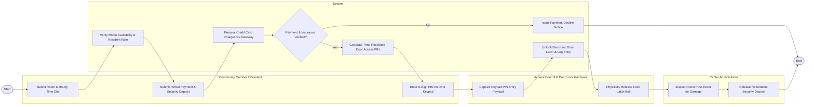

# Swimlane Diagram — Community Center Management System

## Mermaid Code

## Flow Description | Mô tả luồng

| Lane | Actor | Role in Flow |
|------|-------|-------------|
| 1 | Community Member / Resident | Selects room and hourly time slot, submits rental payment and security deposit, and enters 6-digit PIN on room door keypad. |
| 2 | System | Verifies room schedule availability, processes credit card charges via gateway, validates event insurance, generates time-restricted door PIN, unlocks door, and logs entry. |
| 3 | Access Control & Door Lock Hardware | Captures keypad PIN entry payload, verifies system authorization handshake, and physically releases door latch bolt. |
| 4 | Center Administrator | Inspects rented room post-event for cleanliness or damage, and authorizes full refund of the security deposit. |
