# Action Tree — Community Center Management System

## Mermaid Code

```mermaid
graph TD
    Root["Community Center Management System"]

    Root --> M1["Member & Family Profile Management"]
    Root --> M2["Recreation Class & Workshop Registration"]
    Root --> M3["Facility & Athletic Room Rental"]
    Root --> M4["Door Access & Smart Turnstile Control"]
    Root --> M5["Volunteer & Youth Program Coordination"]
    Root --> M6["Financial Billing & Municipal Reporting"]

    M1 --> A11["Register Community Resident Profiles"]
    M1 --> A12["Verify Municipal Address Residency Proof"]
    M1 --> A13["Link Household Family Members & Dependents"]
    M1 --> A14["Issue Digital Membership Barcode Passes"]

    M2 --> A21["Enroll in Swimming & Fitness Classes"]
    M2 --> A22["Manage Class Rosters & Student Headcounts"]
    M2 --> A23["Process Waitlists & Automated Seat Transfers"]
    M2 --> A24["Sign Digital Medical Release & Liability Waivers"]

    M3 --> A31["Reserve Banquet Halls & Athletic Fields"]
    M3 --> A32["Calculate Resident vs. Non-Resident Fee Tiers"]
    M3 --> A33["Process Security Deposits & Post-Event Refunds"]
    M3 --> A34["Schedule Equipment Add-Ons & AV Setup"]

    M4 --> A41["Generate Time-Restricted Electronic Door PINs"]
    M4 --> A42["Validate RFID Keycard Scans at Gym Turnstiles"]
    M4 --> A43["Log Door Entry Events & Tailgating Alerts"]
    M4 --> A44["Monitor Real-Time Center Occupancy Headcounts"]

    M5 --> A51["Register Community Volunteers & Shift Schedules"]
    M5 --> A52["Process Background Check Clearances"]
    M5 --> A53["Manage Senior Meal Programs & Day Camps"]
    M5 --> A54["Issue Volunteer Service Hour Certificates"]

    M6 --> A61["Export Daily Merchant Settlement Ledgers"]
    M6 --> A62["Generate Facility Utilization Heatmap Reports"]
    M6 --> A63["Process Low-Income Fee Assistance Subsidies"]
    M6 --> A64["File Annual Municipal Recreation Audits"]
```

## Module Description | Mô tả Module

| # | Module | Description | Actions |
|---|--------|-------------|---------|
| 1 | Member & Family Profile Management | Manages resident onboarding, verifies proof of residency, links household dependents, and issues digital membership QR passes. | Register Community Resident Profiles, Verify Municipal Address Residency Proof, Link Household Family Members & Dependents, Issue Digital Membership Barcode Passes |
| 2 | Recreation Class & Workshop Registration | Handles course sign-ups for swimming, yoga, and youth sports, manages student rosters, waitlists, and medical waivers. | Enroll in Swimming & Fitness Classes, Manage Class Rosters & Student Headcounts, Process Waitlists & Automated Seat Transfers, Sign Digital Medical Release & Liability Waivers |
| 3 | Facility & Athletic Room Rental | Manages reservations for halls, meeting rooms, and fields, calculates fee tiers, processes security deposits, and coordinates equipment add-ons. | Reserve Banquet Halls & Athletic Fields, Calculate Resident vs. Non-Resident Fee Tiers, Process Security Deposits & Post-Event Refunds, Schedule Equipment Add-Ons & AV Setup |
| 4 | Door Access & Smart Turnstile Control | Generates door PIN codes, validates RFID keycards at gym turnstiles, logs entry timestamps, and monitors live center occupancy. | Generate Time-Restricted Electronic Door PINs, Validate RFID Keycard Scans at Gym Turnstiles, Log Door Entry Events & Tailgating Alerts, Monitor Real-Time Center Occupancy Headcounts |
| 5 | Volunteer & Youth Program Coordination | Schedules volunteer shifts, verifies background checks, manages senior meal delivery/youth camps, and issues service hour certificates. | Register Community Volunteers & Shift Schedules, Process Background Check Clearances, Manage Senior Meal Programs & Day Camps, Issue Volunteer Service Hour Certificates |
| 6 | Financial Billing & Municipal Reporting | Exports daily credit card settlement ledgers, facility utilization heatmaps, fee subsidies, and municipal recreation audit files. | Export Daily Merchant Settlement Ledgers, Generate Facility Utilization Heatmap Reports, Process Low-Income Fee Assistance Subsidies, File Annual Municipal Recreation Audits |
