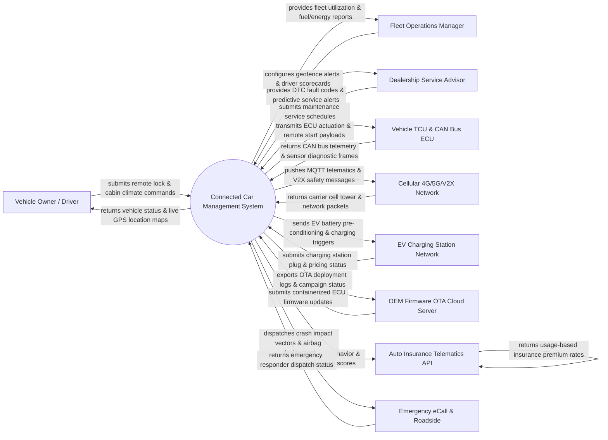

# Context Diagram — Connected Car Management System

## Mermaid Code

## Actor & Interaction Table | Bảng Actor & Tương tác

| # | Actor | Actor Type | Data Sent TO System | Data Received FROM System | Notes |
|---|-------|------------|---------------------|---------------------------|-------|
| 1 | Vehicle Owner / Driver | Primary | Remote door lock/unlock requests, cabin pre-climate temperature setpoints, horn/light triggers, destination nav inputs | Real-time vehicle location, fuel level / EV battery SOC, tire pressure (TPMS), door lock status, remote command ACK | End user controlling connected car features via mobile companion app or smartwatch. |
| 2 | Fleet Operations Manager | Primary | Geofence polygon rules, speed limit thresholds, driver assignment schedules, vehicle maintenance locks | Fleet location heatmaps, driver safety scorecards, fuel economy reports, unauthorized usage alerts | Commercial fleet manager governing corporate cars, delivery vans, or rental vehicles. |
| 3 | Dealership Service Advisor | Primary | Recommended service packages, recall notifications, maintenance appointment booking confirmations | Diagnostic Trouble Codes (DTCs), brake pad wear metrics, oil life percentages, mileage logs | Authorized dealership technician monitoring vehicle health for predictive maintenance. |
| 4 | Vehicle TCU & CAN Bus ECU | Primary / Hardware | CAN bus sensor frames (Speed, RPM, Odometer, Battery SOC, Airbag State), GPS NMEA sentences, DTC fault codes | Remote ECU actuation packets (Door Lock, Engine Start, Climate Relay), OTA firmware payload blocks | On-board Telematics Control Unit (TCU) and Controller Area Network (CAN) bus Electronic Control Units. |
| 5 | Cellular 4G/5G/V2X Network | Supporting System | Carrier network IP packets, SIM eSIM profile status, cell tower triangulation data, V2X mesh packets | Encrypted MQTT/CoAP telematics packets, V2I traffic signal priority requests | Mobile network operators (AT&T, Vodafone) and V2X infrastructure providing connectivity. |
| 6 | EV Charging Station Network | Supporting System | Charger plug availability, charge rate (kW), station location coordinates, electricity pricing | EV battery pre-conditioning commands, automated Plug & Charge authorization, charging schedules | Commercial EV charging networks (ChargePoint, Tesla Supercharger) facilitating EV charging. |
| 7 | OEM Firmware OTA Cloud Server | Supporting System | Encrypted ECU firmware binary packages (SREC/HEX files), OTA campaign manifests, software delta patches | Vehicle OTA campaign installation reports, ECU flashing verification tokens, rollback logs | Vehicle manufacturer (OEM) cloud infrastructure authorizing Over-The-Air software updates. |
| 8 | Auto Insurance Telematics API | Supporting System | Usage-Based Insurance (UBI) policy rules, driver risk tier definitions, premium discount quotes | Driver safety behavior metrics (hard braking, rapid acceleration, speeding, nighttime driving) | Insurance company API processing driver telematics for Usage-Based Insurance (UBI) discounts. |
| 9 | Emergency eCall & Roadside | Supporting System | Emergency dispatch confirmation, PSAP (Public Safety Answering Point) status, tow truck ETA | Crash severity index, GPS impact location, occupant count, airbag deployment notification | Statutory European eCall / OnStar emergency dispatch network assisting in crashes. |

## System Boundary Description | Mô tả Phạm vi Hệ thống

The **Connected Car Management System (CCMS)** is an automotive IoT telematics and remote vehicle management platform. Inside the system boundary, CCMS manages vehicle onboarding (VIN/TCU pairing), real-time CAN bus telemetry ingestion, remote command execution (door lock/unlock, engine start, cabin climate), EV battery charge optimization, predictive maintenance DTC alerts, driver safety scoring, Over-The-Air (OTA) ECU firmware updates, and automated eCall crash response. External to the system boundary are physical vehicle control units (TCU & CAN Bus ECUs), cellular mobile networks (Cellular 4G/5G Network), commercial charging stations (EV Charging Network), vehicle manufacturer servers (OEM Firmware OTA Cloud), insurance telematics platforms (Auto Insurance API), and emergency dispatch centers (Emergency eCall & Roadside Assistance).
