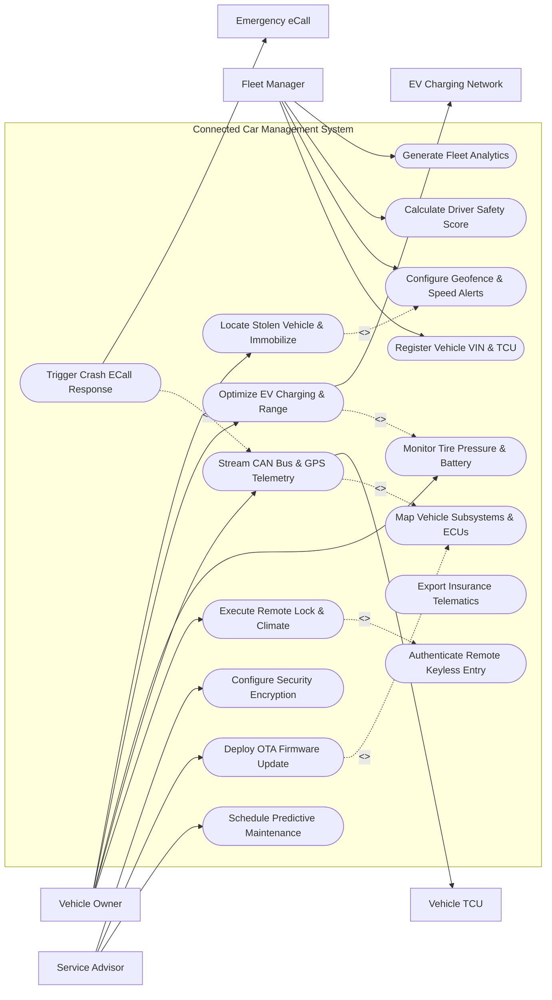

# Use Case Diagram — Connected Car Management System

## Mermaid Code

## Actor Table | Bảng Actor

| # | Actor | Actor Type | Role Description | Related Use Cases |
|---|-------|------------|------------------|-------------------|
| 1 | Vehicle Owner | Primary | Car owner using mobile app for remote door unlock, cabin pre-climate, locate car, and check battery. | UC03, UC05, UC06, UC09, UC13 |
| 2 | Fleet Manager | Primary | Commercial fleet manager registering VINs, tracking vehicle geofences, analyzing driver scores, and fleet reports. | UC01, UC10, UC12, UC15 |
| 3 | Service Advisor | Primary | Dealership service advisor scheduling maintenance, inspecting DTC codes, and deploying OTA updates. | UC07, UC08, UC16 |
| 4 | Vehicle TCU | Hardware | On-board Telematics Control Unit streaming CAN bus sensor data and executing ECU control commands. | UC05 |
| 5 | EV Charging Network | System | Commercial charging station network coordinating EV battery pre-conditioning and Plug & Charge payments. | UC09 |
| 6 | Emergency eCall | Safety System | Public Safety Answering Point (PSAP) receiving automated crash notifications and impact data. | UC11 |

## Use Case Table | Bảng Use Case

| # | UC ID | Use Case Name | Primary Actor | Secondary Actor | Description | Priority |
|---|-------|---------------|---------------|-----------------|-------------|----------|
| 1 | UC01 | Register Vehicle VIN & TCU | Fleet Manager | None | Registers vehicle Vehicle Identification Number (VIN), pairs TCU ICCID/eSIM, and provisions security keys. | High |
| 2 | UC02 | Map Vehicle Subsystems & ECUs | Service Advisor | None | Maps internal CAN/FlexRay/Ethernet ECU network topology (BCM, ECM, BMS, ABS, ADAS). | High |
| 3 | UC03 | Execute Remote Lock & Climate | Vehicle Owner | None | Issues remote door lock/unlock, engine start/stop, horn/light flash, and cabin pre-conditioning commands. | High |
| 4 | UC04 | Authenticate Remote Keyless Entry | Vehicle Owner | None | Verifies cryptographic token and PIN/biometric authentication before executing remote vehicle commands. | High |
| 5 | UC05 | Stream CAN Bus & GPS Telemetry | Vehicle Owner | Vehicle TCU | Ingests high-frequency CAN bus sensor frames (Speed, RPM, Fuel, Odometer, Lat/Long) over cellular MQTT. | High |
| 6 | UC06 | Monitor Tire Pressure & Battery | Vehicle Owner | None | Monitors TPMS tire pressure, 12V battery health, engine oil life percentage, and fluid levels. | High |
| 7 | UC07 | Schedule Predictive Maintenance | Service Advisor | None | Analyzes Diagnostic Trouble Codes (DTCs) and component wear to auto-schedule dealership service appointments. | High |
| 8 | UC08 | Deploy OTA Firmware Update | Service Advisor | None | Deploys Over-The-Air (OTA) ECU firmware binary packages and software patches to vehicle ECUs. | High |
| 9 | UC09 | Optimize EV Charging & Range | Vehicle Owner | EV Charging Network | Schedules EV charging during off-peak electricity hours, pre-conditions battery, and calculates real-world range. | High |
| 10 | UC10 | Configure Geofence & Speed Alerts | Fleet Manager | None | Draws geographical boundary polygons and speed thresholds, triggering notifications upon breach. | High |
| 11 | UC11 | Trigger Crash ECall Response | Vehicle Owner | Emergency eCall | Detects severe impact collision/airbag deployment and dispatches crash telemetry and GPS location to emergency services. | High |
| 12 | UC12 | Calculate Driver Safety Score | Fleet Manager | None | Analyzes hard braking, rapid acceleration, cornering g-force, and speeding to calculate weekly driver safety scores. | Medium |
| 13 | UC13 | Locate Stolen Vehicle & Immobilize | Vehicle Owner | None | Tracks live stolen vehicle GPS coordinates and sends authorized remote engine starter lockout commands. | High |
| 14 | UC14 | Export Insurance Telematics | Fleet Manager | None | Exports driver safety metrics to insurance partner APIs for Usage-Based Insurance (UBI) premium discounts. | Medium |
| 15 | UC15 | Generate Fleet Analytics | Fleet Manager | None | Exports total fleet fuel/kWh consumption, idle time percentages, vehicle utilization, and carbon emissions. | Medium |
| 16 | UC16 | Configure Security Encryption | Service Advisor | None | Configures AES-256 transport layer security (TLS 1.3) keys and SecOC (Secure Onboard Communication) tokens. | Low |

## Use Case Specification | Đặc tả Use Case

---

### UC01 — Register Vehicle VIN & TCU

| Field | Detail |
|-------|--------|
| **UC ID** | UC01 |
| **Use Case Name** | Register Vehicle VIN & TCU |
| **Actor(s)** | Primary: Fleet Manager / Secondary: None |
| **Description** | Registers a new connected vehicle into the system database by pairing its 17-character VIN with its Telematics Control Unit (TCU) IMEI, ICCID/eSIM, and provisioning security encryption keys. |
| **Precondition** | 1. User holds Fleet Manager or Administrator privileges.   2. Vehicle is equipped with a compatible telematics unit connected to the CAN bus network. |
| **Main Flow** | 1. Actor selects "Add New Connected Vehicle".   2. System presents vehicle registration form requesting 17-character Vehicle Identification Number (VIN), Vehicle Make, Model, Model Year, Engine/Drivetrain Type (ICE, EV, PHEV), and License Plate.   3. Actor inputs Telematics Control Unit (TCU) hardware details: TCU Serial Number, Cellular IMEI, eSIM ICCID, and MAC Address.   4. System queries OEM master VIN decoder database to verify vehicle specifications and subsystem ECU list (UC02).   5. System generates unique PKI X.509 client certificate and SecOC cryptographic token for secure vehicle-to-cloud communication.   6. System transmits initial provisioning packet over cellular network to the vehicle's TCU.   7. TCU receives provisioning packet, verifies cryptographic handshake, and returns success acknowledgment.   8. System stores Connected_Vehicle entity and sets status to "Active - Online". |
| **Alternative Flow** | **AF1** — Bulk Fleet Import: Fleet Manager uploads CSV containing 100 VINs and TCU serial numbers; System processes batch registration and provisions security tokens.   **AF2** — QR Code Scan Pairing: Owner scans QR code on vehicle center console display using mobile companion app to link car to owner account. |
| **Exception Flow** | **EX1** — Invalid VIN Checksum: If entered VIN fails ISO 3779 checksum validation, System halts registration with error "Invalid VIN format or checksum error."   **EX2** — TCU Provisioning Timeout: If TCU fails to complete cellular security handshake within 60 seconds, System alerts "Cellular handshake failed. Verify SIM activation and cellular signal." |
| **Postcondition** | A Connected_Vehicle and Telematics_TCU record are stored, establishing encrypted telematics communication between vehicle and cloud. |
| **Business Rule** | **BR1**: Every connected vehicle must possess a unique X.509 digital security certificate to prevent unauthorized vehicle spoofing. |

---

### UC03 — Execute Remote Lock & Climate Command

| Field | Detail |
|-------|--------|
| **UC ID** | UC03 |
| **Use Case Name** | Execute Remote Lock & Climate Command |
| **Actor(s)** | Primary: Vehicle Owner / Secondary: None |
| **Description** | Allows a vehicle owner to issue remote commands from a mobile app (Door Lock/Unlock, Remote Engine Start, Cabin Pre-Conditioning, Horn/Lights) to the vehicle. |
| **Precondition** | 1. Vehicle is paired to owner mobile app (UC01) and in "Online" cellular standby mode.   2. User authenticates via PIN, Touch ID, or Face ID (UC04). |
| **Main Flow** | 1. Actor opens Mobile App and selects remote command action: e.g. "Lock Doors" or "Pre-Heat Cabin to 22°C".   2. System triggers UC04 (Authenticate Remote Keyless Entry) prompting biometric or PIN verification.   3. Upon successful authentication, System constructs encrypted command payload containing Command Code (`CMD_DOOR_LOCK`), Expiration Timestamp (30 sec TTL), and SecOC signature.   4. System transmits command payload via MQTT/APNs push notification over Cellular Network to the vehicle's TCU.   5. Vehicle TCU receives payload, verifies cryptographic signature, passes command over CAN bus to Body Control Module (BCM), and actuates door lock actuators.   6. BCM verifies physical door latch status ("All Doors Locked") and returns execution ACK payload back over cellular network.   7. System receives ACK payload, updates vehicle state in database, and updates mobile app UI displaying "Doors Locked" with green confirmation badge. |
| **Alternative Flow** | **AF1** — Remote Cabin Pre-Conditioning (EV): Owner sets cabin temp to 21°C; System commands HVAC compressor and battery heater to pre-condition cabin while connected to EV charger.   **AF2** — Flash Lights & Sound Horn: Owner triggers "Find My Car"; System commands BCM to flash hazard lights 5 times and beep horn twice. |
| **Exception Flow** | **EX1** — Door Ajar Prevention: If driver door is physically open when lock command is sent, BCM rejects lock and returns error "Door Ajar - Cannot Lock".   **EX2** — Low Fuel / Low Battery Lockout: If owner sends Remote Engine Start but fuel level is <10% (or EV battery <15%), System halts command with warning "Remote Start disabled due to low fuel/battery." |
| **Postcondition** | Remote command is executed on the vehicle CAN bus ECU and owner mobile app displays confirmed execution status. |
| **Business Rule** | **BR1**: Remote engine start commands must automatically shut off after 15 minutes of idling if driver key is not detected inside cabin. |

---

### UC05 — Stream Real-Time CAN Bus & GPS Telemetry

| Field | Detail |
|-------|--------|
| **UC ID** | UC05 |
| **Use Case Name** | Stream Real-Time CAN Bus & GPS Telemetry |
| **Actor(s)** | Primary: Vehicle Owner / Secondary: Vehicle TCU |
| **Description** | Continuously ingests high-frequency CAN bus sensor telemetry (speed, RPM, fuel level, EV battery SOC, tire pressure, GPS location, DTC codes) over cellular networks. |
| **Precondition** | 1. Vehicle TCU is powered on and connected to cellular network.   2. Vehicle ignition is ON (or active in background telematics mode). |
| **Main Flow** | 1. Vehicle TCU samples CAN bus message frames at programmed intervals (e.g. 1 Hz for GPS/Speed, 10 Hz for acceleration, 0.1 Hz for tire pressure).   2. TCU compresses telemetry data frames into Protobuf/MQTT binary packets.   3. TCU transmits encrypted telematics packets over 4G/5G Cellular Network to the cloud telematics ingest gateway.   4. System decodes binary CAN messages using vehicle DBC database file, parsing specific metrics: Vehicle Speed (km/h), Engine RPM, Fuel Level (%), EV Battery SOC (%), Tire Pressures (PSI), Odometer (km), and GPS Latitude/Longitude.   5. System checks metrics against threshold limits (e.g., Low Tire Pressure UC06, High Water Temp, Diagnostic Trouble Code DTCs).   6. System updates live vehicle state in database, updates live vehicle location map on owner/fleet mobile apps, and archives historical telemetry in time-series database. |
| **Alternative Flow** | **AF1** — Cellular Dead Zone Buffer: Vehicle enters underground tunnel with no cellular service; TCU buffers up to 48 hours of telematics data in internal flash memory and flushes buffer upon reconnecting to network.   **AF2** — High-Frequency Event Trigger: G-force sensor detects sudden hard braking (>0.5g); TCU immediately switches telemetry frequency to 50 Hz to capture detailed crash/braking dynamics. |
| **Exception Flow** | **EX1** — CAN Bus Communication Error: If TCU loses communication with Engine Control Module (ECM), TCU logs "CAN Bus Bus-Off Error" and transmits diagnostic alert to cloud.   **EX2** — GPS Jamming / Spoofing: If GPS signal is lost, System uses cellular tower triangulation fallback and flags potential location tampering. |
| **Postcondition** | Real-time vehicle telematics are persisted in time-series logs and rendered on owner/fleet dashboards. |
| **Business Rule** | **BR1**: High-frequency telematics ingestion must encrypt all GPS location data at rest and in transit to comply with automotive data privacy regulations. |

---

### UC08 — Deploy Over-The-Air OTA Firmware Update

| Field | Detail |
|-------|--------|
| **UC ID** | UC08 |
| **Use Case Name** | Deploy Over-The-Air OTA Firmware Update |
| **Actor(s)** | Primary: Service Advisor / Secondary: None |
| **Description** | Deploys containerized Over-The-Air (OTA) ECU firmware update packages to target vehicles, verifying software integrity, pre-installation safety checks, and ECU flashing. |
| **Precondition** | 1. OEM software release is approved and signed by OEM Firmware Cloud.   2. Target vehicle is parked, in "OFF" state, with >50% 12V battery and EV main battery. |
| **Main Flow** | 1. Service Advisor (or automated OEM campaign) creates "OTA Firmware Campaign" for target VINs.   2. System downloads encrypted ECU binary update package (SREC/HEX delta patch) and release manifest from OEM Firmware Cloud.   3. System sends OTA update availability push notification to vehicle owner mobile app detailing release notes and estimated install time (e.g. 25 mins).   4. Vehicle Owner approves installation and schedules installation time (or selects "Install Now").   5. System streams encrypted firmware binary payload over cellular network to vehicle TCU background storage.   6. Vehicle TCU executes pre-installation safety checks: verifies vehicle is parked, handbrake engaged, doors closed, and battery >50%.   7. TCU puts target ECU (e.g. Infotainment, Power Steering, Battery Management System) into bootloader flashing mode and flashes new firmware.   8. TCU executes post-flashing checksum verification, resets ECU, and verifies nominal CAN bus communication.   9. System receives success ACK, updates vehicle software inventory ledger, and sends completion notification to owner and dealership. |
| **Alternative Flow** | **AF1** — Automatic Background Download over Home Wi-Fi: Vehicle connects to home Wi-Fi while parked in garage; TCU downloads firmware package over Wi-Fi to save cellular data.   **AF2** — Silent Telematics Unit Patch: Critical security patch for TCU is deployed silently without requiring full vehicle shutdown. |
| **Exception Flow** | **EX1** — Firmware Flashing Checksum Error: If flashed ECU binary fails SHA-256 verification, TCU automatically triggers roll-back sequence restoring previous working firmware version.   **EX2** — Vehicle Started During Install Attempt: If driver steps into car and depresses brake pedal prior to install start, System cancels installation and prompts "OTA update deferred: Vehicle in use." |
| **Postcondition** | Target ECU is successfully flashed with updated firmware version and logged in the vehicle software ledger. |
| **Business Rule** | **BR1**: OTA ECU firmware flashing must strictly enforce automated dual-bank rollback safety to restore previous firmware if installation is interrupted. |

---

### UC11 — Trigger Crash ECall & Emergency Response

| Field | Detail |
|-------|--------|
| **UC ID** | UC11 |
| **Use Case Name** | Trigger Crash ECall & Emergency Response |
| **Actor(s)** | Primary: Vehicle Owner / Secondary: Emergency eCall |
| **Description** | Automatically detects severe vehicle impact collisions or airbag deployments, transmitting high-priority crash location vectors, occupant count, and impact severity to emergency services. |
| **Precondition** | 1. Vehicle is equipped with statutory eCall/OnStar hardware integrated with airbag sensing crash sensors.   2. Emergency response network (PSAP) integration is active. |
| **Main Flow** | 1. Vehicle suffers severe collision; Airbag Control Unit (ACU) fires airbag inflators or seatbelt pretensioners.   2. ACU immediately transmits high-priority crash event pulse over CAN bus to TCU.   3. TCU overrides all non-essential cellular traffic and opens dedicated high-priority Emergency Data Packet (Minimum Set of Data - MSD).   4. TCU populates MSD payload: Exact GPS Latitude/Longitude, Vehicle Direction of Travel, Timestamp, VIN, Fuel Type (ICE/EV), Occupant Seatbelt Sensor Count, and Crash Delta-V Severity Index.   5. TCU opens emergency voice call channel to Public Safety Answering Point (PSAP) emergency operator.   6. System simultaneously receives eCall telemetry packet, alerts emergency dispatch team, and sends SMS emergency notification to owner's designated emergency contacts.   7. PSAP operator speaks to vehicle cabin occupants over hands-free speaker; if no response, operator dispatches police, ambulance, and fire rescue to GPS coordinates. |
| **Alternative Flow** | **AF1** — Manual SOS Button Press: Occupant presses overhead console physical "SOS" red button during medical emergency; System initiates eCall voice link and transmits current GPS position.   **AF2** — EV Battery Thermal Runaway Crash Alert: Collision damages EV battery pack; System sends thermal alert to fire department warning of high-voltage lithium battery hazard. |
| **Exception Flow** | **EX1** — Primary Cellular Antenna Damaged: If primary roof antenna is destroyed during rollover, TCU automatically switches to internal backup emergency antenna and internal lithium battery.   **EX2** — False Positive Bumper Impact: Low-speed parking bump (<5 km/h) triggers sensor; System displays 10-second cancel countdown on dashboard allowing driver to press "Cancel eCall". |
| **Postcondition** | Emergency crash telemetry is delivered to PSAP emergency services within 5 seconds of impact, initiating immediate rescue dispatch. |
| **Business Rule** | **BR1**: Automated eCall crash telemetry packets (MSD) must be transmitted with top network priority within 5 seconds of airbag deployment. |
