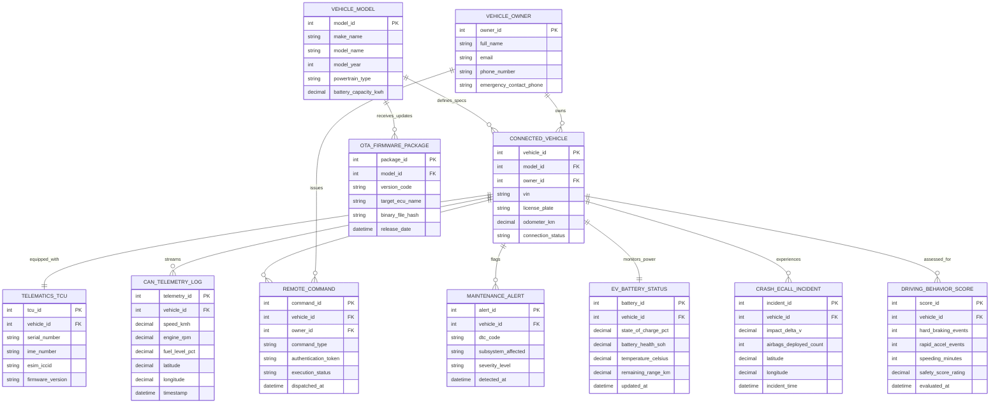

# Conceptual ERD — Connected Car Management System

## Mermaid Code

## Entity Description Table | Bảng mô tả Entity

| # | Entity Name | Vietnamese Name | Description | Key Attributes | Main Relationships |
|---|-------------|-----------------|-------------|----------------|-------------------|
| 1 | VEHICLE_MODEL | Dòng Xe / Model | Vehicle manufacturer model specifications (Make, Model, Year, Powertrain, Battery size). | model_id (PK), make_name, model_name, powertrain_type, battery_capacity_kwh | Defines specs for Connected Vehicles, receives OTA Firmware Packages |
| 2 | VEHICLE_OWNER | Chủ Sở hữu Xe | Vehicle owner or primary driver profile managing connected vehicle controls. | owner_id (PK), full_name, email, phone_number, emergency_contact_phone | Owns Connected Vehicles, issues Remote Commands |
| 3 | CONNECTED_VEHICLE | Xe kết nối (VIN) | Physical connected car instance identified by 17-character VIN and telematics status. | vehicle_id (PK), model_id (FK), owner_id (FK), vin, license_plate, connection_status | Defined by Model, owned by Owner, equipped with TCU, streams Telemetry |
| 4 | TELEMATICS_TCU | Bộ Telematics TCU | On-board Telematics Control Unit hardware equipped with cellular eSIM and firmware. | tcu_id (PK), vehicle_id (FK), serial_number, ime_number, esim_iccid, firmware_version | Equipped on Connected Vehicle |
| 5 | CAN_TELEMETRY_LOG | Nhật ký Telemetry CAN | High-frequency CAN bus sensor log recording vehicle speed, RPM, GPS coordinates, and fuel level. | telemetry_id (PK), vehicle_id (FK), speed_kmh, fuel_level_pct, latitude, longitude | Streamed from Connected Vehicle |
| 6 | REMOTE_COMMAND | Lệnh Điều khiển Từ xa | Remote command issued from mobile app (Lock/Unlock, Pre-Climate, Remote Start, Horn). | command_id (PK), vehicle_id (FK), owner_id (FK), command_type, execution_status | Issued by Owner, received by Connected Vehicle |
| 7 | MAINTENANCE_ALERT | Báo động Bảo trì DTC | Diagnostic Trouble Code (DTC) alert flagging engine, brake, or battery sensor faults. | alert_id (PK), vehicle_id (FK), dtc_code, subsystem_affected, severity_level | Flagged by Connected Vehicle |
| 8 | EV_BATTERY_STATUS | Trạng thái Pin EV | Real-time high-voltage EV battery status tracking State of Charge (SOC), SOH, and range. | battery_id (PK), vehicle_id (FK), state_of_charge_pct, battery_health_soh, remaining_range_km | Monitors Connected Vehicle power |
| 9 | CRASH_ECALL_INCIDENT | Sự cố Va chạm eCall | Severe collision incident record logging impact delta-V, airbag deployment, and crash GPS. | incident_id (PK), vehicle_id (FK), impact_delta_v, airbags_deployed_count, latitude | Experienced by Connected Vehicle |
| 10 | DRIVING_BEHAVIOR_SCORE | Đánh giá Hành vi Lái xe | Telematics evaluation of driver safety based on hard braking, rapid acceleration, and speeding. | score_id (PK), vehicle_id (FK), hard_braking_events, rapid_accel_events, safety_score_rating | Assessed for Connected Vehicle |
| 11 | OTA_FIRMWARE_PACKAGE | Bản Firmware OTA | Containerized binary firmware update package released by vehicle OEM for ECU flashing. | package_id (PK), model_id (FK), version_code, target_ecu_name, binary_file_hash | Updates Vehicle Model |

## Relationship Description | Mô tả Quan hệ

| # | From Entity | Cardinality | To Entity | Relationship Label | Business Explanation |
|---|-------------|-------------|-----------|-------------------|----------------------|
| 1 | VEHICLE_MODEL | one-to-many | CONNECTED_VEHICLE | defines_specs | A Vehicle Model defines specifications for multiple Connected Vehicles. |
| 2 | VEHICLE_OWNER | one-to-many | CONNECTED_VEHICLE | owns | A Vehicle Owner owns one or multiple Connected Vehicles. |
| 3 | CONNECTED_VEHICLE | one-to-one | TELEMATICS_TCU | equipped_with | A Connected Vehicle is equipped with a single Telematics TCU unit. |
| 4 | CONNECTED_VEHICLE | one-to-many | CAN_TELEMETRY_LOG | streams | A Connected Vehicle streams high-frequency CAN Telemetry Logs. |
| 5 | CONNECTED_VEHICLE | one-to-many | REMOTE_COMMAND | receives | A Connected Vehicle receives multiple Remote Commands over time. |
| 6 | VEHICLE_OWNER | one-to-many | REMOTE_COMMAND | issues | A Vehicle Owner issues multiple Remote Commands. |
| 7 | CONNECTED_VEHICLE | one-to-many | MAINTENANCE_ALERT | flags | A Connected Vehicle flags multiple Diagnostic Maintenance Alerts. |
| 8 | CONNECTED_VEHICLE | one-to-one | EV_BATTERY_STATUS | monitors_power | A Connected Vehicle monitors its power via an EV Battery Status record. |
| 9 | CONNECTED_VEHICLE | one-to-many | CRASH_ECALL_INCIDENT | experiences | A Connected Vehicle can experience Crash eCall Incidents. |
| 10 | CONNECTED_VEHICLE | one-to-many | DRIVING_BEHAVIOR_SCORE | assessed_for | A Connected Vehicle is assessed for periodic Driving Behavior Scores. |
| 11 | VEHICLE_MODEL | one-to-many | OTA_FIRMWARE_PACKAGE | receives_updates | A Vehicle Model receives multiple OTA Firmware Packages. |
