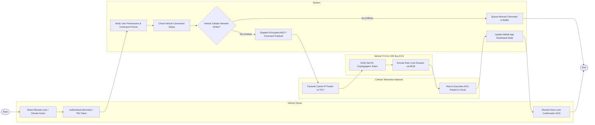

# Swimlane Diagram — Connected Car Management System

## Mermaid Code

## Flow Description | Mô tả luồng

| Lane | Actor | Role in Flow |
|------|-------|-------------|
| 1 | Vehicle Owner | Selects remote command (e.g. Lock Doors / Pre-Climate) on mobile app, authenticates via biometric PIN, and receives execution ACK. |
| 2 | System | Validates owner permissions, checks vehicle cellular connection state, handles command queue buffering if offline, dispatches encrypted MQTT payloads, and updates mobile app UI. |
| 3 | Cellular Telematics Network | Routes encrypted carrier IP packets over 4G/5G mobile networks to the vehicle's eSIM, and returns execution ACK packets back to the cloud. |
| 4 | Vehicle TCU & CAN Bus ECU | Verifies SecOC cryptographic security tokens, passes command over CAN bus to Body Control Module (BCM), and actuates door lock motors. |
