# Action Tree — Connected Car Management System

## Mermaid Code

```mermaid
graph TD
    Root["Connected Car Management System"]

    Root --> M1["Vehicle Onboarding & Telematics Pairing"]
    Root --> M2["Remote Commands & Access Control"]
    Root --> M3["Real-Time Telemetry & Diagnostic Health"]
    Root --> M4["EV Charging & Range Management"]
    Root --> M5["OTA Firmware & Software Management"]
    Root --> M6["Emergency eCall & Driver Safety Analytics"]

    M1 --> A11["Register Vehicle VIN & Model Specs"]
    M1 --> A12["Pair TCU Hardware & Cellular eSIM"]
    M1 --> A13["Provision X.509 Security Certificates"]
    M1 --> A14["Map Internal CAN Bus ECU Subsystems"]

    M2 --> A21["Execute Remote Door Lock & Unlock"]
    M2 --> A22["Pre-Condition Cabin Climate Temperature"]
    M2 --> A23["Trigger Remote Engine Start & Lockout"]
    M2 --> A24["Flash Hazard Lights & Sound Horn"]

    M3 --> A31["Stream High-Frequency CAN Bus Metrics"]
    M3 --> A32["Monitor Tire Pressure & 12V Battery"]
    M3 --> A33["Detect Diagnostic Trouble Codes DTC"]
    M3 --> A34["Schedule Predictive Dealership Service"]

    M4 --> A41["Schedule Off-Peak EV Charging Times"]
    M4 --> A42["Pre-Condition EV Battery Temperature"]
    M4 --> A43["Locate Commercial EV Charging Stations"]
    M4 --> A44["Calculate Real-World Driving Range"]

    M5 --> A51["Download OEM ECU Firmware Delta Patches"]
    M5 --> A52["Execute Pre-Install Vehicle Safety Checks"]
    M5 --> A53["Flash ECU Firmware via TCU Bootloader"]
    M5 --> A54["Verify SHA-256 Checksums & Rollback"]

    M6 --> A61["Detect Airbag Deployment & Crash Impact"]
    M6 --> A62["Transmit Minimum Set of Data MSD to eCall"]
    M6 --> A63["Calculate Driver Safety Scorecards"]
    M6 --> A64["Export Telematics to Usage-Based Insurance"]
```

## Module Description | Mô tả Module

| # | Module | Description | Actions |
|---|--------|-------------|---------|
| 1 | Vehicle Onboarding & Telematics Pairing | Registers 17-character VINs, pairs TCU hardware eSIMs, provisions X.509 security certificates, and maps CAN bus ECU topologies. | Register Vehicle VIN & Model Specs, Pair TCU Hardware & Cellular eSIM, Provision X.509 Security Certificates, Map Internal CAN Bus ECU Subsystems |
| 2 | Remote Commands & Access Control | Manages mobile app remote commands including door lock/unlock, cabin climate pre-conditioning, engine start, and horn/light triggers. | Execute Remote Door Lock & Unlock, Pre-Condition Cabin Climate Temperature, Trigger Remote Engine Start & Lockout, Flash Hazard Lights & Sound Horn |
| 3 | Real-Time Telemetry & Diagnostic Health | Ingests CAN bus sensor streams, monitors TPMS tire pressure, detects Diagnostic Trouble Codes (DTCs), and schedules dealership service. | Stream High-Frequency CAN Bus Metrics, Monitor Tire Pressure & 12V Battery, Detect Diagnostic Trouble Codes DTC, Schedule Predictive Dealership Service |
| 4 | EV Charging & Range Management | Schedules EV charging during off-peak power hours, pre-conditions battery temperature, locates charging stations, and predicts driving range. | Schedule Off-Peak EV Charging Times, Pre-Condition EV Battery Temperature, Locate Commercial EV Charging Stations, Calculate Real-World Driving Range |
| 5 | OTA Firmware & Software Management | Downloads OEM ECU software delta patches over-the-air, executes pre-install safety checks, flashes ECUs via TCU, and manages rollbacks. | Download OEM ECU Firmware Delta Patches, Execute Pre-Install Vehicle Safety Checks, Flash ECU Firmware via TCU Bootloader, Verify SHA-256 Checksums & Rollback |
| 6 | Emergency eCall & Driver Safety Analytics | Detects airbag crash deployment, transmits eCall Minimum Set of Data (MSD) to emergency services, scores driver safety, and exports UBI data. | Detect Airbag Deployment & Crash Impact, Transmit Minimum Set of Data MSD to eCall, Calculate Driver Safety Scorecards, Export Telematics to Usage-Based Insurance |
