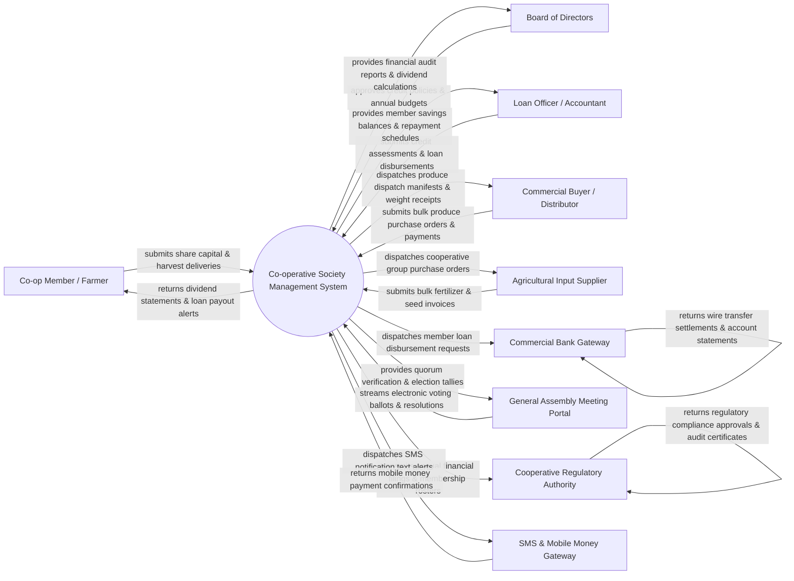

# Context Diagram — Co-operative Society Management System

## Mermaid Code

## Actor & Interaction Table | Bảng Actor & Tương tác

| # | Actor | Actor Type | Data Sent TO System | Data Received FROM System | Notes |
|---|-------|------------|---------------------|---------------------------|-------|
| 1 | Co-op Member / Farmer | Primary | Share capital subscriptions, micro-credit loan applications, crop harvest deliveries, AGM voting ballots | Member dividend statements, savings account balances, loan payout SMS notifications, harvest receipts | Farmers, artisans, or smallholders owning shares in the cooperative society. |
| 2 | Board of Directors | Primary | Credit policy limits, annual budget allocations, profit distribution ratios, board meeting resolutions | Financial balance sheets, patronage dividend calculations, audit logs, member growth metrics | Elected cooperative board members governing strategy, policies, and profit allocation. |
| 3 | Loan Officer / Accountant | Primary | Member creditworthiness scores, loan underwriting decisions, cash collection entries, journal vouchers | Member savings ledgers, loan repayment schedules, aging debt reports, trial balance sheets | Staff managing daily accounting, savings collections, and loan underwriting. |
| 4 | Commercial Buyer / Wholesale Distributor | Supporting System | Bulk agricultural purchase orders, contract bids, wire transfer payment confirmations | Produce dispatch manifests, certified weight scale receipts, quality grade certificates | B2B buyers purchasing bulk grain, coffee, milk, or goods from the cooperative. |
| 5 | Agricultural Input Supplier | Supporting System | Bulk fertilizer/seed price quotes, inventory availability, shipment delivery invoices | Group purchase orders, consolidated member supply requisitions, wire payments | Vendors supplying bulk agricultural inputs, tools, and equipment at group discounts. |
| 6 | Commercial Bank Gateway | Supporting System | Bank account balance updates, wire transfer settlements, direct deposit receipts | Member loan payout requests, supplier invoice payment authorizations, payroll files | Partner commercial banks or credit union federations processing electronic funds. |
| 7 | General Assembly Meeting Portal | Supporting System | Electronic voting ballots, attendee sign-in tokens, resolution amendment submissions | Quorum threshold verifications, real-time election tallies, approved AGM minutes | Digital voting and proxy system used during Annual General Meetings (AGMs). |
| 8 | Cooperative Regulatory Authority | Regulatory System | Statutory cooperative laws, audit standards, tax exemption regulations, licensing rules | Annual financial audit filings, board election results, membership rosters, tax returns | Government department of cooperatives supervising legal compliance and governance. |
| 9 | SMS & Mobile Money Gateway | Supporting System | Mobile money (M-Pesa/Airtel) deposit notifications, SMS delivery receipts | Automated SMS text alerts (loan due dates, dividend payouts), mobile payout triggers | Telecom gateways enabling mobile money payments and SMS member alerts in rural areas. |

## System Boundary Description | Mô tả Phạm vi Hệ thống

The **Co-operative Society Management System (CSMS)** is an integrated financial, operational, and governance enterprise software platform. Inside the system boundary, CSMS manages member share capital subscriptions, member savings accounts, micro-credit loan underwriting, crop harvest delivery grading, collective input purchasing, bulk produce sales, patronage dividend calculations, AGM voting, and regulatory compliance. External to the system boundary are individual cooperative members (Co-op Member), commercial bank networks (Commercial Bank Gateway), mobile money operators (Mobile Money Gateway), wholesale buyers (Commercial Buyer), agricultural vendors (Input Supplier), AGM voting portals (AGM Portal), and government cooperative registrars (Cooperative Regulatory Authority).
