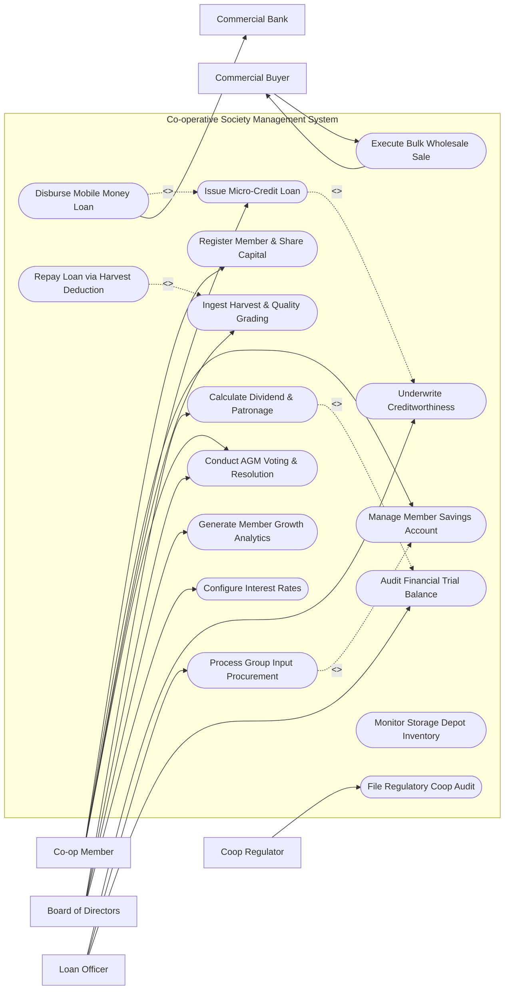

# Use Case Diagram — Co-operative Society Management System

## Mermaid Code

## Actor Table | Bảng Actor

| # | Actor | Actor Type | Role Description | Related Use Cases |
|---|-------|------------|------------------|-------------------|
| 1 | Co-op Member | Primary | Cooperative shareholder (farmer, artisan) depositing savings, applying for loans, delivering crops, and voting in AGMs. | UC01, UC02, UC03, UC05, UC11 |
| 2 | Board of Directors | Primary | Elected board governing cooperative credit policy, calculating dividends, conducting AGMs, and setting interest rates. | UC08, UC11, UC15, UC16 |
| 3 | Loan Officer | Primary | Accountant and loan officer underwriting member credit, managing group input purchasing, and auditing trial balances. | UC04, UC06, UC12 |
| 4 | Commercial Buyer | Primary | Wholesale distributor or food processor buying bulk agricultural commodities from the cooperative depot. | UC07 |
| 5 | Commercial Bank | System | Banking and mobile money integration gateway facilitating electronic loan disbursements and dividend payouts. | UC09 |
| 6 | Coop Regulator | Regulatory System | Government Registrar of Cooperatives auditing annual financial returns, share limits, and governance compliance. | UC14 |

## Use Case Table | Bảng Use Case

| # | UC ID | Use Case Name | Primary Actor | Secondary Actor | Description | Priority |
|---|-------|---------------|---------------|-----------------|-------------|----------|
| 1 | UC01 | Register Member & Share Capital | Co-op Member | None | Onboards a new cooperative member, records mandatory share capital purchases, and issues membership card. | High |
| 2 | UC02 | Manage Member Savings Account | Co-op Member | None | Manages voluntary member savings deposits, withdrawal requests, and interest calculations on savings. | High |
| 3 | UC03 | Issue Micro-Credit Loan | Co-op Member | Commercial Bank | Processes agricultural or emergency micro-credit loan requests, checking share capital multiplier limits. | High |
| 4 | UC04 | Underwrite Creditworthiness | Loan Officer | None | Assesses member loan repayment history, share capital balance, crop yield projections, and guarantor backing. | High |
| 5 | UC05 | Ingest Harvest & Quality Grading | Co-op Member | None | Records crop harvest weigh-in at depot, grades quality (Grade A/B/C), and issues electronic receipt. | High |
| 6 | UC06 | Process Group Input Procurement | Loan Officer | None | Aggregates member orders for seeds and fertilizers, procuring bulk inputs at wholesale discount rates. | High |
| 7 | UC07 | Execute Bulk Wholesale Sale | Commercial Buyer | Commercial Buyer | Sells consolidated depot crop inventory to wholesale buyers, generating commercial invoices and contracts. | High |
| 8 | UC08 | Calculate Dividend & Patronage | Board of Directors | None | Calculates annual net surplus allocation: dividend on share capital + patronage refund based on member sales. | High |
| 9 | UC09 | Disburse Mobile Money Loan | Co-op Member | Commercial Bank | Disburses approved loan funds or dividend payouts directly to member mobile money wallets (e.g. M-Pesa). | High |
| 10 | UC10 | Repay Loan via Harvest Deduction | Co-op Member | None | Automatically deducts outstanding member loan principal and interest from crop harvest delivery payouts. | High |
| 11 | UC11 | Conduct AGM Voting & Resolution | Co-op Member | None | Verifies AGM quorum, presents board resolutions, and tabulates democratic one-member-one-vote election ballots. | High |
| 12 | UC12 | Audit Financial Trial Balance | Loan Officer | None | Reconciles general ledger entries, member savings balances, loan portfolios, and generates balance sheets. | High |
| 13 | UC13 | Monitor Storage Depot Inventory | Loan Officer | None | Tracks grain/crop tonnage in cooperative warehouses, monitoring moisture levels and shrinkage loss. | Medium |
| 14 | UC14 | File Regulatory Coop Audit | Coop Regulator | None | Generates mandatory annual financial audit filings and board election compliance returns for government registrars. | High |
| 15 | UC15 | Generate Member Growth Analytics | Board of Directors | None | Exports member demographics, loan repayment rates, crop yield trends, and cooperative equity growth dashboards. | Medium |
| 16 | UC16 | Configure Interest Rates | Board of Directors | None | Sets cooperative interest rates for member savings deposits and micro-credit loan categories. | Medium |

## Use Case Specification | Đặc tả Use Case

---

### UC01 — Register Member & Share Capital

| Field | Detail |
|-------|--------|
| **UC ID** | UC01 |
| **Use Case Name** | Register Member & Share Capital |
| **Actor(s)** | Primary: Co-op Member / Secondary: None |
| **Description** | Onboards a new member into the cooperative society, registering personal/farm details, collecting mandatory share capital subscriptions, and issuing a membership certificate. |
| **Precondition** | 1. Applicant meets cooperative membership eligibility requirements.   2. Co-op accountant has administrative access to member ledger. |
| **Main Flow** | 1. Applicant submits membership application form with National ID, Tax ID, Address, Farm Acreage, and Next of Kin.   2. Accountant enters member details into System.   3. System checks duplicate national ID records across existing cooperative database.   4. Accountant records initial payment: Registration Fee ($10) + Mandatory Share Capital Subscription (e.g. 50 shares @ $5/share = $250).   5. System generates unique Member ID (e.g. `MEM-2026-0419`), opens Member Share Capital ledger, and initializes Member Savings Account (UC02).   6. System calculates member voting eligibility status (Eligible once minimum share threshold is paid).   7. System prints official Cooperative Membership Certificate and dispatches welcome SMS alert. |
| **Alternative Flow** | **AF1** — Installment Share Payment: Member pays 20% initial share deposit; System sets status to "Provisional Member - Partial Shares" until full subscription is paid within 6 months.   **AF2** — Joint / Group Membership: Registering a registered farmer self-help group as a collective member unit. |
| **Exception Flow** | **EX1** — Duplicate National ID: If national ID is already registered to an active member, System halts registration with error "Applicant already registered as MEM-0812."   **EX2** — Share Cap Exceeded: If member attempts to purchase >20% of total cooperative share capital, System blocks transaction per cooperative law limits. |
| **Postcondition** | Coop_Member and Member_Share_Capital records are created, enabling member participation in loans, harvest delivery, and AGM voting. |
| **Business Rule** | **BR1**: No single member shall own or control more than 20% of the total issued share capital of the cooperative society. |

---

### UC03 — Issue Micro-Credit Loan to Member

| Field | Detail |
|-------|--------|
| **UC ID** | UC03 |
| **Use Case Name** | Issue Micro-Credit Loan to Member |
| **Actor(s)** | Primary: Co-op Member / Secondary: Commercial Bank |
| **Description** | Processes agricultural input or emergency micro-credit loan applications for cooperative members, enforcing share capital leverage limits and guarantor approvals. |
| **Precondition** | 1. Member has been active for at least 3 months with fully paid minimum share capital (UC01).   2. Member has no defaulted outstanding loans. |
| **Main Flow** | 1. Member submits loan application requesting Loan Amount ($1,000), Loan Purpose (Crop Input / Fertilizer), and Repayment Period (6 months).   2. System checks member share capital balance: verifies requested loan does not exceed maximum leverage multiplier (e.g. Max Loan = 3x Share Capital + Savings).   3. Member inputs two co-signor Guarantors (must be active co-op members with unencumbered shares).   4. System sends SMS verification to Guarantors requesting digital pledge approval.   5. System triggers UC04 (Underwrite Creditworthiness); Loan Officer reviews application, credit score, and farm yield history, approving the loan.   6. System generates Loan Agreement Contract detailing Principal ($1,000), Annual Interest Rate (12%), and Monthly Repayment Schedule.   7. Member signs agreement; System triggers UC09 (Disburse Mobile Money Loan), transferring funds to member mobile wallet or bank account.   8. System logs Member_Loan_Application record in "Active - Disbursed" status. |
| **Alternative Flow** | **AF1** — In-Kind Input Loan: Loan is disbursed directly as physical fertilizer/seeds (UC06) rather than cash payout.   **AF2** — Emergency Medical Loan: Short-term 30-day interest-free loan approved automatically for medical emergencies up to $100. |
| **Exception Flow** | **EX1** — Guarantor Shares Fully Pledged: If selected guarantor's shares are already pledged to 3 active loans, System prompts "Guarantor share limit reached. Select another guarantor."   **EX2** — Insufficient Share Multiplier: If requested loan exceeds 3x share capital, System automatically caps max loan offer at eligible limit. |
| **Postcondition** | Loan application is underwritten, approved, disbursed to member, and tracked in the active loan portfolio ledger. |
| **Business Rule** | **BR1**: Total loan exposure for any member must not exceed 3 times their fully paid share capital plus voluntary savings balance. |

---

### UC05 — Ingest Harvest & Quality Grading

| Field | Detail |
|-------|--------|
| **UC ID** | UC05 |
| **Use Case Name** | Ingest Harvest & Quality Grading |
| **Actor(s)** | Primary: Co-op Member / Secondary: None |
| **Description** | Records crop harvest produce deliveries at the cooperative warehouse depot, measures gross/net weight via digital scale, conducts quality grading, and issues a delivery receipt. |
| **Precondition** | 1. Member arrives at cooperative warehouse with harvested produce (e.g. Coffee cherries, Maize, Paddy Rice, Milk).   2. Warehouse weighmaster console and digital scale are connected to system. |
| **Main Flow** | 1. Member presents Member ID Card (or scans QR code); Weighmaster verifies active member status.   2. Produce bags/crates are placed onto digital scale platform.   3. System automatically reads Gross Weight (e.g. 850 kg) from scale interface, subtracts container tare weight (20 kg), calculating Net Weight (830 kg).   4. Quality inspector tests produce sample: measures moisture content (e.g. 13.5%), defect percentage, and assigns Quality Grade (Grade A - Premium).   5. System computes Gross Payout Value based on current cooperative advance price per kg for Grade A produce ($0.60/kg x 830 kg = $498.00).   6. System checks for active member loans (UC10); automatically deducts scheduled loan repayment ($100.00), calculating Net Payable Amount ($398.00).   7. System stores Produce_Harvest_Delivery record, prints weight receipt, and dispatches SMS receipt to member phone.   8. System updates cooperative warehouse depot inventory balance (UC13). |
| **Alternative Flow** | **AF1** — Daily Dairy Milk Intake: Member delivers 40 Liters of fresh milk morning and evening; System records volume, fat content %, and aggregates weekly payouts.   **AF2** — Rejected Quality Batch: Moisture content exceeds 18% (mold risk); System flags "High Moisture - Rejected" and directs member to dry crop before re-testing. |
| **Exception Flow** | **EX1** — Scale Interface Disconnected: Digital scale communication drops; System requires manual weight entry with mandatory supervisor dual-authorization pin.   **EX2** — Unregistered Non-Member Delivery: Non-member attempts delivery; System prompts weighmaster to register applicant (UC01) or process under non-member commission rate. |
| **Postcondition** | Harvest delivery is weighed, quality-graded, recorded in warehouse inventory, and member payout account is credited after loan deductions. |
| **Business Rule** | **BR1**: Harvest delivery weigh-in data must be read directly from calibrated digital scales to eliminate manual data entry fraud. |

---

### UC08 — Calculate Dividend & Patronage Refund

| Field | Detail |
|-------|--------|
| **UC ID** | UC08 |
| **Use Case Name** | Calculate Dividend & Patronage Refund |
| **Actor(s)** | Primary: Board of Directors / Secondary: None |
| **Description** | Computes the annual cooperative net surplus allocation, calculating dividends payable on member share capital and patronage refunds proportional to member crop sales volume. |
| **Precondition** | 1. Annual financial audit (UC12) is completed and approved by the General Assembly.   2. Net distributable surplus amount is confirmed by the Board of Directors. |
| **Main Flow** | 1. Board of Directors opens "Annual Surplus & Dividend Distribution Module".   2. System retrieves audited Net Operating Surplus (e.g. $150,000).   3. Board inputs statutory reserve allocations per cooperative law: Statutory Reserve Fund (20% = $30,000), Education Fund (5% = $7,500), and General Reserve (10% = $15,000), leaving Distributable Net Surplus ($97,500).   4. Board inputs distribution ratio: 40% Share Dividend ($39,000) / 60% Patronage Refund ($58,500).   5. System computes Share Dividend per Member: allocates $39,000 proportionally based on each member's average share capital balance during the financial year (e.g. 10% return on share capital).   6. System computes Patronage Refund per Member: allocates $58,500 proportionally based on total value of crop harvest delivered (UC05) or store purchases made by each member during the year.   7. System generates Dividend Distribution Schedule detailing individual member earnings (Share Dividend + Patronage Refund - Any Unpaid Loan Defaults).   8. Board reviews and approves schedule; System posts credits to member savings accounts or queues mobile money disbursements (UC09). |
| **Alternative Flow** | **AF1** — Capitalization of Dividends: Member opts to reinvest dividend earnings to purchase additional share capital (UC01) instead of receiving cash payout.   **AF2** — Deficit Year Holdback: Cooperative experiences net loss; System calculates zero dividend payout and updates reserve deficit accounts. |
| **Exception Flow** | **EX1** — Unregistered Member Account: Dividend calculation flags member with missing tax identification; System holds payout in escrow until tax ID is updated.   **EX2** — Statutory Reserve Below Legal Threshold: If statutory reserve allocation is set below mandatory 20%, System blocks approval per cooperative law. |
| **Postcondition** | Net surplus is legally allocated, member dividend and patronage refunds are calculated, credited, and logged in Patronage_Dividend_Distribution records. |
| **Business Rule** | **BR1**: Patronage refunds must be distributed in direct proportion to the volume of business (deliveries or purchases) each member transacted with the cooperative. |

---

### UC11 — Conduct AGM Voting & Resolution

| Field | Detail |
|-------|--------|
| **UC ID** | UC11 |
| **Use Case Name** | Conduct AGM Voting & Resolution |
| **Actor(s)** | Primary: Co-op Member / Secondary: None |
| **Description** | Facilitates democratic voting during Annual General Meetings (AGMs) for electing board directors and passing resolutions, enforcing the core "one member, one vote" rule. |
| **Precondition** | 1. AGM meeting date and agenda resolutions are published.   2. Quorum of active, eligible voting members (UC01) is verified. |
| **Main Flow** | 1. Member arrives at AGM (in-person or via AGMPortal) and scans Member ID for attendance check-in.   2. System verifies member voting eligibility (paid minimum share capital, active status) and increments AGM Attendance Quorum counter.   3. Once quorum threshold (e.g. >25% of total membership) is reached, System enables Voting Session.   4. Board presents Agenda Resolution (e.g. "Resolution 04: Approve Construction of New Grain Silo - Budget $80,000").   5. Member casts secret ballot via physical voting terminal, mobile app, or USSD code ("YES", "NO", "ABSTAIN").   6. System enforces strict "One Member, One Vote" principle (each eligible member gets exactly 1 vote regardless of share capital size).   7. System tallies votes in real-time, displays election results on AGM screen (e.g. 340 YES / 45 NO), and records resolution outcome.   8. System logs AGM_Voting_Session record and generates signed AGM Minutes transcript for regulatory filing (UC14). |
| **Alternative Flow** | **AF1** — Board of Directors Election: Members vote for 3 open board seats from a list of 6 nominated candidates; System tallies top 3 vote-getters and declares election winners.   **AF2** — Proxy Voting Assignment: Member unable to attend assigns proxy voting right to another active member prior to AGM start. |
| **Exception Flow** | **EX1** — Quorum Not Met: If attendance is below 25% quorum requirement at cutoff time, System alerts "Quorum Failure: AGM must be adjourned per bylaws."   **EX2** — Duplicate Voting Attempt: Member attempts to vote twice; System blocks second ballot with error "Member ballot already cast." |
| **Postcondition** | AGM voting ballots are cast, democratically tallied under "one member, one vote", and official resolution outcomes are logged. |
| **Business Rule** | **BR1**: Every eligible cooperative member shall have exactly one vote in all general assembly meetings, regardless of the number of shares owned. |
