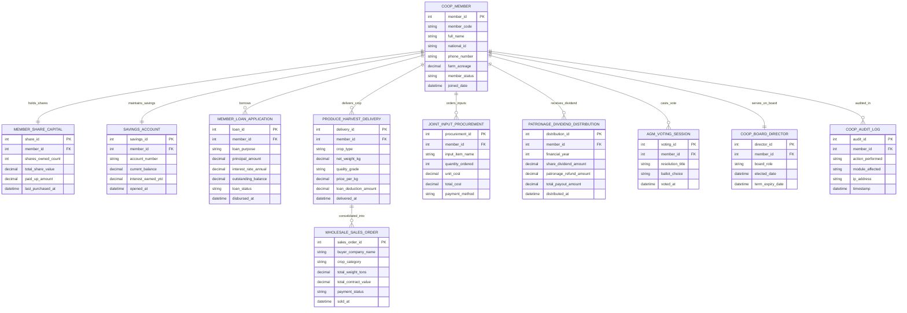

# Conceptual ERD — Co-operative Society Management System

## Mermaid Code

## Entity Description Table | Bảng mô tả Entity

| # | Entity Name | Vietnamese Name | Description | Key Attributes | Main Relationships |
|---|-------------|-----------------|-------------|----------------|-------------------|
| 1 | COOP_MEMBER | Xã viên Hợp tác xã | Primary cooperative member profile storing farm details, contact info, and status. | member_id (PK), member_code, full_name, national_id, farm_acreage, member_status | Holds Share Capital, maintains Savings, borrows Loans, delivers Crops, votes |
| 2 | MEMBER_SHARE_CAPITAL | Cổ phần Xã viên | Capital ledger tracking total shares owned, share value, and paid-up capital balance. | share_id (PK), member_id (FK), shares_owned_count, total_share_value, paid_up_amount | Belongs to Coop Member |
| 3 | SAVINGS_ACCOUNT | Tài khoản Tiết kiệm | Voluntary member savings account tracking balances, deposits, and interest earned. | savings_id (PK), member_id (FK), account_number, current_balance, interest_earned_ytd | Belongs to Coop Member |
| 4 | MEMBER_LOAN_APPLICATION | Khoản Vay Vi mô | Micro-credit loan record tracking principal, interest rate, repayment status, and balance. | loan_id (PK), member_id (FK), loan_purpose, principal_amount, outstanding_balance, loan_status | Borrowed by Coop Member |
| 5 | PRODUCE_HARVEST_DELIVERY | Giao hàng Nông sản | Crop harvest weigh-in log tracking net weight, quality grade, loan deductions, and payout. | delivery_id (PK), member_id (FK), crop_type, net_weight_kg, quality_grade, price_per_kg | Delivered by Coop Member, consolidated into Wholesale Sales Orders |
| 6 | JOINT_INPUT_PROCUREMENT | Mua sắm Vật tư Chung | Requisition log tracking member group purchases of seeds, fertilizers, and tools. | procurement_id (PK), member_id (FK), input_item_name, quantity_ordered, unit_cost, total_cost | Ordered by Coop Member |
| 7 | WHOLESALE_SALES_ORDER | Đơn Bán Nông sản Sỉ | Bulk commodity sales order selling consolidated depot inventory to commercial buyers. | sales_order_id (PK), buyer_company_name, crop_category, total_weight_tons, total_contract_value | Consolidates Produce Harvest Deliveries |
| 8 | PATRONAGE_DIVIDEND_DISTRIBUTION | Chia Cổ tức & Trả lại | Annual profit distribution log detailing share dividends and patronage refunds. | distribution_id (PK), member_id (FK), financial_year, share_dividend_amount, total_payout_amount | Received by Coop Member |
| 9 | AGM_VOTING_SESSION | Phiếu Bầu Đại hội | Individual ballot record tracking member votes on AGM resolutions and director elections. | voting_id (PK), member_id (FK), resolution_title, ballot_choice, voted_at | Cast by Coop Member |
| 10 | COOP_BOARD_DIRECTOR | Thành viên Hội đồng | Elected cooperative board director record tracking roles (Chairman, Treasurer) and terms. | director_id (PK), member_id (FK), board_role, elected_date, term_expiry_date | Served by Coop Member |
| 11 | COOP_AUDIT_LOG | Nhật ký Kiểm toán HTX | Security and financial audit trail logging system transactions, approvals, and changes. | audit_id (PK), member_id (FK), action_performed, module_affected, timestamp | Audits Coop Member actions |

## Relationship Description | Mô tả Quan hệ

| # | From Entity | Cardinality | To Entity | Relationship Label | Business Explanation |
|---|-------------|-------------|-----------|-------------------|----------------------|
| 1 | COOP_MEMBER | one-to-one | MEMBER_SHARE_CAPITAL | holds_shares | A Coop Member holds one Member Share Capital ledger. |
| 2 | COOP_MEMBER | one-to-one | SAVINGS_ACCOUNT | maintains_savings | A Coop Member maintains one voluntary Savings Account. |
| 3 | COOP_MEMBER | one-to-many | MEMBER_LOAN_APPLICATION | borrows | A Coop Member borrows multiple Member Loan Applications over time. |
| 4 | COOP_MEMBER | one-to-many | PRODUCE_HARVEST_DELIVERY | delivers_crop | A Coop Member delivers multiple Produce Harvest Deliveries. |
| 5 | COOP_MEMBER | one-to-many | JOINT_INPUT_PROCUREMENT | orders_inputs | A Coop Member orders multiple Joint Input Procurements. |
| 6 | COOP_MEMBER | one-to-many | PATRONAGE_DIVIDEND_DISTRIBUTION | receives_dividend | A Coop Member receives annual Patronage Dividend Distributions. |
| 7 | COOP_MEMBER | one-to-many | AGM_VOTING_SESSION | casts_vote | A Coop Member casts votes in multiple AGM Voting Sessions. |
| 8 | COOP_MEMBER | one-to-one | COOP_BOARD_DIRECTOR | serves_on_board | An eligible Coop Member serves as a Coop Board Director. |
| 9 | COOP_MEMBER | one-to-many | COOP_AUDIT_LOG | audited_in | A Coop Member's actions are audited in Coop Audit Logs. |
| 10 | PRODUCE_HARVEST_DELIVERY | many-to-many | WHOLESALE_SALES_ORDER | consolidated_into | Produce Harvest Deliveries are consolidated into Wholesale Sales Orders. |
