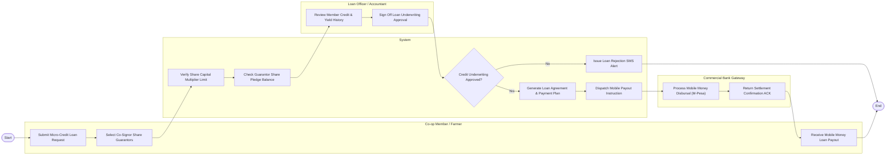

# Swimlane Diagram — Co-operative Society Management System

## Mermaid Code

## Flow Description | Mô tả luồng

| Lane | Actor | Role in Flow |
|------|-------|-------------|
| 1 | Co-op Member / Farmer | Submits micro-credit loan request, selects co-signor share guarantors, signs loan agreement, and receives mobile money cash payout. |
| 2 | System | Verifies member share capital leverage multiplier (max 3x), checks guarantor share pledge balances, generates payment agreements, dispatches mobile payout requests, and sends alerts. |
| 3 | Loan Officer / Accountant | Reviews member credit history, farm crop yield records, and guarantor pledges, signing off on underwriting approval. |
| 4 | Commercial Bank Gateway | Processes electronic mobile money transfer (e.g. M-Pesa / Bank ACH), dispatches funds to member wallet, and returns settlement ACK. |
