# Action Tree — Co-operative Society Management System

## Mermaid Code

```mermaid
graph TD
    Root["Co-operative Society Management System"]

    Root --> M1["Member Share & Capital Management"]
    Root --> M2["Member Savings & Micro-Credit Loans"]
    Root --> M3["Agricultural Harvest & Storage Depot"]
    Root --> M4["Collective Purchasing & Wholesale Sales"]
    Root --> M5["Patronage Dividend & Profit Share"]
    Root --> M6["Governance, AGM Voting & Compliance"]

    M1 --> A11["Register Co-op Member Profile"]
    M1 --> A12["Record Mandatory Share Capital Purchases"]
    M1 --> A13["Issue Member Share Certificates"]
    M1 --> A14["Enforce 20% Maximum Share Ownership Cap"]

    M2 --> A21["Manage Voluntary Member Savings Accounts"]
    M2 --> A22["Underwrite Micro-Credit Loan Applications"]
    M2 --> A23["Pledge Co-Signor Member Share Guarantors"]
    M2 --> A24["Disburse Mobile Money & Bank Payouts"]

    M3 --> A31["Weigh Crop Harvest on Digital Scale"]
    M3 --> A32["Grade Produce Quality & Moisture Content"]
    M3 --> A33["Deduct Outstanding Loan Payments from Harvest"]
    M3 --> A34["Track Warehouse Depot Crop Tonnage"]

    M4 --> A41["Aggregate Member Fertilizer Group Orders"]
    M4 --> A42["Procure Wholesale Inputs at Bulk Discount"]
    M4 --> A43["Execute B2B Wholesale Produce Contracts"]
    M4 --> A44["Generate Commercial Buyer Dispatch Manifests"]

    M5 --> A51["Allocate Net Operating Surplus Reserves"]
    M5 --> A52["Calculate Share Capital Dividend Returns"]
    M5 --> A53["Calculate Patronage Refunds on Crop Sales"]
    M5 --> A54["Reinvest Dividends into Share Capital"]

    M6 --> A61["Verify AGM Attendance & Quorum Thresholds"]
    M6 --> A62["Execute One-Member-One-Vote Elections"]
    M6 --> A63["File Statutory Annual Financial Audits"]
    M6 --> A64["Track Board of Director Election Terms"]
```

## Module Description | Mô tả Module

| # | Module | Description | Actions |
|---|--------|-------------|---------|
| 1 | Member Share & Capital Management | Manages member registration, mandatory share capital subscriptions, share certificates, and 20% share caps. | Register Co-op Member Profile, Record Mandatory Share Capital Purchases, Issue Member Share Certificates, Enforce 20% Maximum Share Ownership Cap |
| 2 | Member Savings & Micro-Credit Loans | Handles voluntary savings accounts, micro-credit loan underwriting, guarantor share pledges, and mobile money disbursements. | Manage Voluntary Member Savings Accounts, Underwrite Micro-Credit Loan Applications, Pledge Co-Signor Member Share Guarantors, Disburse Mobile Money & Bank Payouts |
| 3 | Agricultural Harvest & Storage Depot | Records digital scale harvest weights, conducts quality grading, deducts loan repayments, and tracks warehouse crop inventory. | Weigh Crop Harvest on Digital Scale, Grade Produce Quality & Moisture Content, Deduct Outstanding Loan Payments from Harvest, Track Warehouse Depot Crop Tonnage |
| 4 | Collective Purchasing & Wholesale Sales | Aggregates bulk input purchasing (fertilizers/seeds), executes wholesale commodity sales, and generates buyer dispatch manifests. | Aggregate Member Fertilizer Group Orders, Procure Wholesale Inputs at Bulk Discount, Execute B2B Wholesale Produce Contracts, Generate Commercial Buyer Dispatch Manifests |
| 5 | Patronage Dividend & Profit Share | Allocates net operating surplus to statutory reserves, computes share capital dividends, and patronage refunds on crop sales. | Allocate Net Operating Surplus Reserves, Calculate Share Capital Dividend Returns, Calculate Patronage Refunds on Crop Sales, Reinvest Dividends into Share Capital |
| 6 | Governance, AGM Voting & Compliance | Verifies AGM quorum thresholds, executes democratic "one member, one vote" elections, and files regulatory cooperative audits. | Verify AGM Attendance & Quorum Thresholds, Execute One-Member-One-Vote Elections, File Statutory Annual Financial Audits, Track Board of Director Election Terms |
