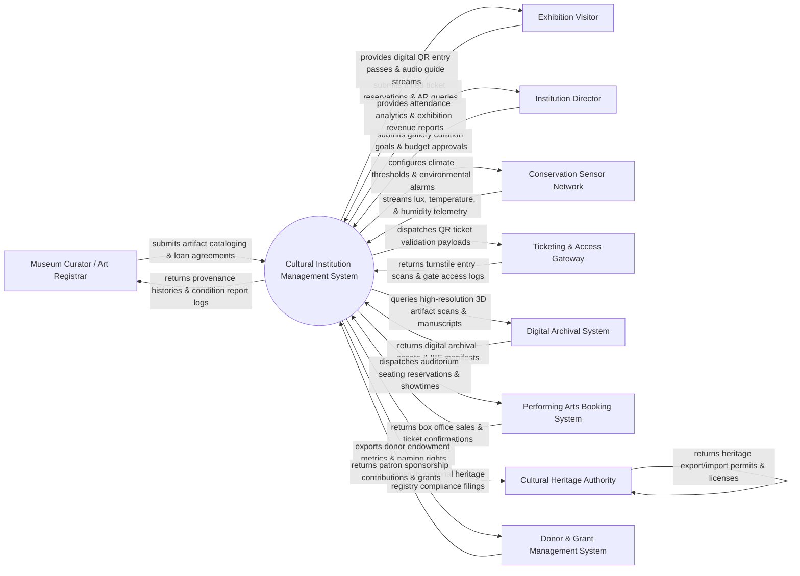

# Context Diagram — Cultural Institution Management System

## Mermaid Code

## Actor & Interaction Table | Bảng Actor & Tương tác

| # | Actor | Actor Type | Data Sent TO System | Data Received FROM System | Notes |
|---|-------|------------|---------------------|---------------------------|-------|
| 1 | Museum Curator / Art Registrar | Primary | Artifact acquisition details, accession numbers, provenance histories, condition reports, inter-museum loan contracts | Catalog search results, conservation alerts, loan expiration notices, valuation ledgers | Museum staff responsible for artifact preservation, curation, acquisition, and loan management. |
| 2 | Exhibition Visitor | Primary | Timed-entry ticket reservations, membership pass renewals, AR tour guide queries, feedback ratings | QR entry passes, digital exhibition guides, audio tour streams, event schedule notifications | Museum, gallery, or theater visitors booking tickets and engaging with cultural exhibits. |
| 3 | Institution Director | Primary | Exhibition curation approvals, annual operating budgets, naming rights policies, strategic priorities | Attendance dashboards, exhibition ROI analytics, donor contribution summaries, security audit logs | Executive leadership overseeing institution strategy, fundraising, financial growth, and operations. |
| 4 | Conservation Sensor Network | Primary / Hardware | Temperature (°C), relative humidity (%), lux light exposure, UV index, vibration telemetry | Sensor calibration commands, environmental alarm thresholds, battery health alerts | IoT sensors placed inside display cases and galleries to prevent artifact degradation. |
| 5 | Ticketing & Access Gateway | Supporting System | Turnstile QR code entry scans, barcode validation timestamps, attendance gate counters | Ticket validation payloads, gate access permissions, membership pass validity checks | Physical turnstiles, handheld scanners, and barcode readers controlling visitor entry. |
| 6 | Digital Archival System | Supporting System | High-resolution 3D photogrammetry scans, IIIF image manifests, digitized ancient manuscripts | Archival metadata queries, digital asset indexing requests, public research access logs | Enterprise digital repository (DSpace, Omeka) archiving high-definition cultural assets. |
| 7 | Performing Arts Booking System | Supporting System | Auditorium seat availability maps, box office ticket sales receipts, performance showtime updates | Event reservation payloads, seat allocation blocks, artist booking schedules | Ticketing system managing theater performances, concerts, lectures, and film screenings. |
| 8 | Cultural Heritage Authority | Regulatory System | UNESCO heritage classifications, national artifact protection laws, export/import permits | Mandatory heritage inventory filings, artifact loan security protocols, theft incident alerts | Government department of culture or UNESCO auditing historical asset preservation compliance. |
| 9 | Donor & Grant Management System | Supporting System | Patron donation receipts, endowment pledges, grant funding allocations, VIP membership tiers | Donor naming rights allocations, VIP event invitations, sponsorship attribution reports | CRM platform (Raiser's Edge, Salesforce) managing donor relationships and grant funding. |

## System Boundary Description | Mô tả Phạm vi Hệ thống

The **Cultural Institution Management System (CIMS)** is an enterprise museum, gallery, and performing arts administration platform. Inside the system boundary, CIMS manages artifact cataloging, provenance tracking, inter-museum loan agreements, exhibition curation, gallery environmental conservation monitoring, timed-entry visitor ticketing, performing arts auditorium scheduling, AR/VR audio guide delivery, and digital archival asset indexing. External to the system boundary are physical conservation sensors (Conservation Sensor Network), physical entry turnstiles (Ticketing & Access Gateway), enterprise digital archives (Digital Archival System), box office platforms (Performing Arts Booking System), national heritage regulators (Cultural Heritage Authority), and donor CRM software (Donor Management System).
