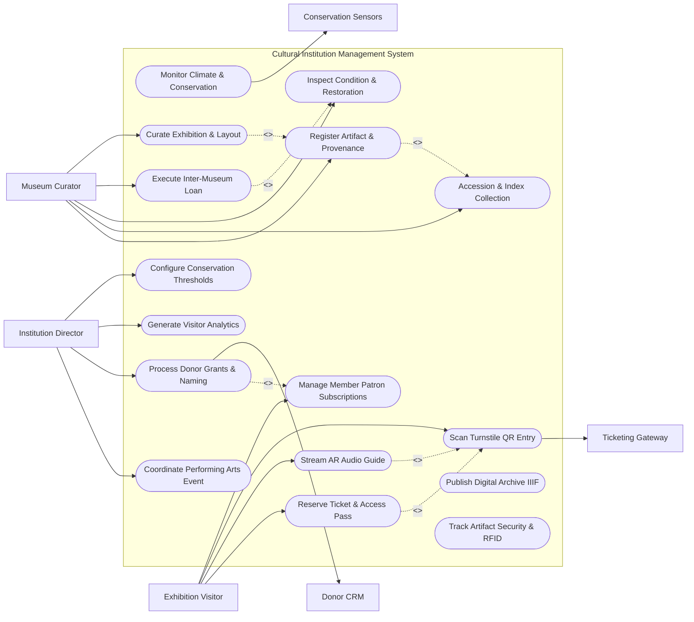

# Use Case Diagram — Cultural Institution Management System

## Mermaid Code

## Actor Table | Bảng Actor

| # | Actor | Actor Type | Role Description | Related Use Cases |
|---|-------|------------|------------------|-------------------|
| 1 | Museum Curator | Primary | Curator and art registrar cataloging artifacts, documenting provenance, managing loans, and curating exhibitions. | UC01, UC02, UC06, UC07, UC08 |
| 2 | Exhibition Visitor | Primary | Visitor or patron purchasing timed tickets, scanning QR entry codes, and streaming AR audio guides. | UC03, UC04, UC09, UC10 |
| 3 | Institution Director | Primary | Executive director managing performing arts events, processing donor sponsorships, and reviewing analytics. | UC11, UC12, UC15, UC16 |
| 4 | Conservation Sensors | Hardware | IoT environmental sensors streaming temperature, relative humidity, lux, and UV data from display cases. | UC05 |
| 5 | Ticketing Gateway | System | Physical turnstile gate controllers and handheld barcode scanners validating visitor entry passes. | UC09 |
| 6 | Donor CRM | System | External donor relationship management software syncing patron memberships and endowment gifts. | UC12 |

## Use Case Table | Bảng Use Case

| # | UC ID | Use Case Name | Primary Actor | Secondary Actor | Description | Priority |
|---|-------|---------------|---------------|-----------------|-------------|----------|
| 1 | UC01 | Register Artifact & Provenance | Museum Curator | None | Registers new cultural artifact acquisitions, assigning accession numbers, historical provenance, and valuation. | High |
| 2 | UC02 | Accession & Index Collection | Museum Curator | None | Categorizes artifacts into Dublin Core / SPECTRUM collection taxonomies with high-res photography. | High |
| 3 | UC03 | Reserve Ticket & Access Pass | Exhibition Visitor | None | Allows visitors to select timed-entry slots, purchase general admission or special exhibition passes online. | High |
| 4 | UC04 | Stream AR Audio Guide | Exhibition Visitor | None | Delivers location-aware Augmented Reality (AR) visual overlays and multilingual audio tour guides on visitor smartphones. | High |
| 5 | UC05 | Monitor Climate & Conservation | Museum Curator | Conservation Sensors | Ingests real-time temperature, humidity, lux light, and UV index sensor data from display cases, alerting on drifts. | High |
| 6 | UC06 | Inspect Condition & Restoration | Museum Curator | None | Logs physical artifact condition reports (craquelure, flaking, cracks) and tracks conservation restoration treatments. | High |
| 7 | UC07 | Execute Inter-Museum Loan | Museum Curator | None | Manages outgoing/incoming artifact loan agreements between international cultural institutions, including insurance. | High |
| 8 | UC08 | Curate Exhibition & Layout | Museum Curator | None | Designs exhibition gallery wall layouts, assigns artifacts to floor plans, and generates gallery wall labels. | High |
| 9 | UC09 | Scan Turnstile QR Entry | Exhibition Visitor | Ticketing Gateway | Validates visitor QR entry passes at turnstiles, preventing duplicate entry and tracking live gallery capacity. | High |
| 10 | UC10 | Manage Member Patron Subscriptions | Exhibition Visitor | None | Manages annual museum membership subscriptions, granting unlimited free entry and preview invitations. | Medium |
| 11 | UC11 | Coordinate Performing Arts Event | Institution Director | None | Schedules theater performances, musical concerts, and lectures, managing seating charts and box office sales. | High |
| 12 | UC12 | Process Donor Grants & Naming | Institution Director | Donor CRM | Processes major patron donations, endowment grants, and assigns donor naming rights to galleries or wings. | Medium |
| 13 | UC13 | Publish Digital Archive IIIF | Museum Curator | None | Publishes high-resolution deep-zoom IIIF image manifests and 3D photogrammetry models for academic researchers. | Medium |
| 14 | UC14 | Track Artifact Security & RFID | Museum Curator | None | Tracks active RFID/BLE tag locations on high-value artifacts, sounding security alarms upon unauthorized movement. | High |
| 15 | UC15 | Generate Visitor Analytics | Institution Director | None | Exports visitor attendance heatmaps, peak arrival times, popular exhibit dwell durations, and ticket revenue. | Medium |
| 16 | UC16 | Configure Conservation Thresholds | Institution Director | None | Sets maximum lux light exposure thresholds and relative humidity safety bands for sensitive oil paintings/paper. | Low |

## Use Case Specification | Đặc tả Use Case

---

### UC01 — Register Artifact & Provenance

| Field | Detail |
|-------|--------|
| **UC ID** | UC01 |
| **Use Case Name** | Register Artifact & Provenance |
| **Actor(s)** | Primary: Museum Curator / Secondary: None |
| **Description** | Onboards a newly acquired or donated cultural artifact, assigning a unique accession number, documenting historical provenance, physical dimensions, material classification, and insurance appraisal value. |
| **Precondition** | 1. Curator has administrative registration credentials.   2. Acquisition documentation, deed of gift, or bill of sale is verified. |
| **Main Flow** | 1. Actor selects "Register New Artifact Acquisition".   2. System presents registration form requesting Object Name (e.g. `18th Century Bronze Buddha Statue`), Object Type (Sculpture, Oil Painting, Textile, Coin), and Culture/Period (Nguyen Dynasty, 18th Century).   3. System auto-generates unique Accession Number formatted according to SPECTRUM standards (e.g. `ACC-2026.04.19`).   4. Actor enters physical dimensions: Height, Width, Depth (cm), Weight (kg), and Primary Materials (Bronze, Gold Leaf).   5. Actor documents Provenance History: enters chronological ownership chain (e.g. `Collection of A. Smith (1920-1955) -> Donated to National Museum (1956)`).   6. Actor uploads high-resolution acquisition photographs and attaches Legal Title / Export Permit documentation.   7. Actor inputs Insurance Valuation ($150,000 USD) and designates Storage Location (Vault B, Rack 04).   8. System saves Cultural_Artifact and Provenance_Record entities, updating collection inventory. |
| **Alternative Flow** | **AF1** — Bulk Archaeological Find Registration: Curator imports CSV containing 200 cataloged ceramic sherds from an archaeological excavation site; System batch-assigns accession sub-numbers (`ACC-2026.04.19.001` through `200`).   **AF2** — Temporary Deposit Registration: Item is deposited temporarily for authentication review; System sets status to "Temporary Custody - Pending Acquisition Approval." |
| **Exception Flow** | **EX1** — Unclear Ownership / Theft Risk: Provenance history indicates item was in occupied territory during 1939-1945 without clear title; System flags "Nazi-Era Looting Due Diligence Required" and halts registration pending legal review.   **EX2** — Duplicate Accession Number: Entered accession number collides with existing record; System alerts curator and auto-suggests next available sequential number. |
| **Postcondition** | Cultural_Artifact and Provenance_Record entities are persisted, establishing legal ownership documentation and cataloging specs. |
| **Business Rule** | **BR1**: Every registered artifact must possess an un-broken provenance ownership chain and verified legal export permit prior to permanent accessioning. |

---

### UC03 — Reserve Exhibition Ticket & Access Pass

| Field | Detail |
|-------|--------|
| **UC ID** | UC03 |
| **Use Case Name** | Reserve Exhibition Ticket & Access Pass |
| **Actor(s)** | Primary: Exhibition Visitor / Secondary: None |
| **Description** | Allows a museum visitor to select an exhibition date, reserve a 30-minute timed-entry slot, purchase admission passes, and receive a digital QR code access ticket. |
| **Precondition** | 1. Exhibition schedule and ticket pricing tiers (Adult, Student, Senior, Member) are configured.   2. Payment gateway is active. |
| **Main Flow** | 1. Actor accesses online ticketing portal or mobile app.   2. Actor selects Exhibition (e.g. "Special Exhibition: Ancient Treasures of Asia"), Date, and Timed-Entry Slot (e.g. Saturday 10:30 AM - 11:00 AM).   3. System queries remaining capacity for the selected slot (Cap: 150 visitors/30 mins; Available: 42 slots).   4. Actor selects ticket quantities (2 Adult @ $20, 1 Child @ $10 = $50.00 Total).   5. System reserves slots for 10 minutes and prompts checkout details.   6. Actor enters billing information and submits credit card payment.   7. System processes payment transaction via payment gateway.   8. System generates unique 12-digit Visitor_Ticket ID and encodes encrypted entry QR code.   9. System emails PDF ticket pass to visitor and adds pass to smartphone Apple Wallet / Google Wallet. |
| **Alternative Flow** | **AF1** — Free Member Entry Pass: Active museum member signs in; System verifies membership validity (UC10), waives ticket price ($0.00), and generates priority VIP entry QR pass.   **AF2** — On-Site Kiosk Ticket Purchase: Visitor uses self-service touch kiosk in museum lobby; pays via contactless Apple Pay and prints paper QR barcode ticket. |
| **Exception Flow** | **EX1** — Timed-Entry Slot Sold Out: Selected 10:30 AM slot reaches 150 visitor capacity limit; System grays out slot and suggests next available slot (11:00 AM).   **EX2** — Payment Processing Declined: Credit card is declined; System holds tickets for 3 minutes and prompts visitor to try another card. |
| **Postcondition** | A Visitor_Ticket record is created, timed-entry capacity is reserved, and visitor receives digital QR entry pass. |
| **Business Rule** | **BR1**: Timed-entry capacity limits must be strictly enforced to prevent gallery overcrowding and protect fragile artifact environments. |

---

### UC05 — Monitor Gallery Climate & Conservation

| Field | Detail |
|-------|--------|
| **UC ID** | UC05 |
| **Use Case Name** | Monitor Gallery Climate & Conservation |
| **Actor(s)** | Primary: Museum Curator / Secondary: Conservation Sensors |
| **Description** | Continuously ingests environmental sensor data (temperature, relative humidity, lux light exposure, UV index) from gallery display cases, triggering alarms upon climate drift. |
| **Precondition** | 1. Conservation IoT sensors are deployed inside display cases and galleries.   2. Environmental safety threshold bands (UC16) are configured for specific artifact classes. |
| **Main Flow** | 1. Conservation Sensors transmit wireless telemetry reports (via Zigbee/Matter) every 5 minutes to system.   2. System parses telemetry data: Temperature (20.2°C), Relative Humidity (50.5%), Lux Light Level (48 Lux), and Cumulative UV Index (10 µW/lumen).   3. System compares incoming telemetry against safety thresholds assigned to the display case's artifacts (e.g. Sensitive Oil Painting: Target 20°C ± 1°C, 50% RH ± 3%, Lux <50).   4. System updates Gallery_Conservation_Sensor dashboard in real-time, rendering green status indicators for compliant galleries.   5. System calculates cumulative light exposure (Lux-Hours/Year) to ensure annual light budgets are not exceeded.   6. System stores sensor readings in time-series conservation database. |
| **Alternative Flow** | **AF1** — Automated HVAC HVAC Climate Adjustment: Humidity drops to 42% in Gallery 3; System automatically dispatches correction signal to building HVAC humidifier to restore 50% RH.   **AF2** — Micro-Climate Case Nitrogen Purging: System monitors anoxic sealed display case housing ancient silk; verifies oxygen level remains <0.1%. |
| **Exception Flow** | **EX1** — Critical Humidity Drift Alarm: Relative humidity in Display Case 12 spikes to 68% (risk of mold growth on 15th-century manuscript); System triggers high-priority audible alarm at security console, sends urgent SMS to head conservator, and highlights case in red on 3D gallery map.   **EX2** — Sensor Telemetry Loss: Display case sensor fails to report for 30 minutes; System flags "Sensor Offline" and alerts maintenance team. |
| **Postcondition** | Environmental telemetry is recorded in conservation logs, and automated alerts are triggered if climate parameters drift outside safe conservation limits. |
| **Business Rule** | **BR1**: Organic artifacts (paper, textiles, parchment) must be maintained within strict relative humidity bands (50% ± 3% RH) to prevent irreversible material warping or mold. |

---

### UC08 — Curate Cultural Exhibition & Layout

| Field | Detail |
|-------|--------|
| **UC ID** | UC08 |
| **Use Case Name** | Curate Cultural Exhibition & Layout |
| **Actor(s)** | Primary: Museum Curator / Secondary: None |
| **Description** | Designs exhibition theme, assigns cataloged artifacts to 3D gallery floor plans, creates narrative wall text labels, and schedules exhibition opening/closing dates. |
| **Precondition** | 1. Artifacts are cataloged in collection database (UC01).   2. 3D gallery spatial CAD floor plans are loaded in system. |
| **Main Flow** | 1. Actor selects "Create New Exhibition Curation".   2. System presents curation wizard requesting Exhibition Title (e.g. "Silk Road: Crossroads of Empire"), Narrative Subtitle, Opening Date, and Closing Date.   3. Actor selects target Exhibition_Gallery (e.g. "East Wing Special Exhibition Gallery 2").   4. Actor queries catalog and selects 45 target artifacts (UC01), including 10 borrowed items from partner museums (UC07).   5. System renders interactive 3D Gallery Floor Plan.   6. Actor drags and drops 3D artifact models onto specific display cases, pedestals, and wall mounting positions.   7. System checks spatial clearances (ensuring ADA wheelchair accessibility and visitor flow lanes) and light exposure budgets.   8. Actor composes curatorial wall panel text, exhibit case labels, and audio guide script links (UC04).   9. System saves Exhibition_Gallery assignment, publishes gallery layout, and generates printable exhibit object labels. |
| **Alternative Flow** | **AF1** — Virtual 3D Online Exhibition: Curator publishes 3D gallery floor plan online, allowing global web users to take a virtual 3D walkthrough of the exhibition.   **AF2** — Traveling Exhibition Packing List: Exhibition closes; System auto-generates crating packing lists, climate-controlled transport manifests, and condition check-sheets for the next venue. |
| **Exception Flow** | **EX1** — Artifact Schedule Conflict: Selected painting is already committed to an international loan in Paris during the same dates; System alerts "Scheduling Conflict: Painting on loan until Nov 2026."   **EX2** — Oversized Artifact Weight Limit: 3-ton marble statue position exceeds gallery floor load capacity (500 kg/m²); System flags "Floor Weight Capacity Exceeded." |
| **Postcondition** | Exhibition curation plan is finalized, 3D gallery layout is assigned, wall labels generated, and exhibit guide content published. |
| **Business Rule** | **BR1**: Exhibition floor plan layouts must maintain minimum 1.5-meter wide circulation aisles to ensure full accessibility and safe emergency evacuation paths. |

---

### UC11 — Coordinate Performing Arts Event

| Field | Detail |
|-------|--------|
| **UC ID** | UC11 |
| **Use Case Name** | Coordinate Performing Arts Event |
| **Actor(s)** | Primary: Institution Director / Secondary: None |
| **Description** | Schedules performing arts productions (theater plays, orchestral concerts, dance performances, lectures), manages auditorium seating charts, artist contracts, and box office sales. |
| **Precondition** | 1. Auditorium venue seating layout (Orchestra, Mezzanine, Balcony) is configured.   2. Institution Director has event management privileges. |
| **Main Flow** | 1. Actor selects "Schedule Performing Arts Production".   2. System presents event form requesting Production Name (e.g. "Vivaldi Four Seasons Concert"), Performing Artist / Ensemble, Venue (Main Auditorium - 850 seats), and Showtime Dates/Times.   3. Actor configures Seating Chart Tier Pricing: VIP Orchestra ($75), Standard Mezzanine ($45), Student Balcony ($25), and Accessible Wheelchair Seats ($25).   4. Actor attaches Artist Contract, Tech Rider requirements (lighting, sound, acoustic shell setup), and rehearsal schedules.   5. System publishes event to online box office portal and syncs ticket availability with Performing Arts Booking System (UC11).   6. Visitors browse interactive seating map, select specific seats, and purchase tickets (UC03).   7. On event date, System tracks real-time box office sales, manages usher scanning at auditorium doors, and logs Performing_Arts_Event revenue. |
| **Alternative Flow** | **AF1** — Season Subscriber Seat Lock: Active season subscribers automatically receive their reserved seat assignments across all 6 annual concert series performances.   **AF2** — Pre-Show Educational Lecture: Event includes a 30-minute pre-show curator talk in the adjacent lecture hall; System manages add-on ticket reservations. |
| **Exception Flow** | **EX1** — Double-Booked Auditorium: Selected showtime conflicts with a scheduled film screening; System halts event creation alerting "Auditorium Double-Booked."   **EX2** — Performance Cancellation / Refund: Artist illness causes performance cancellation; System triggers automated email alerts and refunds 620 ticket buyers. |
| **Postcondition** | Performing_Arts_Event is scheduled, seating charts published, box office sales enabled, and production contracts stored. |
| **Business Rule** | **BR1**: Wheelchair-accessible seats and companion seating must be reserved exclusively for accessible ticket requests until 24 hours prior to showtime. |
