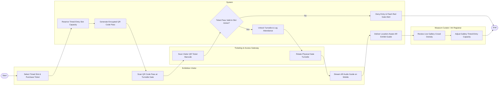

# Swimlane Diagram — Cultural Institution Management System

## Mermaid Code

## Flow Description | Mô tả luồng

| Lane | Actor | Role in Flow |
|------|-------|-------------|
| 1 | Exhibition Visitor | Selects timed-entry slot, purchases exhibition ticket online, scans QR code pass at turnstile gate, and streams AR audio guide on mobile device. |
| 2 | System | Reserves slot capacity, generates encrypted QR code pass, verifies pass validity and slot timestamps, unlocks turnstile, logs entry, and streams AR content. |
| 3 | Ticketing & Access Gateway | Scans visitor QR ticket barcode at entrance turnstile, verifies hardware handshake, and physically rotates gate arm to admit visitor. |
| 4 | Museum Curator / Art Registrar | Monitors live gallery crowd density on EOC dashboard and dynamically adjusts hourly timed-entry ticket capacity limits. |
