# Action Tree — Cultural Institution Management System

## Mermaid Code

```mermaid
graph TD
    Root["Cultural Institution Management System"]

    Root --> M1["Artifact Cataloging & Provenance Tracking"]
    Root --> M2["Exhibition Curation & Loan Management"]
    Root --> M3["Gallery Environmental Conservation & Security"]
    Root --> M4["Visitor Ticketing & Access Control"]
    Root --> M5["Performing Arts & Cultural Event Operations"]
    Root --> M6["Archival Research & Donor Management"]

    M1 --> A11["Register Artifact & Accession Numbers"]
    M1 --> A12["Document Chronological Ownership Provenance"]
    M1 --> A13["Log Physical Condition & Restoration Reports"]
    M1 --> A14["Record Insurance Appraisals & Title Deeds"]

    M2 --> A21["Design 3D Exhibition Gallery Floor Plans"]
    M2 --> A22["Assign Artifacts to Display Cases & Walls"]
    M2 --> A23["Execute Inter-Museum Loan Agreements"]
    M2 --> A24["Generate Exhibit Wall Panel Object Labels"]

    M3 --> A31["Ingest Real-Time Temp & Humidity Sensor Logs"]
    M3 --> A32["Monitor Lux Light Exposure & UV Index Hours"]
    M3 --> A33["Track RFID Active Artifact Security Locations"]
    M3 --> A34["Trigger Automated HVAC Climate Drift Alarms"]

    M4 --> A41["Reserve Online Timed-Entry Ticket Passes"]
    M4 --> A42["Validate Turnstile QR Code Gate Entries"]
    M4 --> A43["Stream Location-Aware AR Audio Guides"]
    M4 --> A44["Manage Annual Patron Membership Passes"]

    M5 --> A51["Schedule Theater & Concert Showtimes"]
    M5 --> A52["Manage Auditorium Tiered Seating Charts"]
    M5 --> A53["Process Box Office Ticket Sales receipts"]
    M5 --> A54["Coordinate Artist Contracts & Tech Riders"]

    M6 --> A61["Publish High-Resolution IIIF Digital Assets"]
    M6 --> A62["Index 3D Photogrammetry Archival Meshes"]
    M6 --> A63["Process Major Patron Grants & Endowments"]
    M6 --> A64["Assign Donor Naming Rights to Galleries"]
```

## Module Description | Mô tả Module

| # | Module | Description | Actions |
|---|--------|-------------|---------|
| 1 | Artifact Cataloging & Provenance Tracking | Registers cultural artifacts, documents historical provenance, logs condition restoration reports, and stores insurance appraisals. | Register Artifact & Accession Numbers, Document Chronological Ownership Provenance, Log Physical Condition & Restoration Reports, Record Insurance Appraisals & Title Deeds |
| 2 | Exhibition Curation & Loan Management | Designs 3D gallery floor layouts, assigns artifacts to cases, manages inter-museum loan contracts, and generates exhibit labels. | Design 3D Exhibition Gallery Floor Plans, Assign Artifacts to Display Cases & Walls, Execute Inter-Museum Loan Agreements, Generate Exhibit Wall Panel Object Labels |
| 3 | Gallery Environmental Conservation & Security | Monitors display case climate sensors (temp, RH, lux, UV), tracks RFID artifact locations, and alerts on HVAC climate drifts. | Ingest Real-Time Temp & Humidity Sensor Logs, Monitor Lux Light Exposure & UV Index Hours, Track RFID Active Artifact Security Locations, Trigger Automated HVAC Climate Drift Alarms |
| 4 | Visitor Ticketing & Access Control | Manages online timed-entry ticket reservations, validates turnstile QR entry codes, streams AR guides, and manages patron passes. | Reserve Online Timed-Entry Ticket Passes, Validate Turnstile QR Code Gate Entries, Stream Location-Aware AR Audio Guides, Manage Annual Patron Membership Passes |
| 5 | Performing Arts & Cultural Event Operations | Schedules theater productions, manages auditorium seating maps, processes box office sales, and coordinates artist tech riders. | Schedule Theater & Concert Showtimes, Manage Auditorium Tiered Seating Charts, Process Box Office Ticket Sales receipts, Coordinate Artist Contracts & Tech Riders |
| 6 | Archival Research & Donor Management | Publishes IIIF digital image manifests, indexes 3D photogrammetry meshes, processes patron gifts, and manages gallery naming rights. | Publish High-Resolution IIIF Digital Assets, Index 3D Photogrammetry Archival Meshes, Process Major Patron Grants & Endowments, Assign Donor Naming Rights to Galleries |
