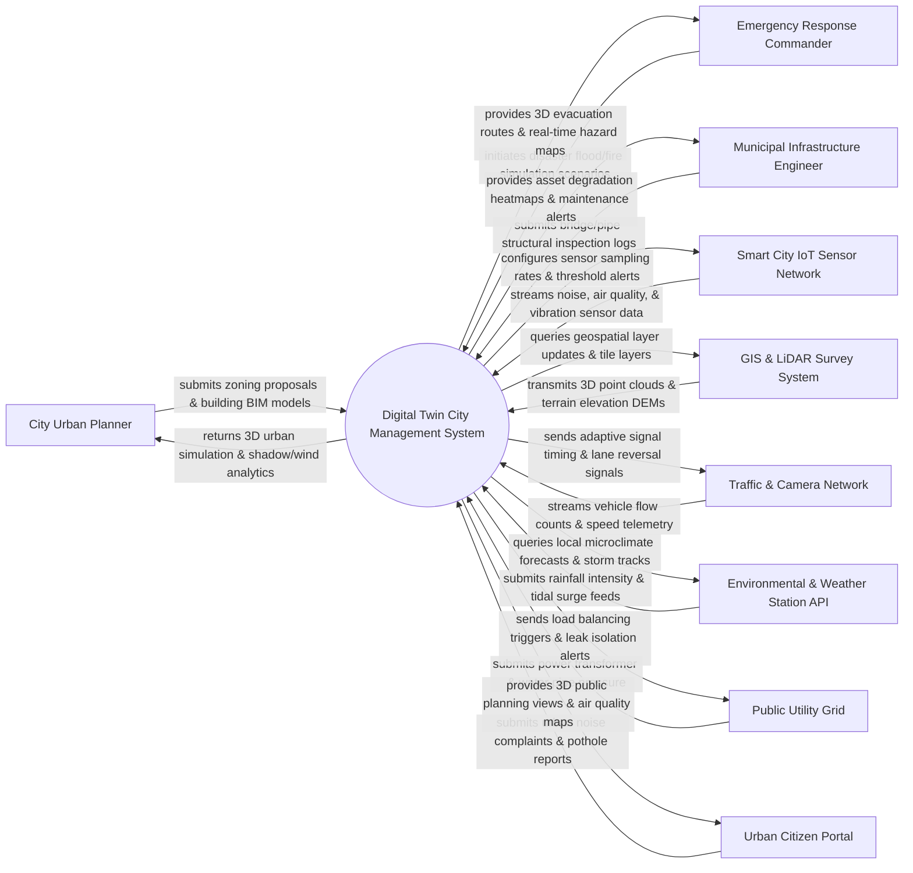

# Context Diagram — Digital Twin City Management System

## Mermaid Code

## Actor & Interaction Table | Bảng Actor & Tương tác

| # | Actor | Actor Type | Data Sent TO System | Data Received FROM System | Notes |
|---|-------|------------|---------------------|---------------------------|-------|
| 1 | City Urban Planner | Primary | Zoning policy proposals, Building Information Modeling (BIM) architectural models, land-use zoning rules | 3D urban twin visualization, solar shadow impact models, wind tunnel CFD analytics, density heatmaps | Municipal urban planning officials designing city expansions and evaluating zoning proposals. |
| 2 | Emergency Response Commander | Primary | Disaster simulation triggers (100-year flood, earthquake, chemical spill), evacuation center capacities | 3D flood inundation depth maps, optimal emergency vehicle routes, population risk density layers | Disaster management authorities coordinating emergency evacuations during natural hazards. |
| 3 | Municipal Infrastructure Engineer | Primary | Bridge stress telemetry, underground pipe maintenance logs, road pavement condition index (PCI) | Structural degradation heatmaps, predictive asset failure alerts, pipe pressure drop warnings | Civil engineers maintaining municipal bridges, tunnels, roads, and water/sewer networks. |
| 4 | Smart City IoT Sensor Network | Primary / Hardware | Environmental noise (dB), air quality (PM2.5, NO2), structural vibration (Hz), water level (m) | Sensor sampling rate commands, calibration offsets, battery low alerts, mesh routing rules | City-wide IoT sensor nodes deployed across streets, buildings, bridges, and storm drains. |
| 5 | GIS & LiDAR Survey System | Supporting System | Aerial drone LiDAR point clouds, 3D building mesh models, Digital Elevation Models (DEM), GIS shapefiles | Geospatial tile requests, layer synchronization status, spatial CRS transformation queries | Municipal mapping agency updating 3D geospatial GIS layers and elevation meshes. |
| 6 | Traffic Management & Camera Network | Supporting System | AI camera vehicle counts, average road speeds, intersection queue lengths, traffic incident flags | Adaptive traffic signal timing matrices, dynamic lane reversal triggers, variable speed limit updates | Traffic control center managing smart traffic lights, AI CCTV cameras, and freeway gantries. |
| 7 | Environmental & Weather Station API | Supporting System | Precipitation rates (mm/h), wind vectors, tidal surge heights, ambient temperature, humidity | Weather query payloads, microclimate simulation triggers, storm track forecasting requests | Meteorological agency streaming real-time weather, flood gauges, and coastal sea level data. |
| 8 | Public Utility Grid | Supporting System | Electrical transformer load (MW), water pipe flow rates (L/min), natural gas pressure telemetry | Automated load shedding signals, water main leak isolation alerts, grid balancing commands | Municipal power, water, wastewater, and gas utility distribution management systems. |
| 9 | Urban Citizen Portal | Supporting System | Public civic issue reports (potholes, streetlamp outages, noise), public feedback submissions | 3D public urban planning previews, neighborhood air quality indices, public transport live maps | Public mobile application and web portal for citizens to view city data and report municipal issues. |

## System Boundary Description | Mô tả Phạm vi Hệ thống

The **Digital Twin City Management System (DTCMS)** is an integrated 3D geospatial urban modeling, simulation, and real-time smart city operations platform. Inside the system boundary, DTCMS manages 3D GIS/BIM mesh rendering, high-frequency IoT sensor telemetry ingestion, urban traffic flow optimization, hydrodynamic flood/storm surge modeling, infrastructure structural health tracking, utility grid monitoring, and 3D emergency evacuation route calculation. External to the system boundary are physical city sensors (Smart City IoT Sensor Network), municipal GIS mapping tools (GIS & LiDAR Survey System), traffic signals (Traffic & Camera Network), weather services (Weather Station API), utility distribution platforms (Public Utility Grid), and public civic apps (Urban Citizen Portal).
