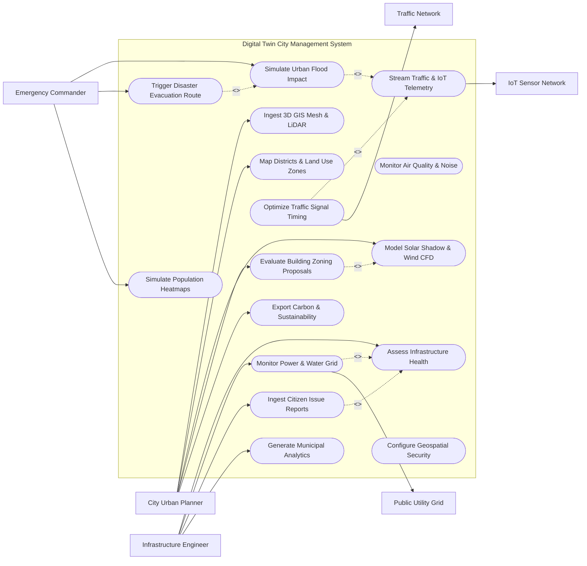

# Use Case Diagram — Digital Twin City Management System

## Mermaid Code

## Actor Table | Bảng Actor

| # | Actor | Actor Type | Role Description | Related Use Cases |
|---|-------|------------|------------------|-------------------|
| 1 | City Urban Planner | Primary | Municipal urban planner ingesting 3D building meshes, evaluating zoning applications, and analyzing solar/wind CFD impact. | UC01, UC02, UC06, UC10, UC14 |
| 2 | Emergency Commander | Primary | Disaster management commander simulating floods, tracking population heatmaps, and deploying 3D evacuation routes. | UC05, UC11, UC13 |
| 3 | Infrastructure Engineer | Primary | Civil engineer monitoring bridge/road structural integrity, water/power utility grids, and citizen maintenance tickets. | UC07, UC09, UC12, UC15 |
| 4 | IoT Sensor Network | Hardware | Network of municipal IoT sensors streaming real-time environmental, acoustic, and vibration telemetry. | UC03 |
| 5 | Traffic Network | System | Adaptive traffic signal management system receiving dynamic signal timing updates from the digital twin. | UC08 |
| 6 | Public Utility Grid | System | Electrical, water, and gas utility distribution networks exchanging operational state and leak alerts. | UC09 |

## Use Case Table | Bảng Use Case

| # | UC ID | Use Case Name | Primary Actor | Secondary Actor | Description | Priority |
|---|-------|---------------|---------------|-----------------|-------------|----------|
| 1 | UC01 | Ingest 3D GIS Mesh & LiDAR | City Urban Planner | None | Ingests aerial LiDAR point clouds, 3D photogrammetry meshes, and BIM models to build the city 3D digital twin. | High |
| 2 | UC02 | Map Districts & Land Use Zones | City Urban Planner | None | Defines administrative city district boundaries, land-use zoning classifications, and height restriction envelopes. | High |
| 3 | UC03 | Stream Traffic & IoT Telemetry | City Urban Planner | IoT Sensor Network | Ingests real-time IoT sensor streams (traffic volume, air quality PM2.5, environmental noise dB, weather). | High |
| 4 | UC04 | Monitor Air Quality & Noise | City Urban Planner | None | Renders 3D volumetric heatmaps of urban air pollution dispersion and acoustic noise pollution across city blocks. | Medium |
| 5 | UC05 | Simulate Urban Flood Impact | Emergency Commander | None | Executes 3D hydrodynamic flood simulation modeling storm surge and 100-year rainfall inundation depth across streets. | High |
| 6 | UC06 | Model Solar Shadow & Wind CFD | City Urban Planner | None | Simulates solar shadow trajectory across seasons and computes Computational Fluid Dynamics (CFD) wind canyon effects. | High |
| 7 | UC07 | Assess Infrastructure Health | Infrastructure Engineer | None | Tracks structural health index of bridges, tunnels, and overpasses using IoT strain gauges and tiltmeter telemetry. | High |
| 8 | UC08 | Optimize Traffic Signal Timing | City Urban Planner | Traffic Network | Analyzes real-time vehicle congestion in 3D and dispatches adaptive green-light timing algorithms to traffic intersections. | High |
| 9 | UC09 | Monitor Power & Water Grid | Infrastructure Engineer | Public Utility Grid | Visualizes underground 3D water pipe pressure, electrical transformer loads, and flags pipeline leak locations. | High |
| 10 | UC10 | Evaluate Building Zoning Proposals | City Urban Planner | None | Imports proposed 3D skyscraper BIM models into digital twin to evaluate skyline visual impact and shadow compliance. | High |
| 11 | UC11 | Trigger Disaster Evacuation Route | Emergency Commander | None | Calculates fastest 3D hazard-free emergency evacuation routes for emergency vehicles during urban disasters. | High |
| 12 | UC12 | Ingest Citizen Issue Reports | Infrastructure Engineer | None | Maps geolocated citizen mobile reports (potholes, water leaks, damaged streetlights) onto the 3D twin model. | Medium |
| 13 | UC13 | Simulate Population Heatmaps | Emergency Commander | None | Models real-time human mobility density and pedestrian crowd heatmaps during major city events or emergencies. | Medium |
| 14 | UC14 | Export Carbon & Sustainability | City Urban Planner | None | Calculates city-wide carbon emission metrics, solar rooftop generation potential, and urban heat island effects. | Medium |
| 15 | UC15 | Generate Municipal Analytics | Infrastructure Engineer | None | Exports executive city performance dashboards covering traffic speed averages, air quality trends, and asset uptime. | Medium |
| 16 | UC16 | Configure Geospatial Security | City Urban Planner | None | Enforces role-based geospatial layer access security, restricting sensitive utility and defense data layers. | Low |

## Use Case Specification | Đặc tả Use Case

---

### UC01 — Ingest 3D GIS Mesh & LiDAR

| Field | Detail |
|-------|--------|
| **UC ID** | UC01 |
| **Use Case Name** | Ingest 3D GIS Mesh & LiDAR |
| **Actor(s)** | Primary: City Urban Planner / Secondary: None |
| **Description** | Ingests high-resolution aerial drone LiDAR point clouds, 3D textured photogrammetry meshes (OBJ/GLTF), and architectural Building Information Modeling (BIM/IFC) files to construct the 3D city digital twin. |
| **Precondition** | 1. Urban Planner has municipal administrator credentials.   2. Raw 3D LiDAR point cloud (LAS/LAZ) or 3D mesh files are available on spatial storage. |
| **Main Flow** | 1. Actor selects "Ingest 3D Geospatial Layer".   2. System presents data ingestion wizard requesting Spatial Layer Type (LiDAR Point Cloud, Photogrammetry Mesh, BIM Model, DEM Elevation), Coordinate Reference System (EPSG:4326 / WGS 84), and Target City District.   3. Actor selects 3D file package (e.g. `District01_LiDAR_2026.laz` or `CityHall_BIM.ifc`).   4. System parses 3D data: converts point cloud into 3D Tiles format (Cesium 3D Tiles / OGC standard), generates Level-of-Detail (LOD 1 to LOD 4) pyramid levels, and aligns mesh coordinates to city ground elevation.   5. System checks spatial alignment against existing GIS basemap features (roads, property boundaries).   6. System renders updated 3D digital twin district view, allowing actor to inspect textured 3D buildings, terrain, and vegetation.   7. System stores Urban_Building_Asset records and updates 3D geospatial catalog. |
| **Alternative Flow** | **AF1** — Automated Drone Mission Import: System automatically ingests 3D photogrammetry mesh output uploaded from autonomous municipal survey drone flights.   **AF2** — IFC/BIM Attribute Extraction: System parses IFC architectural files and auto-extracts building floor counts, gross floor area, structural material, and HVAC system specs. |
| **Exception Flow** | **EX1** — Coordinate Projection Mismatch: If 3D mesh projection is offset by >5 meters from baseline GIS, System halts ingestion and prompts "CRS Mismatch: Select correct EPSG spatial projection."   **EX2** — Corrupted Point Cloud File: If LAZ file contains invalid header bounds, System flags "Point Cloud File Corrupted" and aborts processing. |
| **Postcondition** | High-precision 3D building mesh and terrain layers are indexed in 3D Tiles format, accessible for real-time visualization and urban simulations. |
| **Business Rule** | **BR1**: All ingested 3D building models must be rendered with Level-of-Detail (LOD 2 minimum) geometry and georeferenced to within 10 cm positional accuracy. |

---

### UC03 — Stream Real-Time Traffic & IoT Telemetry

| Field | Detail |
|-------|--------|
| **UC ID** | UC03 |
| **Use Case Name** | Stream Real-Time Traffic & IoT Telemetry |
| **Actor(s)** | Primary: City Urban Planner / Secondary: IoT Sensor Network |
| **Description** | Ingests continuous real-time IoT sensor telemetry (vehicle counts, average speeds, air quality PM2.5, environmental noise dB, river water levels) and binds telemetry data to 3D twin assets. |
| **Precondition** | 1. City IoT sensors and traffic cameras are paired (UC03) and streaming data over MQTT/CoAP protocols.   2. Digital twin 3D spatial basemap is loaded. |
| **Main Flow** | 1. System receives real-time telematics MQTT payload from Smart City IoT Sensor Network.   2. System parses sensor message header: Sensor ID (e.g. `SENSOR-AQ-4401`), Sensor Type (Air Quality), Coordinates (Lat/Long/Elev), and Timestamp.   3. System extracts metric values: PM2.5 = 38 µg/m³, NO2 = 45 ppb, Ambient Temp = 31°C, Noise = 72 dB.   4. System binds telemetry values to the corresponding IoT_Sensor_Device node mapped on the 3D digital twin scene.   5. System updates 3D volumetric heatmap overlays: renders air quality color gradients (Green/Yellow/Red) over city street blocks in real-time.   6. System checks values against environmental safety thresholds: if PM2.5 > 50 µg/m³, System triggers automated alert badge on municipal operator dashboard.   7. System stores telemetry data in Realtime_Telemetry_Stream time-series database. |
| **Alternative Flow** | **AF1** — AI Traffic Camera Vision Stream: System ingests vehicle count and velocity telemetry from traffic camera edge AI processors; updates 3D road segment color overlays (Green = Free Flow, Red = Congested).   **AF2** — Storm Drain Water Level Stream: Ultrasonic sensor in storm drain reports rapid water rise; System triggers flood warning overlay (UC05). |
| **Exception Flow** | **EX1** — Sensor Telemetry Flatline (Stale Data): If an IoT sensor fails to stream data for >30 minutes, System grays out 3D sensor icon and marks state "Sensor Offline".   **EX2** — Out-of-Range Anomaly Read: If noise sensor reads impossible value (180 dB), System filters outlier and flags sensor for maintenance calibration. |
| **Postcondition** | Real-time IoT sensor telemetry is bound to 3D digital twin assets, updating dynamic 3D heatmaps and triggering operational threshold alerts. |
| **Business Rule** | **BR1**: Real-time IoT sensor streams must update 3D digital twin dashboard overlays within 2 seconds of sensor data transmission. |

---

### UC05 — Simulate Urban Flood & Storm Surge Impact

| Field | Detail |
|-------|--------|
| **UC ID** | UC05 |
| **Use Case Name** | Simulate Urban Flood & Storm Surge Impact |
| **Actor(s)** | Primary: Emergency Commander / Secondary: None |
| **Description** | Executes 3D hydrodynamic flood simulation modeling storm surge, sea level rise, and 100-year heavy rainfall inundation across 3D terrain elevation and building geometry. |
| **Precondition** | 1. Digital Elevation Model (DEM) and 3D building geometry (UC01) are loaded for the target city district.   2. Environmental & Weather API provides rainfall intensity or tidal surge parameters. |
| **Main Flow** | 1. Emergency Commander selects "New Flood Simulation Scenario".   2. System presents simulation configuration setup: Scenario Type (100-Year Rainfall, Category 4 Storm Surge, River Breach), Rainfall Intensity (e.g. 120 mm/hour for 6 hours), Sea Level Elevation (+2.5 meters), and Drainage Pump Operational Status.   3. Actor clicks "Execute Hydrodynamic Simulation".   4. System dispatches simulation job to High-Performance Computing (HPC) simulation solver engine.   5. Solver calculates 2D/3D shallow water hydrodynamic equations, accounting for terrain slope, soil permeability, building barrier deflection, and storm drain capacity.   6. System receives simulation output time-steps (Hour 1 through Hour 12).   7. System renders dynamic 3D visual water inundation layer over the city twin model, displaying water depth color gradients (Blue = 0.2m, Dark Red = >2.0m) moving through 3D streets and building basements.   8. System identifies impacted buildings, vulnerable populations, submerged roadways, and exports Flood_Impact_Report.   9. System automatically triggers UC11 (Trigger Disaster Evacuation Route) to recalculate safe rescue paths. |
| **Alternative Flow** | **AF1** — Sea Level Rise Climate Projection: Planner runs 50-year climate change simulation (+1.2m sea level rise) to evaluate coastal sea wall fortification projects.   **AF2** — Real-Time Flash Flood Forecast: System ingests live Doppler weather radar data during typhoon; auto-executes 3-hour predictive flood simulation. |
| **Exception Flow** | **EX1** — High-Performance Computing Solver Timeout: If simulation grid size exceeds memory limit, System reduces mesh resolution grid to 5-meter tiles and resumes solver.   **EX2** — Missing Culvert/Drain Data: System warns "Drainage network data incomplete; simulation assuming 80% default pipe capacity." |
| **Postcondition** | Dynamic 3D flood inundation model is rendered over the digital twin, identifying submerged infrastructure and updating emergency evacuation plans. |
| **Business Rule** | **BR1**: Urban flood simulation models must incorporate high-precision 3D building geometry to accurately simulate water barrier deflection in dense urban canyons. |

---

### UC08 — Optimize Urban Traffic Signal Timing

| Field | Detail |
|-------|--------|
| **UC ID** | UC08 |
| **Use Case Name** | Optimize Urban Traffic Signal Timing |
| **Actor(s)** | Primary: City Urban Planner / Secondary: Traffic Network |
| **Description** | Analyzes real-time 3D vehicle congestion telemetry, calculates optimal adaptive traffic signal cycle times, and dispatches signal timing updates to smart traffic intersections. |
| **Precondition** | 1. Traffic management AI cameras and loop detectors are streaming real-time vehicle counts (UC03).   2. Smart traffic light controllers are connected via city fiber network. |
| **Main Flow** | 1. System monitors real-time vehicle queuing and travel times across target traffic corridor (e.g. Main Street Arterial containing 12 intersections).   2. System detects heavy northbound congestion bottleneck: Queue length exceeds 250 meters, average speed drops below 12 km/h.   3. System executes Macroscopic Traffic Flow Optimization model to calculate optimal signal timing matrix.   4. System determines optimized timing: Extends North-South green light phase by 18 seconds while dynamically coordinating green wave signal offsets across consecutive intersections.   5. System dispatches adaptive signal timing payload to Traffic Network (Traffic Light Controllers).   6. Traffic light controllers update green light phases for the next 15-minute operational cycle.   7. System monitors incoming vehicle speed telemetry (UC03), tracking delay reduction (e.g. 24% increase in corridor throughput speed).   8. System updates 3D digital twin traffic visualization displaying green flow vectors along the corridor. |
| **Alternative Flow** | **AF1** — Emergency Vehicle Signal Preemption: Fire truck or ambulance approaches intersection; System detects emergency GPS vector (UC11) and immediately forces green light phase for emergency vehicle.   **AF2** — Pedestrian Rush Hour Mode: High pedestrian density detected by crosswalk sensors; System increases pedestrian walk light timing by 10 seconds. |
| **Exception Flow** | **EX1** — Traffic Signal Controller Disconnected: If traffic light controller fails to ACK timing payload within 3 seconds, System falls back to local fixed-time signal schedule and alerts traffic engineering.   **EX2** — Gridlock Loop Detection: Traffic gridlock locks all 4 intersection approaches; System triggers special "Gridlock Flush Routine" alternating cycle phases. |
| **Postcondition** | Adaptive traffic signal timing matrices are deployed to physical traffic controllers, improving vehicle flow and reducing urban congestion. |
| **Business Rule** | **BR1**: Adaptive traffic signal adjustments must enforce mandatory minimum pedestrian walk intervals (minimum 15 seconds) for pedestrian safety. |

---

### UC11 — Trigger Disaster Evacuation & Emergency Route

| Field | Detail |
|-------|--------|
| **UC ID** | UC11 |
| **Use Case Name** | Trigger Disaster Evacuation & Emergency Route |
| **Actor(s)** | Primary: Emergency Commander / Secondary: None |
| **Description** | Calculates optimal, hazard-free 3D emergency evacuation routes for citizens and dispatch paths for first responders during urban floods, fires, or industrial disasters. |
| **Precondition** | 1. Urban disaster event (flood UC05, building fire, gas leak) is active in the digital twin.   2. Real-time road congestion and flood inundation depth layers are updated. |
| **Main Flow** | 1. Emergency Commander selects "Calculate Emergency Evacuation Routes".   2. System identifies Disaster Hazard Zone (e.g. 2 km radius surrounding chemical factory fire) and affected population estimate (24,500 residents).   3. System identifies available Emergency Evacuation Shelters and checks real-time shelter capacity metrics.   4. System queries 3D digital twin routing engine, filtering out submerged roads (depth >0.3m), blocked bridges, and congested streets.   5. System computes optimal multi-modal evacuation routing paths directing vehicular and pedestrian traffic away from hazard towards nearest open shelters.   6. System generates First Responder Emergency Ingress Routes ensuring fire trucks and ambulances bypass evacuation traffic jams.   7. System transmits routing instructions to Urban Citizen Portal (UC12), digital highway message signs, and emergency service CAD systems.   8. System renders 3D dynamic evacuation flow arrows on commander 3D digital twin console. |
| **Alternative Flow** | **AF1** — Dynamic Route Rerouting: Structural sensor detects bridge instability (UC07) during evacuation; System immediately closes bridge in digital twin and reroutes evacuation traffic via secondary northern bridge.   **AF2** — Contraflow Lane Reversal: System commands traffic management network to reverse inbound lanes to outbound direction on main evacuation highway. |
| **Exception Flow** | **EX1** — All Primary Evacuation Routes Submerged: If severe flooding blocks all primary roads, System calculates alternate elevated highway routes and dispatches high-clearance rescue vehicles.   **EX2** — Evacuation Shelter Full: Designated shelter reaches 100% capacity; System dynamically redirects remaining evacuation flow to secondary shelter. |
| **Postcondition** | Hazard-free emergency evacuation routes are calculated, rendered in 3D, and broadcasted to emergency responders and citizens. |
| **Business Rule** | **BR1**: Emergency evacuation routing algorithms must automatically exclude any road segment flagged with flood inundation depth exceeding 30 cm for standard passenger vehicles. |
