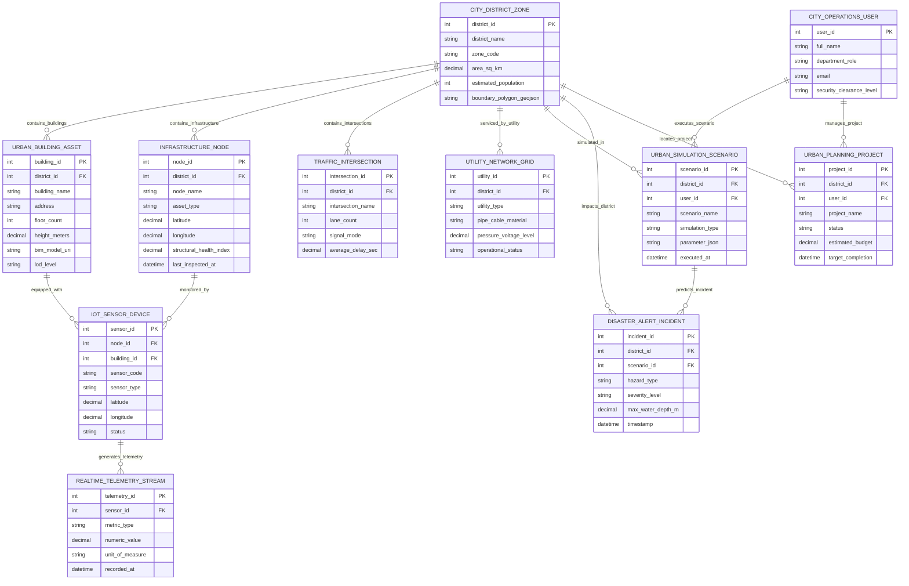

# Conceptual ERD — Digital Twin City Management System

## Mermaid Code

## Entity Description Table | Bảng mô tả Entity

| # | Entity Name | Vietnamese Name | Description | Key Attributes | Main Relationships |
|---|-------------|-----------------|-------------|----------------|-------------------|
| 1 | CITY_DISTRICT_ZONE | Quận / Phường Thành phố | Administrative city district or land-use zone defined by boundary polygons. | district_id (PK), district_name, zone_code, area_sq_km, boundary_polygon_geojson | Contains Buildings, Infrastructure, Intersections, Utilities |
| 2 | CITY_OPERATIONS_USER | Cán bộ Vận hành | Municipal user profile (Urban Planner, Emergency Commander, Engineer). | user_id (PK), full_name, department_role, security_clearance_level | Executes Scenarios, manages Planning Projects |
| 3 | URBAN_BUILDING_ASSET | Tòa nhà 3D / Công trình | Physical building 3D mesh model with BIM specs, height, and floor count. | building_id (PK), district_id (FK), building_name, height_meters, bim_model_uri, lod_level | Contained in City District, equipped with IoT Sensors |
| 4 | INFRASTRUCTURE_NODE | Nút Hạ tầng Kỹ thuật | Municipal infrastructure asset (Bridge, Tunnel, Overpass, Storm Drain, Dam). | node_id (PK), district_id (FK), node_name, asset_type, structural_health_index | Contained in City District, monitored by IoT Sensors |
| 5 | IOT_SENSOR_DEVICE | Thiết bị Cảm biến IoT | Municipal IoT sensor hardware measuring air quality, noise, vibration, water levels. | sensor_id (PK), node_id (FK), building_id (FK), sensor_code, sensor_type, status | Monitors Infrastructure/Building, generates Telemetry |
| 6 | REALTIME_TELEMETRY_STREAM | Luồng Telemetry IoT | High-frequency time-series telemetry data stream generated by IoT sensors. | telemetry_id (PK), sensor_id (FK), metric_type, numeric_value, unit_of_measure, recorded_at | Generated by IoT Sensor Device |
| 7 | TRAFFIC_INTERSECTION | Nút Giao thông | City street intersection equipped with smart traffic lights and AI cameras. | intersection_id (PK), district_id (FK), intersection_name, lane_count, signal_mode, average_delay_sec | Contained in City District |
| 8 | URBAN_SIMULATION_SCENARIO | Kịch bản Mô phỏng | Simulation scenario configuration (Hydrodynamic Flood, Wind CFD, Traffic Optimization). | scenario_id (PK), district_id (FK), user_id (FK), scenario_name, simulation_type, parameter_json | Simulated in District, executed by User, predicts Incident |
| 9 | DISASTER_ALERT_INCIDENT | Sự cố Thảm họa | Simulated or active urban disaster incident (Flood inundation, fire hazard, gas leak). | incident_id (PK), district_id (FK), scenario_id (FK), hazard_type, severity_level, max_water_depth_m | Predicted by Simulation Scenario, impacts District |
| 10 | UTILITY_NETWORK_GRID | Mạng lưới Hạ tầng Lưới | Power, water, wastewater, or natural gas utility distribution grid segment. | utility_id (PK), district_id (FK), utility_type, pipe_cable_material, pressure_voltage_level | Services City District |
| 11 | URBAN_PLANNING_PROJECT | Dự án Quy hoạch Đô thị | Municipal urban development project (New Skyscraper, Bridge Retrofit, Park Development). | project_id (PK), district_id (FK), user_id (FK), project_name, status, estimated_budget | Located in District, managed by User |

## Relationship Description | Mô tả Quan hệ

| # | From Entity | Cardinality | To Entity | Relationship Label | Business Explanation |
|---|-------------|-------------|-----------|-------------------|----------------------|
| 1 | CITY_DISTRICT_ZONE | one-to-many | URBAN_BUILDING_ASSET | contains_buildings | A City District Zone contains multiple Urban Building Assets. |
| 2 | CITY_DISTRICT_ZONE | one-to-many | INFRASTRUCTURE_NODE | contains_infrastructure | A City District Zone contains multiple Infrastructure Nodes. |
| 3 | CITY_DISTRICT_ZONE | one-to-many | TRAFFIC_INTERSECTION | contains_intersections | A City District Zone contains multiple Traffic Intersections. |
| 4 | CITY_DISTRICT_ZONE | one-to-many | UTILITY_NETWORK_GRID | serviced_by_utility | A City District Zone is serviced by Utility Network Grids. |
| 5 | INFRASTRUCTURE_NODE | one-to-many | IOT_SENSOR_DEVICE | monitored_by | An Infrastructure Node is monitored by multiple IoT Sensor Devices. |
| 6 | URBAN_BUILDING_ASSET | one-to-many | IOT_SENSOR_DEVICE | equipped_with | An Urban Building Asset is equipped with IoT Sensor Devices. |
| 7 | IOT_SENSOR_DEVICE | one-to-many | REALTIME_TELEMETRY_STREAM | generates_telemetry | An IoT Sensor Device generates continuous Telemetry Streams. |
| 8 | CITY_DISTRICT_ZONE | one-to-many | URBAN_SIMULATION_SCENARIO | simulated_in | A City District Zone is simulated in multiple Simulation Scenarios. |
| 9 | CITY_OPERATIONS_USER | one-to-many | URBAN_SIMULATION_SCENARIO | executes_scenario | A City Operations User executes multiple Simulation Scenarios. |
| 10 | URBAN_SIMULATION_SCENARIO | one-to-many | DISASTER_ALERT_INCIDENT | predicts_incident | An Urban Simulation Scenario predicts Disaster Alert Incidents. |
| 11 | CITY_DISTRICT_ZONE | one-to-many | DISASTER_ALERT_INCIDENT | impacts_district | A Disaster Alert Incident impacts a City District Zone. |
| 12 | CITY_OPERATIONS_USER | one-to-many | URBAN_PLANNING_PROJECT | manages_project | A City Operations User manages Urban Planning Projects. |
| 13 | CITY_DISTRICT_ZONE | one-to-many | URBAN_PLANNING_PROJECT | locates_project | An Urban Planning Project is located in a City District Zone. |
