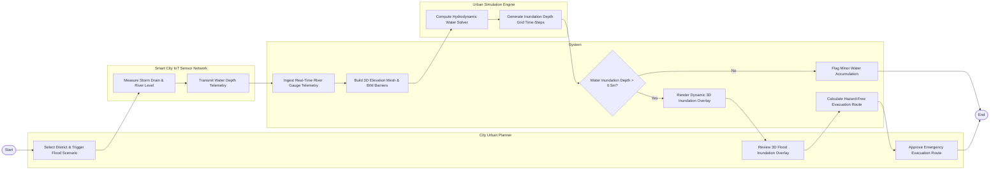

# Swimlane Diagram — Digital Twin City Management System

## Mermaid Code

## Flow Description | Mô tả luồng

| Lane | Actor | Role in Flow |
|------|-------|-------------|
| 1 | City Urban Planner | Selects target city district, configures 100-year rainfall parameters, reviews 3D flood inundation depth overlays, and approves emergency evacuation routing plans. |
| 2 | System | Ingests real-time IoT river gauge telemetry, builds 3D terrain elevation and building obstacle meshes, evaluates flood depth thresholds, renders 3D inundation layers, and computes evacuation routes. |
| 3 | Smart City IoT Sensor Network | Measures river water levels and storm drain flow rates, transmitting real-time telematics packets over the municipal network. |
| 4 | Urban Simulation Engine | Computes 2D/3D shallow water hydrodynamic solver equations and generates time-series inundation depth grid matrices for rendering. |
