# Action Tree — Digital Twin City Management System

## Mermaid Code

```mermaid
graph TD
    Root["Digital Twin City Management System"]

    Root --> M1["3D Geospatial & BIM Mesh Ingestion"]
    Root --> M2["Real-Time IoT Telemetry Stream Control"]
    Root --> M3["Traffic Flow & Mobility Simulation"]
    Root --> M4["Urban Infrastructure & Utility Monitoring"]
    Root --> M5["Environmental Hazard & Flood Modeling"]
    Root --> M6["Urban Planning & Executive Dashboard"]

    M1 --> A11["Ingest Aerial LiDAR Point Clouds"]
    M1 --> A12["Convert 3D Mesh to Cesium 3D Tiles"]
    M1 --> A13["Import Architectural Building BIM Models"]
    M1 --> A14["Map City District Land-Use Zones"]

    M2 --> A21["Ingest Multi-Sensor MQTT Telemetry"]
    M2 --> A22["Render 3D Volumetric Air Quality Heatmaps"]
    M2 --> A23["Monitor Environmental Noise Pollution"]
    M2 --> A24["Detect Sensor Anomaly Flatline Errors"]

    M3 --> A31["Simulate Vehicle Traffic Congestion"]
    M3 --> A32["Dispatch Adaptive Traffic Signal Timing"]
    M3 --> A33["Model Pedestrian Crowd Mobility Density"]
    M3 --> A34["Preempt Signals for Emergency Vehicles"]

    M4 --> A41["Track Structural Health of Bridges & Tunnels"]
    M4 --> A42["Monitor Underground Water Pipe Pressure"]
    M4 --> A43["Detect Electrical Transformer Overloads"]
    M4 --> A44["Ingest Citizen Pothole & Repair Tickets"]

    M5 --> A51["Execute 3D Hydrodynamic Flood Simulations"]
    M5 --> A52["Calculate Storm Surge Inundation Depth"]
    M5 --> A53["Deploy Disaster Evacuation Routing Plans"]
    M5 --> A54["Model Solar Shadow & Wind Canyon CFD"]

    M6 --> A61["Evaluate New Building Zoning Proposals"]
    M6 --> A62["Calculate City Carbon Emissions Metrics"]
    M6 --> A63["Export Municipal Operations Analytics"]
    M6 --> A64["Configure Geospatial Security Access Rules"]
```

## Module Description | Mô tả Module

| # | Module | Description | Actions |
|---|--------|-------------|---------|
| 1 | 3D Geospatial & BIM Mesh Ingestion | Ingests LiDAR point clouds, converts 3D meshes to 3D Tiles, imports BIM models, and maps city district land-use zones. | Ingest Aerial LiDAR Point Clouds, Convert 3D Mesh to Cesium 3D Tiles, Import Architectural Building BIM Models, Map City District Land-Use Zones |
| 2 | Real-Time IoT Telemetry Stream Control | Ingests MQTT sensor streams, renders 3D air quality heatmaps, tracks environmental noise, and detects sensor flatlines. | Ingest Multi-Sensor MQTT Telemetry, Render 3D Volumetric Air Quality Heatmaps, Monitor Environmental Noise Pollution, Detect Sensor Anomaly Flatline Errors |
| 3 | Traffic Flow & Mobility Simulation | Simulates traffic congestion, dispatches adaptive signal timing, models pedestrian crowds, and handles emergency signal preemption. | Simulate Vehicle Traffic Congestion, Dispatch Adaptive Traffic Signal Timing, Model Pedestrian Crowd Mobility Density, Preempt Signals for Emergency Vehicles |
| 4 | Urban Infrastructure & Utility Monitoring | Tracks structural health of bridges/tunnels, monitors water pipe pressure, detects power overloads, and maps citizen repair tickets. | Track Structural Health of Bridges & Tunnels, Monitor Underground Water Pipe Pressure, Detect Electrical Transformer Overloads, Ingest Citizen Pothole & Repair Tickets |
| 5 | Environmental Hazard & Flood Modeling | Executes 3D hydrodynamic flood simulations, calculates storm surge depth, deploys evacuation routes, and models solar/wind CFD effects. | Execute 3D Hydrodynamic Flood Simulations, Calculate Storm Surge Inundation Depth, Deploy Disaster Evacuation Routing Plans, Model Solar Shadow & Wind Canyon CFD |
| 6 | Urban Planning & Executive Dashboard | Evaluates building zoning proposals, calculates city carbon footprints, exports municipal analytics, and configures geospatial security. | Evaluate New Building Zoning Proposals, Calculate City Carbon Emissions Metrics, Export Municipal Operations Analytics, Configure Geospatial Security Access Rules |
