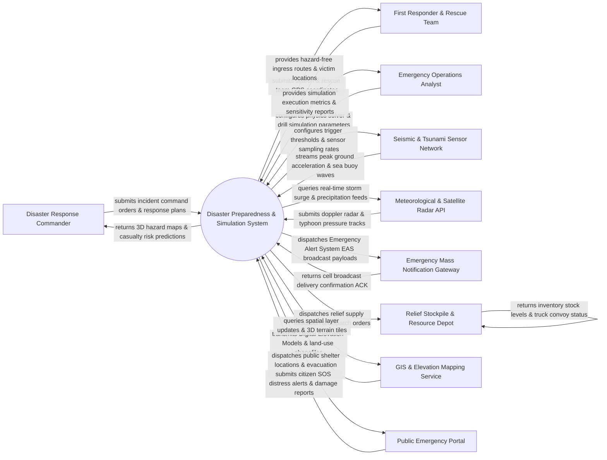

# Context Diagram — Disaster Preparedness & Simulation System

## Mermaid Code

## Actor & Interaction Table | Bảng Actor & Tương tác

| # | Actor | Actor Type | Data Sent TO System | Data Received FROM System | Notes |
|---|-------|------------|---------------------|---------------------------|-------|
| 1 | Disaster Response Commander | Primary | Incident command orders, emergency response declarations, shelter opening commands, resource allocations | 3D hazard inundation overlays, casualty risk projections, real-time rescue status dashboards | Senior emergency management commander directing disaster operations from the EOC console. |
| 2 | First Responder & Rescue Team | Primary | Search and rescue team GPS tracking coordinates, victim extrication reports, field hazard assessments | Hazard-free tactical ingress routes, 3D victim location pins, structural collapse warnings | Firefighters, paramedics, military search-and-rescue units executing field operations. |
| 3 | Emergency Operations Analyst | Primary | Disaster simulation parameters (Earthquake magnitude, Tsunami height, Typhoon trajectory), drill scenarios | Simulation execution metrics, sensitivity analysis reports, training drill scorecards | Technical analysts running predictive physics simulations and organizing readiness drills. |
| 4 | Seismic & Tsunami Sensor Network | Primary / Hardware | Peak Ground Acceleration (PGA) seismic waveforms, deep-ocean DART buoy wave heights, fault displacement | Sensor sampling rate adjustments, trigger threshold updates, battery health telemetry | National seismic network stations, ocean tsunameter buoys, and coastal tide gauges. |
| 5 | Meteorological & Satellite Radar API | Supporting System | Doppler weather radar reflectivity, satellite typhoon tracks, river gauge water levels, wind vectors | Real-time weather query payloads, storm track forecasting requests, radar tile requests | National weather service (NOAA, JMA) streaming satellite weather radar and flood data. |
| 6 | Emergency Mass Notification Gateway | Supporting System | Cell broadcast delivery confirmation ACKs, SMS gateway status, TV/Radio EAS broadcast status | Wireless Emergency Alert (WEA) payloads, Emergency Alert System (EAS) audio files, evacuation SMS | National wireless emergency alert gateway broadcasting emergency alerts to citizen mobile phones. |
| 7 | Relief Stockpile & Resource Depot | Supporting System | Emergency inventory levels (food, clean water, medical kits, tents, generators), convoy dispatch receipts | Relief supply allocation orders, logistics dispatch manifests, shelter delivery schedules | Disaster relief warehouses managing emergency supplies and heavy equipment convoys. |
| 8 | GIS & Elevation Mapping Service | Supporting System | High-resolution Digital Elevation Models (DEM), 3D building vector meshes, road network shapefiles | Spatial layer query requests, 3D terrain tile requests, CRS projection transformations | National mapping authority supplying 3D geospatial elevation data and infrastructure layers. |
| 9 | Public Emergency Portal & Mobile App | Supporting System | Citizen SOS distress alerts, geolocated damage photos, missing person reports, shelter check-ins | Public evacuation route guidance, 3D shelter locations, emergency safety instructions | Mobile application and web portal used by citizens during disasters to access help and information. |

## System Boundary Description | Mô tả Phạm vi Hệ thống

The **Disaster Preparedness & Simulation System (DPSS)** is an emergency management, early warning, and high-performance physics simulation platform. Inside the system boundary, DPSS manages multi-hazard simulation modeling (Earthquake ground motion, Tsunami wave propagation, Wildfire CFD dispersion, Flood hydrodynamic inundation), real-time sensor telemetry ingestion, early warning trigger generation, automated Emergency Mass Notification (EAS/WEA) dispatch, tactical rescue team routing, relief supply chain allocation, and readiness training drill scoring. External to the system boundary are physical seismic/tsunami sensor networks (Seismic & Tsunami Sensor Network), national weather satellites (Meteorological Radar API), public mass alert gateways (Mass Alert Gateway), disaster relief warehouses (Relief Stockpile Depot), GIS mapping services (GIS Mapping Service), and citizen emergency apps (Public Emergency Portal).
