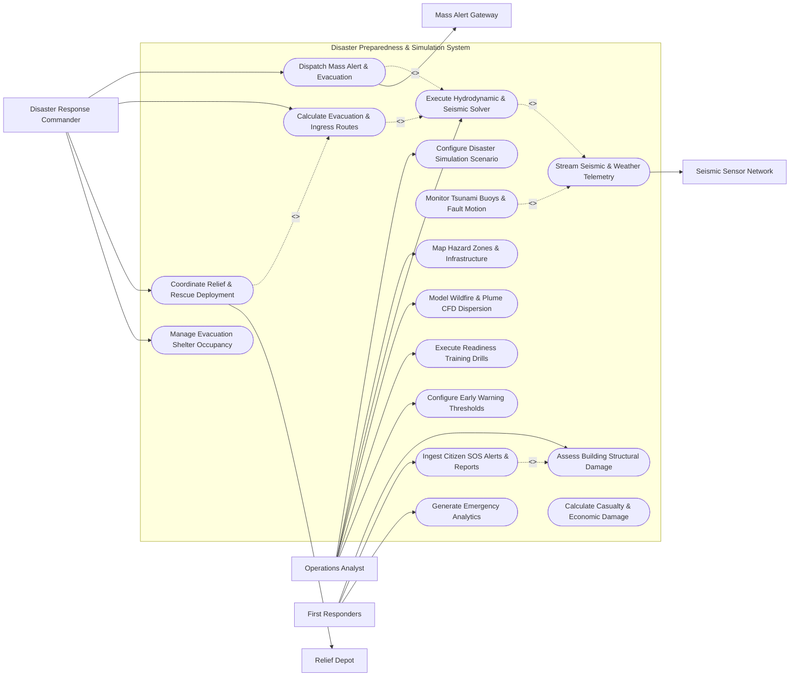

# Use Case Diagram — Disaster Preparedness & Simulation System

## Mermaid Code

## Actor Table | Bảng Actor

| # | Actor | Actor Type | Role Description | Related Use Cases |
|---|-------|------------|------------------|-------------------|
| 1 | Disaster Response Commander | Primary | Senior commander issuing evacuation orders, managing shelters, deploying rescue teams, and directing operations. | UC08, UC09, UC11, UC12 |
| 2 | Operations Analyst | Primary | Technical analyst configuring physics simulation scenarios, training drills, and early warning threshold rules. | UC01, UC02, UC05, UC06, UC13, UC16 |
| 3 | First Responders | Primary | Field search-and-rescue personnel assessing structural damage, receiving tactical ingress routes, and handling SOS alerts. | UC07, UC10, UC15 |
| 4 | Seismic Sensor Network | Hardware | Network of seismometers, ocean tsunameters, and weather radars streaming real-time environmental telemetry. | UC03 |
| 5 | Mass Alert Gateway | System | Wireless Emergency Alert (WEA) and Emergency Alert System (EAS) broadcasting emergency alerts to citizens. | UC08 |
| 6 | Relief Depot | System | Logistics warehouse and resource depot managing emergency food, water, medical supplies, and rescue vehicles. | UC11 |

## Use Case Table | Bảng Use Case

| # | UC ID | Use Case Name | Primary Actor | Secondary Actor | Description | Priority |
|---|-------|---------------|---------------|-----------------|-------------|----------|
| 1 | UC01 | Configure Disaster Simulation Scenario | Operations Analyst | None | Defines simulation parameters (Earthquake Richter magnitude, epicenter coordinates, Tsunami wave height, Typhoon path). | High |
| 2 | UC02 | Map Hazard Zones & Infrastructure | Operations Analyst | None | Maps high-risk geographical hazard zones, fault lines, flood plains, and critical infrastructure assets (Hospitals, Dams). | High |
| 3 | UC03 | Stream Seismic & Weather Telemetry | Operations Analyst | Seismic Sensor Network | Ingests real-time seismic waveforms (P-wave/S-wave), peak ground acceleration (PGA), and Doppler weather radar data. | High |
| 4 | UC04 | Monitor Tsunami Buoys & Fault Motion | Operations Analyst | None | Monitors ocean DART tsunameter buoy pressure drops and tectonic fault line displacement in real-time. | High |
| 5 | UC05 | Execute Hydrodynamic & Seismic Solver | Operations Analyst | None | Executes High-Performance Computing (HPC) physics solver modeling earthquake ground shaking and tsunami inundation. | High |
| 6 | UC06 | Model Wildfire & Plume CFD Dispersion | Operations Analyst | None | Simulates wildfire propagation speed, wind-driven flame front direction, and toxic chemical plume CFD dispersion. | High |
| 7 | UC07 | Assess Building Structural Damage | First Responders | None | Evaluates building structural collapse risks, tiltmeter readings, and tags structures (Green=Safe, Yellow=Damage, Red=Danger). | High |
| 8 | UC08 | Dispatch Mass Alert & Evacuation | Disaster Response Commander | Mass Alert Gateway | Triggers multi-channel emergency alert broadcasts (Cell Broadcast, TV/Radio EAS, Siren) instructing citizen evacuation. | High |
| 9 | UC09 | Calculate Evacuation & Ingress Routes | Disaster Response Commander | None | Computes optimal hazard-free evacuation routes for fleeing citizens and tactical ingress routes for first responders. | High |
| 10 | UC10 | Ingest Citizen SOS Alerts & Reports | First Responders | None | Ingests geolocated citizen SOS distress signals, trapped victim reports, and damage photos from mobile apps. | High |
| 11 | UC11 | Coordinate Relief & Rescue Deployment | Disaster Response Commander | Relief Depot | Dispatches search-and-rescue teams, emergency medical units, and relief supply convoys to designated impact zones. | High |
| 12 | UC12 | Manage Evacuation Shelter Occupancy | Disaster Response Commander | None | Tracks capacity, medical supplies, food reserves, and registered evacuees across designated emergency shelters. | High |
| 13 | UC13 | Execute Readiness Training Drills | Operations Analyst | None | Conducts simulated disaster response training drills for emergency personnel, evaluating decision speed and team readiness. | Medium |
| 14 | UC14 | Calculate Casualty & Economic Damage | Operations Analyst | None | Estimates potential human casualty counts, injured hospitalizations, and direct infrastructure economic damage. | Medium |
| 15 | UC15 | Generate Emergency Analytics | First Responders | None | Exports post-disaster operational dashboards detailing rescue mission times, shelter occupancies, and resource costs. | Medium |
| 16 | UC16 | Configure Early Warning Thresholds | Operations Analyst | None | Sets automated early warning trigger limits (e.g. Seismic PGA >0.15g or River Level >4.5m) to auto-trigger alerts. | Low |

## Use Case Specification | Đặc tả Use Case

---

### UC01 — Configure Disaster Simulation Scenario

| Field | Detail |
|-------|--------|
| **UC ID** | UC01 |
| **Use Case Name** | Configure Disaster Simulation Scenario |
| **Actor(s)** | Primary: Operations Analyst / Secondary: None |
| **Description** | Configures multi-hazard simulation scenarios (Earthquake, Tsunami, Typhoon, Wildfire, Chemical Spill), setting physical magnitude, epicenter, environmental conditions, and time duration. |
| **Precondition** | 1. Operations Analyst has logged into the simulation console.   2. High-resolution Digital Elevation Model (DEM) and 3D building layers are loaded. |
| **Main Flow** | 1. Actor selects "Create New Simulation Scenario".   2. System prompts selection of Hazard Type: Earthquake, Tsunami, Storm Surge Flood, Wildfire, or Industrial Chemical Plume.   3. Actor sets physical parameters:   &nbsp;&nbsp;&nbsp;&nbsp;a. For Earthquake: Richter Magnitude (e.g. 7.8 M), Hypocenter Depth (12 km), Epicenter Lat/Long, Fault Mechanism (Strike-Slip / Subduction).   &nbsp;&nbsp;&nbsp;&nbsp;b. For Tsunami: Sea Floor Displacement (meters), Wave Period (mins), Offshore Wave Height (4.5 m).   &nbsp;&nbsp;&nbsp;&nbsp;c. For Environmental: Wind Speed (45 m/s), Wind Direction (SW), Ambient Temp (35°C), Humidity (20%).   4. Actor selects Target Spatial Region (e.g. Coastal District A) and Simulation Duration (12 hours).   5. System validates physical parameter bounds and calculates computational grid resolution (e.g. 2-meter spatial grid).   6. System saves Disaster_Simulation_Scenario entity, generating a unique Scenario ID (`SCEN-2026-0996`). |
| **Alternative Flow** | **AF1** — Historical Disaster Re-creation: Analyst selects "Re-create 2011 Tohoku Earthquake & Tsunami"; System auto-fills historical sensor waveforms and sea floor displacement data.   **AF2** — Cascading Multi-Hazard Scenario: Analyst chains an Earthquake scenario that triggers a subsequent Tsunami and Dam Failure cascading sequence. |
| **Exception Flow** | **EX1** — Out-of-Physical Bounds Parameter: Entered earthquake magnitude (>10.0 M) exceeds physical fault capacity; System alerts "Parameter Error: Exceeds Maximum Fault Capacity."   **EX2** — Insufficient HPC Solver Memory: Selected grid resolution requires >512 GB RAM; System suggests optimizing grid size to 5 meters. |
| **Postcondition** | A Disaster_Simulation_Scenario entity is created and queued for execution by the High-Performance Computing Physics Solver (UC05). |
| **Business Rule** | **BR1**: Multi-hazard simulation scenarios must incorporate validated historical physical parameters to ensure realistic predictive accuracy. |

---

### UC03 — Stream Real-Time Seismic & Weather Telemetry

| Field | Detail |
|-------|--------|
| **UC ID** | UC03 |
| **Use Case Name** | Stream Real-Time Seismic & Weather Telemetry |
| **Actor(s)** | Primary: Operations Analyst / Secondary: Seismic Sensor Network |
| **Description** | Continuously ingests high-frequency real-time telemetry from seismic accelerometers, ocean tsunameter buoys, weather radars, and river level gauges, detecting early hazard anomalies. |
| **Precondition** | 1. Field sensor networks and weather APIs are online.   2. Early Warning Trigger Thresholds (UC16) are configured. |
| **Main Flow** | 1. System ingests real-time 100 Hz seismic waveform streams from field accelerometers via SeedLink/MQTT protocols.   2. System applies real-time STA/LTA (Short-Term Average / Long-Term Average) signal detection algorithms.   3. System detects primary P-wave arrival (fast-moving compressional wave) at 4 independent seismic stations.   4. System automatically estimates initial Earthquake Epicenter and Magnitude (e.g. 7.4 M) within 3 seconds of P-wave detection, BEFORE destructive S-waves arrive.   5. System checks Peak Ground Acceleration (PGA) values against early warning thresholds (UC16).   6. System updates live Emergency Operations Center (EOC) map console, highlighting seismic epicenter and expanding ground shaking propagation rings.   7. System logs Telemetry_Alert_Stream record and automatically triggers UC08 (Dispatch Emergency Mass Alert) if PGA exceeds 0.15g. |
| **Alternative Flow** | **AF1** — Ocean Tsunami Buoy Pressure Drop: Deep-ocean DART buoy detects 15 cm water pressure drop following subduction earthquake; System calculates tsunami travel time and alerts coastal defense.   **AF2** — High-Volume River Surge Detection: Ultrasonic river gauge detects water level rising at >0.5 m/hour; System triggers upstream dam overflow warning. |
| **Exception Flow** | **EX1** — Local Noise Artifact False Alarm: Heavy construction truck triggers single accelerometer; System requires 3-station coincidence check to reject false alarms.   **EX2** — Sensor Communication Loss: Telemetry stream drops for a seismic station; System flags station "Offline" and redistributes network weight. |
| **Postcondition** | Real-time sensor telemetry is processed, detecting initial hazard P-waves within seconds and triggering early warning alerts (UC08). |
| **Business Rule** | **BR1**: Automated Earthquake Early Warning (EEW) algorithms must estimate magnitude and dispatch initial alerts within 5 seconds of P-wave detection. |

---

### UC05 — Execute Hydrodynamic & Seismic Solver

| Field | Detail |
|-------|--------|
| **UC ID** | UC05 |
| **Use Case Name** | Execute Hydrodynamic & Seismic Solver |
| **Actor(s)** | Primary: Operations Analyst / Secondary: None |
| **Description** | Executes High-Performance Computing (HPC) physics solver algorithms to compute 3D ground shaking wave propagation, tsunami wave inundation, or CFD wildfire flame fronts. |
| **Precondition** | 1. Simulation scenario parameters (UC01) or real-time early warning telemetry (UC03) are loaded.   2. Distributed GPU/CPU cluster nodes are provisioned. |
| **Main Flow** | 1. Analyst initiates "Run Physics Solver" for configured scenario (`SCEN-2026-0996`).   2. System dispatches simulation workload to High-Performance Computing (HPC) cluster nodes.   3. HPC solver executes physical equations:   &nbsp;&nbsp;&nbsp;&nbsp;a. For Earthquake: Solves 3D elastodynamic wave equations through heterogeneous geological soil layers.   &nbsp;&nbsp;&nbsp;&nbsp;b. For Tsunami / Flood: Solves 2D/3D non-linear shallow water hydrodynamic equations across 3D digital elevation terrain.   &nbsp;&nbsp;&nbsp;&nbsp;c. For Wildfire: Solves Navier-Stokes Computational Fluid Dynamics (CFD) equations for wind-driven thermal combustion.   4. Solver computes time-series output matrices (e.g. T+5 mins, T+15 mins, T+30 mins, T+60 mins).   5. System receives simulation output grids and generates 3D visual hazard overlays: ground shaking Modified Mercalli Intensity (MMI) zones and water inundation depth maps (Blue = 0.5m to Red = >4.0m).   6. System overlays simulation output with 3D building layers to identify structural collapse risks (UC07) and calculate casualty estimates (UC14).   7. System stores output in Hazard_Zone_Geometry database. |
| **Alternative Flow** | **AF1** — Ultra-Fast Neural Network Surrogate Solver: System uses pre-trained AI physics surrogate model to predict tsunami inundation depth in 2 seconds instead of 15 minutes of HPC calculation.   **AF2** — Real-Time Recalibration: Live field sensor updates arrive during simulation run; System dynamically updates boundary conditions and re-runs solver. |
| **Exception Flow** | **EX1** — Numerical Instability / Divergence: Extreme slope causes solver Courant-Friedrichs-Lewy (CFL) condition violation; System reduces time-step size and restarts iteration.   **EX2** — HPC Node Failure: GPU worker node crashes; System automatically migrates job state to backup cluster node. |
| **Postcondition** | High-precision 3D hazard impact maps and time-series inundation grids are generated, updating emergency command dashboards and evacuation routing (UC09). |
| **Business Rule** | **BR1**: Hydrodynamic tsunami and flood simulations must account for 3D land elevation, coastal sea walls, and building barrier deflections. |

---

### UC08 — Dispatch Emergency Mass Alert & Evacuation

| Field | Detail |
|-------|--------|
| **UC ID** | UC08 |
| **Use Case Name** | Dispatch Emergency Mass Alert & Evacuation |
| **Actor(s)** | Primary: Disaster Response Commander / Secondary: Mass Alert Gateway |
| **Description** | Triggers automated or commander-approved multi-channel Wireless Emergency Alerts (WEA), cell broadcasts, TV/Radio EAS overrides, and outdoor sirens to instruct citizens to evacuate. |
| **Precondition** | 1. Severe hazard event (Earthquake PGA >0.15g, Tsunami wave >2m) is detected (UC03) or simulated (UC05).   2. Mass Alert Gateway integration is online. |
| **Main Flow** | 1. System detects critical hazard threshold breach (OR Disaster Response Commander clicks "Initiate Mass Evacuation Alert").   2. System defines Target Geographic Alert Polygon (e.g. Coastal Zone A & B encompassing 120,000 mobile subscribers).   3. System constructs CAP (Common Alerting Protocol) compliant emergency alert payload:   &nbsp;&nbsp;&nbsp;&nbsp;a. Alert Title: "TSUNAMI WARNING - EVACUATE IMMEDIATELY"   &nbsp;&nbsp;&nbsp;&nbsp;b. Alert Text: "A 4-meter tsunami is approaching coastal areas. Move to high ground or 3rd floor of reinforced buildings NOW. Follow signs to Shelter 4."   &nbsp;&nbsp;&nbsp;&nbsp;c. Audio File: High-pitch emergency siren tone.   4. Commander approves alert dispatch (OR auto-dispatches if Early Warning System EEW is in fully automated mode).   5. System dispatches CAP payload to Mass Alert Gateway (Cellular Network WEA, TV/Radio EAS, Physical Siren Towers, Mobile App Push).   6. Cellular MNOs broadcast Wireless Emergency Alert to all mobile handsets within the target geographic cell towers within 4 seconds.   7. Physical siren towers sound 110 dB evacuation siren, and Public Emergency Portal (UC10) flashes red banner with evacuation map (UC09).   8. System logs Mass_Alert_Broadcast record and tracks cell broadcast delivery receipt acknowledgments. |
| **Alternative Flow** | **AF1** — Multi-Language Auto-Translation: System automatically translates CAP alert payload into 6 local languages (English, Vietnamese, Spanish, Chinese, Japanese, Korean) based on user phone language preferences.   **AF2** — All-Clear Termination Broadcast: Disaster threat passes; Commander dispatches "ALL CLEAR - Safe to Return Home" mass notification. |
| **Exception Flow** | **EX1** — Cellular Tower Power Failure: Power outage disables 20% of cell towers; System automatically escalates siren tower volume and dispatches loudspeaker vehicles to unserved zones.   **EX2** — Accidental False Alarm Cancellation: Commander accidentally initiates alert; System issues immediate follow-up "CANCEL ALERT - False Alarm" within 30 seconds. |
| **Postcondition** | Multi-channel emergency alerts are broadcasted to citizens within the target hazard zone, initiating immediate evacuation procedures. |
| **Business Rule** | **BR1**: Emergency cell broadcast notifications must reach 95% of active mobile devices within the target polygon within 10 seconds of dispatch. |

---

### UC11 — Coordinate Relief Stockpile & Rescue Deployment

| Field | Detail |
|-------|--------|
| **UC ID** | UC11 |
| **Use Case Name** | Coordinate Relief Stockpile & Rescue Deployment |
| **Actor(s)** | Primary: Disaster Response Commander / Secondary: Relief Depot |
| **Description** | Allocates emergency relief supplies (food, clean water, medical kits, tents, mobile generators) and deploys search-and-rescue teams to impacted disaster zones. |
| **Precondition** | 1. Disaster impact area and shelter occupancy (UC12) are identified.   2. Relief Stockpile Depot inventory and search-and-rescue team rosters are loaded. |
| **Main Flow** | 1. Commander reviews EOC dashboard displaying real-time shelter resource deficits (e.g. Shelter 3 requires 1,500 food rations, 500 blankets, 2 mobile water purifiers).   2. System queries Relief Depot inventory database to locate nearest warehouses holding required emergency supplies.   3. Commander selects "Approve Relief Supply Dispatch".   4. System generates Relief Supply Manifest detailing item counts, warehouse pick locations, and target shelter delivery destinations.   5. System dispatches transport convoy routing instructions (UC09) to military/civil defense logistics drivers.   6. Commander reviews Search and Rescue (SAR) team availability: assigns SAR Team 4 (specialized in collapsed building extraction) to Sector B (where 3 structural collapses were detected via UC07).   7. System dispatches tactical mission payload to SAR team mobile units containing 3D building collapse maps, victim GPS coordinates (UC10), and hazard-free ingress routes.   8. Warehouse operators load trucks, update inventory levels, and mark supply manifest as "In Transit".   9. System tracks truck convoy GPS positions in real-time until delivery confirmation is logged at the shelter. |
| **Alternative Flow** | **AF1** — Helicopter Air Drop Dispatch: Ground roads submersed by flood; System routes emergency medical supply delivery via Coast Guard / Military helicopter drop coordinates.   **AF2** — International Humanitarian Aid Import: System ingests incoming UN/Red Cross humanitarian aid shipments, assigning tracking barcodes for local distribution. |
| **Exception Flow** | **EX1** — Warehouse Supply Stockout: Regional warehouse has zero remaining medical kits; System automatically queries secondary national stockpile depot and re-routes transport.   **EX2** — Convoy Blocked by Landslide: Delivery truck GPS stops moving due to road obstruction; System recalculates alternate ingress route (UC09) and alerts driver. |
| **Postcondition** | Emergency relief supplies are allocated, convoy logistics dispatched, and search-and-rescue teams deployed to critical disaster sectors. |
| **Business Rule** | **BR1**: Emergency medical kits and clean drinking water allocations must be prioritized for shelters housing vulnerable populations (children, elderly, injured). |
