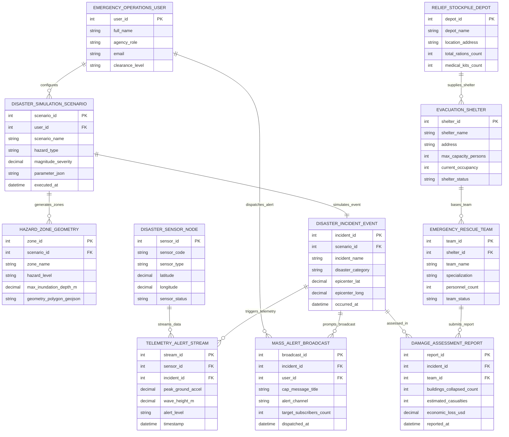

# Conceptual ERD — Disaster Preparedness & Simulation System

## Mermaid Code

## Entity Description Table | Bảng mô tả Entity

| # | Entity Name | Vietnamese Name | Description | Key Attributes | Main Relationships |
|---|-------------|-----------------|-------------|----------------|-------------------|
| 1 | EMERGENCY_OPERATIONS_USER | Cán bộ Điều hành Ứng phó | Emergency operations center user profile (Commander, Analyst, First Responder). | user_id (PK), full_name, agency_role, clearance_level | Configures Scenarios, dispatches Mass Alerts |
| 2 | DISASTER_SIMULATION_SCENARIO | Kịch bản Mô phỏng Thiên tai | Multi-hazard physics simulation scenario storing magnitude, epicenter, and parameters. | scenario_id (PK), user_id (FK), scenario_name, hazard_type, magnitude_severity | Configured by User, generates Hazard Zones, simulates Incident |
| 3 | HAZARD_ZONE_GEOMETRY | Vùng Nguy hiểm GeoJSON | 3D spatial GIS polygon defining earthquake shaking, flood depth, or wildfire risk zones. | zone_id (PK), scenario_id (FK), zone_name, hazard_level, max_inundation_depth_m | Generated by Disaster Simulation Scenario |
| 4 | DISASTER_INCIDENT_EVENT | Sự cố Thiên tai | Real or simulated disaster event instance recording epicenter coordinates and timestamp. | incident_id (PK), scenario_id (FK), incident_name, disaster_category, epicenter_lat | Simulated by Scenario, triggers Telemetry, prompts Broadcasts |
| 5 | DISASTER_SENSOR_NODE | Trạm Cảm biến Thiên tai | Field sensor node (seismometer, DART buoy, weather radar, river level gauge). | sensor_id (PK), sensor_code, sensor_type, latitude, longitude, sensor_status | Streams Telemetry Alert Streams |
| 6 | TELEMETRY_ALERT_STREAM | Luồng Telemetry Báo động | Real-time telemetry stream data capturing PGA acceleration, wave heights, and alert levels. | stream_id (PK), sensor_id (FK), incident_id (FK), peak_ground_accel, wave_height_m | Streamed from Sensor Node, triggered by Incident Event |
| 7 | MASS_ALERT_BROADCAST | Báo động Cấp cấp Đại chúng | Emergency Alert System (EAS/WEA) broadcast payload dispatched to cell towers and media. | broadcast_id (PK), incident_id (FK), user_id (FK), cap_message_title, alert_channel | Dispatched by User, prompted by Incident Event |
| 8 | EVACUATION_SHELTER | Trú ẩn Sơ tán Emergency | Designated public evacuation shelter tracking capacity, occupancy, and status. | shelter_id (PK), shelter_name, address, max_capacity_persons, current_occupancy | Bases Rescue Teams, supplied by Relief Stockpile Depot |
| 9 | RELIEF_STOCKPILE_DEPOT | Kho Vật tư Cứu trợ | Emergency disaster relief warehouse storing food rations, medical kits, and tents. | depot_id (PK), depot_name, location_address, total_rations_count, medical_kits_count | Supplies Evacuation Shelters |
| 10 | EMERGENCY_RESCUE_TEAM | Đội Cứu hộ Cứu nạn | Search-and-rescue team roster tracking specialization, personnel, and base location. | team_id (PK), shelter_id (FK), team_name, specialization, personnel_count | Based at Evacuation Shelter, submits Damage Reports |
| 11 | DAMAGE_ASSESSMENT_REPORT | Báo cáo Thiệt hại Thiên tai | Post-disaster structural damage report capturing collapsed buildings and casualty estimates. | report_id (PK), incident_id (FK), team_id (FK), buildings_collapsed_count, estimated_casualties | Assesses Incident Event, submitted by Rescue Team |

## Relationship Description | Mô tả Quan hệ

| # | From Entity | Cardinality | To Entity | Relationship Label | Business Explanation |
|---|-------------|-------------|-----------|-------------------|----------------------|
| 1 | EMERGENCY_OPERATIONS_USER | one-to-many | DISASTER_SIMULATION_SCENARIO | configures | An Emergency Operations User configures multiple Disaster Simulation Scenarios. |
| 2 | EMERGENCY_OPERATIONS_USER | one-to-many | MASS_ALERT_BROADCAST | dispatches_alert | An Emergency Operations User dispatches multiple Mass Alert Broadcasts. |
| 3 | DISASTER_SIMULATION_SCENARIO | one-to-many | HAZARD_ZONE_GEOMETRY | generates_zones | A Disaster Simulation Scenario generates multiple Hazard Zone Geometries. |
| 4 | DISASTER_SIMULATION_SCENARIO | one-to-one | DISASTER_INCIDENT_EVENT | simulates_event | A Disaster Simulation Scenario simulates one Disaster Incident Event. |
| 5 | DISASTER_SENSOR_NODE | one-to-many | TELEMETRY_ALERT_STREAM | streams_data | A Disaster Sensor Node streams continuous Telemetry Alert Streams. |
| 6 | DISASTER_INCIDENT_EVENT | one-to-many | TELEMETRY_ALERT_STREAM | triggers_telemetry | A Disaster Incident Event triggers Telemetry Alert Streams. |
| 7 | DISASTER_INCIDENT_EVENT | one-to-many | MASS_ALERT_BROADCAST | prompts_broadcast | A Disaster Incident Event prompts Mass Alert Broadcasts. |
| 8 | EVACUATION_SHELTER | one-to-many | EMERGENCY_RESCUE_TEAM | bases_team | An Evacuation Shelter bases multiple Emergency Rescue Teams. |
| 9 | DISASTER_INCIDENT_EVENT | one-to-many | DAMAGE_ASSESSMENT_REPORT | assessed_in | A Disaster Incident Event is assessed in Damage Assessment Reports. |
| 10 | EMERGENCY_RESCUE_TEAM | one-to-many | DAMAGE_ASSESSMENT_REPORT | submits_report | An Emergency Rescue Team submits Damage Assessment Reports. |
| 11 | RELIEF_STOCKPILE_DEPOT | one-to-many | EVACUATION_SHELTER | supplies_shelter | A Relief Stockpile Depot supplies multiple Evacuation Shelters. |
