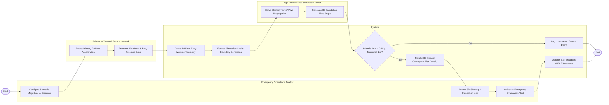

# Swimlane Diagram — Disaster Preparedness & Simulation System

## Mermaid Code

## Flow Description | Mô tả luồng

| Lane | Actor | Role in Flow |
|------|-------|-------------|
| 1 | Emergency Operations Analyst | Configures disaster scenario magnitude and epicenter coordinates, reviews 3D ground shaking and inundation map overlays, and authorizes emergency mass evacuation alerts. |
| 2 | System | Detects P-wave early warning telemetry, formats simulation grid boundary conditions, checks hazard threshold limits, renders 3D hazard overlays, and dispatches wireless emergency alerts. |
| 3 | Seismic & Tsunami Sensor Network | Seismometers detect primary P-wave ground acceleration and deep-ocean DART buoys measure ocean water pressure changes, streaming real-time telemetry. |
| 4 | High-Performance Simulation Solver | Solves 3D elastodynamic wave equations and shallow water hydrodynamic equations, generating time-series 3D hazard impact grids. |
