# Action Tree — Disaster Preparedness & Simulation System

## Mermaid Code

```mermaid
graph TD
    Root["Disaster Preparedness & Simulation System"]

    Root --> M1["Physics Simulation & Hazard Modeling"]
    Root --> M2["Early Warning & Telemetry Sensor Control"]
    Root --> M3["Emergency Mass Notification & Evacuation"]
    Root --> M4["Relief Supply & Rescue Resource Coordination"]
    Root --> M5["Damage Assessment & Casualty Analytics"]
    Root --> M6["Training Drill & Readiness Management"]

    M1 --> A11["Configure Multi-Hazard Simulation Scenarios"]
    M1 --> A12["Execute HPC 3D Seismic Elastodynamic Solvers"]
    M1 --> A13["Execute 2D/3D Hydrodynamic Tsunami Solvers"]
    M1 --> A14["Model Wildfire & Toxic Plume CFD Dispersion"]

    M2 --> A21["Ingest 100 Hz Seismic P-Wave Acceleration Data"]
    M2 --> A22["Monitor Ocean DART Tsunameter Buoy Pressure"]
    M2 --> A23["Query Doppler Weather Radar Typhoon Tracks"]
    M2 --> A24["Configure Automated Early Warning Thresholds"]

    M3 --> A31["Dispatch Wireless Emergency Alert WEA Broadcasts"]
    M3 --> A32["Override TV/Radio Emergency Alert System EAS"]
    M3 --> A33["Calculate Hazard-Free Evacuation Routing Paths"]
    M3 --> A34["Trigger Physical Outdoor Evacuation Sirens"]

    M4 --> A41["Dispatch Search-and-Rescue Teams via GPS"]
    M4 --> A42["Allocate Emergency Relief Stockpile Supplies"]
    M4 --> A43["Manage Evacuation Shelter Capacity & Medical"]
    M4 --> A44["Ingest Citizen SOS Distress Calls & Reports"]

    M5 --> A51["Assess Building Collapse & Tiltmeter Sensor Damage"]
    M5 --> A52["Calculate Estimated Human Casualty Rates"]
    M5 --> A53["Estimate Direct Infrastructure Economic Losses"]
    M5 --> A54["Export Post-Disaster Operational Dashboards"]

    M6 --> A61["Execute Simulated Disaster Training Drills"]
    M6 --> A62["Evaluate Incident Commander Response Times"]
    M6 --> A63["Run Historical Disaster Re-creation Scenarios"]
    M6 --> A64["Generate Municipal Readiness Audit Scorecards"]
```

## Module Description | Mô tả Module

| # | Module | Description | Actions |
|---|--------|-------------|---------|
| 1 | Physics Simulation & Hazard Modeling | Configures multi-hazard scenarios, executes HPC 3D seismic elastodynamic solvers, hydrodynamic tsunami models, and wildfire CFD. | Configure Multi-Hazard Simulation Scenarios, Execute HPC 3D Seismic Elastodynamic Solvers, Execute 2D/3D Hydrodynamic Tsunami Solvers, Model Wildfire & Toxic Plume CFD Dispersion |
| 2 | Early Warning & Telemetry Sensor Control | Ingests 100 Hz P-wave seismic waveforms, monitors ocean DART tsunami buoys, queries weather radar, and configures trigger thresholds. | Ingest 100 Hz Seismic P-Wave Acceleration Data, Monitor Ocean DART Tsunameter Buoy Pressure, Query Doppler Weather Radar Typhoon Tracks, Configure Automated Early Warning Thresholds |
| 3 | Emergency Mass Notification & Evacuation | Dispatches cell broadcast WEA alerts, overrides TV/radio EAS, calculates evacuation routes, and triggers outdoor sirens. | Dispatch Wireless Emergency Alert WEA Broadcasts, Override TV/Radio Emergency Alert System EAS, Calculate Hazard-Free Evacuation Routing Paths, Trigger Physical Outdoor Evacuation Sirens |
| 4 | Relief Supply & Rescue Resource Coordination | Dispatches search-and-rescue teams via GPS, allocates warehouse relief supplies, manages shelter capacity, and ingests citizen SOS alerts. | Dispatch Search-and-Rescue Teams via GPS, Allocate Emergency Relief Stockpile Supplies, Manage Evacuation Shelter Capacity & Medical, Ingest Citizen SOS Distress Calls & Reports |
| 5 | Damage Assessment & Casualty Analytics | Evaluates structural building collapse risks, estimates human casualties, calculates economic losses, and exports operational dashboards. | Assess Building Collapse & Tiltmeter Sensor Damage, Calculate Estimated Human Casualty Rates, Estimate Direct Infrastructure Economic Losses, Export Post-Disaster Operational Dashboards |
| 6 | Training Drill & Readiness Management | Conducts simulated training drills, evaluates response decision speeds, re-creates historical disasters, and scores readiness. | Execute Simulated Disaster Training Drills, Evaluate Incident Commander Response Times, Run Historical Disaster Re-creation Scenarios, Generate Municipal Readiness Audit Scorecards |
