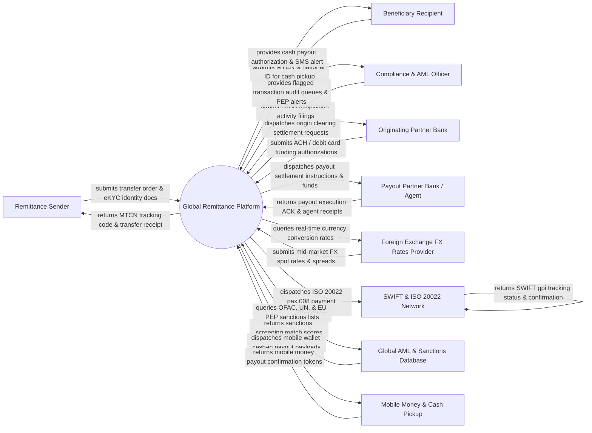

# Context Diagram — Global Remittance Platform

## Mermaid Code

## Actor & Interaction Table | Bảng Actor & Tương tác

| # | Actor | Actor Type | Data Sent TO System | Data Received FROM System | Notes |
|---|-------|------------|---------------------|---------------------------|-------|
| 1 | Remittance Sender | Primary | Sender eKYC identity documents (Passport/ID), funding source details, beneficiary payout info, transfer amount | Money Transfer Control Number (MTCN) tracking code, locked FX exchange rate quote, transfer status, receipt | Individual migrant worker or business customer initiating a cross-border money transfer. |
| 2 | Beneficiary Recipient | Primary | MTCN tracking number, government photo ID (for cash pickup), bank account/mobile wallet number | Cash payout authorization, instant bank deposit confirmation, SMS notification alert | Individual or business receiving the transferred funds in the destination country. |
| 3 | Compliance & AML Officer | Primary | Suspicious Activity Report (SAR) filings, manual AML audit review decisions, sanctioned entity overrides | Flagged transaction audit queues, Politically Exposed Persons (PEP) alerts, transaction risk scores | Compliance officer reviewing flagged transactions for Anti-Money Laundering (AML) compliance. |
| 4 | Originating Partner Bank | Supporting System | Automated Clearing House (ACH) debit authorizations, credit card payment approvals, local bank clearing ACK | Origin clearing settlement requests, transaction funding receipts | Bank or card issuer acquiring the sender's funds in the country of origin. |
| 5 | Payout Partner Bank / Agent | Supporting System | Payout execution confirmation, local currency agent liquidity balance updates, cash pickup receipts | Payout settlement instructions, beneficiary account details, cleared funds wire transfers | Partner bank, Western Union agent, or local pay-out partner in the destination country. |
| 6 | Foreign Exchange FX Rates Provider | Supporting System | Mid-market FX spot rates, forward rates, currency volatility margins, liquidity provider quotes | FX rate query requests, currency conversion lock triggers | Financial FX data providers (Refinitiv, Bloomberg, OANDA) supplying real-time exchange rates. |
| 7 | SWIFT & ISO 20022 Network | Supporting System | SWIFT gpi tracking updates, correspondent bank clearing confirmations, ISO 20022 response XMLs | ISO 20022 payment execution messages (pact.008, camt.053), SWIFT UETR tracking IDs | International interbank messaging network transmitting cross-border wire transfers. |
| 8 | Global AML & Sanctions Database | Supporting System | OFAC SDN sanctions list updates, UN/EU sanctions lists, PEP databases, adverse media screening matches | Real-time sender/beneficiary name screening queries, fuzzy matching threshold requests | Global compliance watchlists (World-Check, Dow Jones Risk) used for automated AML screening. |
| 9 | Mobile Money & Cash Pickup Network | Supporting System | Mobile wallet (M-Pesa, GCash) payout confirmations, agent cash desk availability status | Mobile wallet direct deposit payloads, cash pickup authorization tokens | Mobile money operators and retail cash pick-up networks in developing countries. |

## System Boundary Description | Mô tả Phạm vi Hệ thống

The **Global Remittance Platform (GRP)** is an international cross-border payment processing, foreign exchange (FX), and compliance engine. Inside the system boundary, GRP manages sender eKYC identity verification, real-time FX rate locking, fee tier calculation, automated AML/PEP sanctions screening, MTCN tracking code generation, ISO 20022 payment message routing, correspondent bank settlement, and multi-channel beneficiary payout (Bank Deposit, Mobile Wallet, Retail Cash Pickup). External to the system boundary are originating banks (Originating Partner Bank), destination payout agents (Payout Partner Bank / Agent), foreign exchange brokers (FX Rates Provider), interbank messaging networks (SWIFT Network), compliance watchlists (Global Sanctions Database), and mobile money networks (Mobile Money Network).
