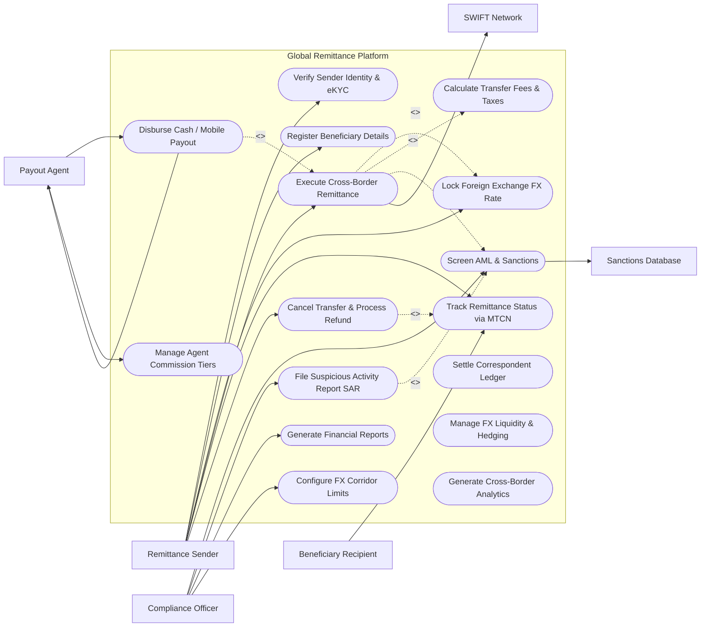

# Use Case Diagram — Global Remittance Platform

## Mermaid Code

## Actor Table | Bảng Actor

| # | Actor | Actor Type | Role Description | Related Use Cases |
|---|-------|------------|------------------|-------------------|
| 1 | Remittance Sender | Primary | Migrant worker or individual initiating a cross-border money transfer, verifying identity, and locking FX rates. | UC01, UC02, UC03, UC05, UC06, UC07 |
| 2 | Beneficiary Recipient | Primary | Individual in destination country receiving money via bank deposit, mobile wallet, or cash pickup. | UC06 |
| 3 | Compliance Officer | Primary | Anti-Money Laundering officer reviewing flagged transactions, filing SAR reports, and configuring FX corridor limits. | UC08, UC09, UC13, UC16 |
| 4 | Payout Agent | Primary | Destination payout agent or partner bank processing cash pickups or local bank disbursements. | UC11, UC14 |
| 5 | SWIFT Network | System | International interbank clearing network routing ISO 20022 payment messages and SWIFT gpi tracking. | UC05 |
| 6 | Sanctions Database | System | Global compliance watchlist screening sender/recipient names against OFAC, UN, and EU sanctions lists. | UC08 |

## Use Case Table | Bảng Use Case

| # | UC ID | Use Case Name | Primary Actor | Secondary Actor | Description | Priority |
|---|-------|---------------|---------------|-----------------|-------------|----------|
| 1 | UC01 | Verify Sender Identity & eKYC | Remittance Sender | None | Performs automated eKYC verification scanning passport/ID, liveness check, and proof of address. | High |
| 2 | UC02 | Register Beneficiary Details | Remittance Sender | None | Registers beneficiary name, destination country, payout channel (Bank, Mobile Wallet, Cash), and account number. | High |
| 3 | UC03 | Lock Foreign Exchange FX Rate | Remittance Sender | None | Locks mid-market FX exchange rate and guaranteed payout amount for a 15-minute transaction window. | High |
| 4 | UC04 | Calculate Transfer Fees & Taxes | Remittance Sender | None | Calculates origin processing fee, FX spread markup, and destination regulatory withholding taxes. | High |
| 5 | UC05 | Execute Cross-Border Remittance | Remittance Sender | SWIFT Network | Debits sender account, processes transfer order, generates unique MTCN tracking code, and dispatches wire message. | High |
| 6 | UC06 | Track Remittance Status via MTCN | Remittance Sender | Beneficiary Recipient | Provides real-time transfer tracking status (Funded, Screened, Settled, Ready for Pickup, Paid Out) using MTCN code. | High |
| 7 | UC07 | Cancel Transfer & Process Refund | Remittance Sender | None | Cancels an uncollected remittance transfer and refunds principal amount back to sender's funding account. | Medium |
| 8 | UC08 | Screen AML & Sanctions | Compliance Officer | Sanctions Database | Automatically screens sender/beneficiary names against OFAC/UN sanctions and flags suspicious transactions. | High |
| 9 | UC09 | File Suspicious Activity Report SAR | Compliance Officer | None | Generates and submits formal Suspicious Activity Report (SAR / STR) filings to national financial intelligence units (FinCEN). | High |
| 10 | UC10 | Settle Correspondent Ledger | Compliance Officer | None | Reconciles daily multi-currency Nostro/Vostro correspondent bank accounts and executes batch clearing settlements. | High |
| 11 | UC11 | Disburse Cash / Mobile Payout | Payout Agent | Payout Agent | Verifies recipient ID & MTCN code at agent location, releasing cash payout or triggering instant mobile wallet deposit. | High |
| 12 | UC12 | Manage FX Liquidity & Hedging | Compliance Officer | None | Monitors platform multi-currency liquidity reserves and executes FX forward hedging contracts to manage exchange risk. | Medium |
| 13 | UC13 | Generate Financial Reports | Compliance Officer | None | Exports daily remittance volume reports, net FX revenue margins, tax withholding ledgers, and audit files. | Medium |
| 14 | UC14 | Manage Agent Commission Tiers | Payout Agent | None | Calculates payout agent commission payouts based on transaction volume tiers and cash pickup counts. | Medium |
| 15 | UC15 | Generate Cross-Border Analytics | Compliance Officer | None | Exports corridor volume heatmaps, average transfer amounts, customer retention rates, and payout speed SLA graphs. | Medium |
| 16 | UC16 | Configure FX Corridor Limits | Compliance Officer | None | Sets maximum daily/monthly transaction limits per corridor (e.g. USD to VND max $10,000/day) per regulatory rules. | Low |

## Use Case Specification | Đặc tả Use Case

---

### UC01 — Verify Sender Identity & eKYC

| Field | Detail |
|-------|--------|
| **UC ID** | UC01 |
| **Use Case Name** | Verify Sender Identity & eKYC |
| **Actor(s)** | Primary: Remittance Sender / Secondary: None |
| **Description** | Conducts automated electronic Know Your Customer (eKYC) identity verification, scanning sender government photo ID, performing facial liveness verification, and validating proof of address. |
| **Precondition** | 1. Remittance Sender has registered an account on the mobile app or web portal.   2. Automated eKYC verification engine integration is active. |
| **Main Flow** | 1. Actor selects "Complete Identity Verification".   2. System prompts selection of Issuing Country and ID Type (Passport, National ID, Driver's License).   3. Actor captures photo of front and back of photo ID using smartphone camera.   4. System performs Optical Character Recognition (OCR) extracting Full Name, Date of Birth, ID Number, Expiry Date, and MRZ code.   5. Actor performs 3D facial liveness video scan (head turn/blink verification).   6. System matches 3D biometric face mesh against photo on ID document (Biometric Match Score >95%).   7. Actor uploads proof of address document (Utility bill or bank statement <3 months old).   8. System validates address, queries national identity database, and assigns KYC Risk Tier (Tier 1: Up to $1,000/mo, Tier 2: Up to $10,000/mo).   9. System updates Customer_KYC_Log record, setting status to "Verified - Tier 2 Active". |
| **Alternative Flow** | **AF1** — In-Person Agent Verification: Sender presents physical passport and utility bill at retail remittance agent counter; Agent verifies documents and uploads scans.   **AF2** — Corporate Sender Verification: Enterprise customer submits company incorporation certificate, UBO (Ultimate Beneficial Owner) disclosures, and Director IDs. |
| **Exception Flow** | **EX1** — ID Expired / Unsupported Document: If uploaded ID is expired, System halts onboarding with error "ID Expired. Please upload a valid unexpired ID."   **EX2** — Facial Liveness Match Failure: Biometric match score <80%; System prompts user to retake photo in bright lighting or routes file to manual compliance review (UC08). |
| **Postcondition** | Sender identity is verified, assigned a KYC Risk Tier, and enabled for cross-border remittance transactions (UC05). |
| **Business Rule** | **BR1**: All remittance senders must complete Tier 1 eKYC verification before initiating any cross-border funds transfer. |

---

### UC03 — Lock Foreign Exchange FX Rate

| Field | Detail |
|-------|--------|
| **UC ID** | UC03 |
| **Use Case Name** | Lock Foreign Exchange FX Rate |
| **Actor(s)** | Primary: Remittance Sender / Secondary: None |
| **Description** | Locks a guaranteed mid-market foreign exchange (FX) conversion rate, fee calculation, and exact destination payout amount for a 15-minute transaction execution window. |
| **Precondition** | 1. Sender is eKYC verified (UC01).   2. Real-time FX market rates provider is streaming spot rates. |
| **Main Flow** | 1. Actor selects Send Country (e.g. United States - USD) and Receive Country (e.g. Vietnam - VND).   2. Actor enters Send Amount (e.g. $500.00 USD) OR target Receive Amount (e.g. 12,500,000 VND).   3. System fetches real-time mid-market FX spot rate (1 USD = 25,450 VND) and applies corridor FX spread markup (0.5%).   4. System calculates Guaranteed Locked FX Rate: `1 USD = 25,322.75 VND`.   5. System computes UC04 (Calculate Transfer Fees & Taxes): Transfer Fee = $2.99 USD, Total Sender Cost = $502.99 USD, Guaranteed Payout = 12,661,375 VND.   6. System presents 15-minute FX Rate Guarantee Countdown Timer on screen.   7. Actor clicks "Confirm & Lock Rate"; System holds FX liquidity reservation in FX_Exchange_Rate database and generates temporary Rate Lock Token.   8. System proceeds to payment step (UC05). |
| **Alternative Flow** | **AF1** — Zero-Fee Loyalty Promotion: System checks sender promo code `FREEJAN`; waives transfer fee, setting total sender cost to $500.00 USD.   **AF2** — Floating Market Rate Mode: For large commercial transfers (> $50,000), rate is locked at exact instant of bank settlement execution. |
| **Exception Flow** | **EX1** — 15-Minute Timer Expiry: If sender fails to complete payment within 15 minutes, Rate Lock Token expires; System refreshes screen with updated FX rate.   **EX2** — High Market Volatility Lock Freeze: Extreme FX market volatility (>2% swing in 5 mins); System temporarily pauses rate locking and displays "Market Volatility Alert". |
| **Postcondition** | Guaranteed FX exchange rate and payout amount are locked for 15 minutes, reserving liquidity for transfer execution. |
| **Business Rule** | **BR1**: Once confirmed by the sender, locked FX exchange rates must be guaranteed for the 15-minute window regardless of market rate fluctuations. |

---

### UC05 — Execute Cross-Border Remittance Transfer

| Field | Detail |
|-------|--------|
| **UC ID** | UC05 |
| **Use Case Name** | Execute Cross-Border Remittance Transfer |
| **Actor(s)** | Primary: Remittance Sender / Secondary: SWIFT Network |
| **Description** | Debits the sender's payment method, executes automated AML screening (UC08), generates a unique 10-digit MTCN code, and routes payment instructions to payout partners or SWIFT. |
| **Precondition** | 1. Sender has locked FX rate (UC03) and selected beneficiary payout channel (UC02).   2. Sender payment method (Debit Card, ACH, Bank Transfer) is authorized. |
| **Main Flow** | 1. Actor selects Payment Method (Debit Card, ACH Bank Transfer, Online Banking) and submits payment authorization.   2. System dispatches payment acquisition charge request to Originating Partner Bank; receives immediate payment authorization receipt.   3. System automatically executes UC08 (Screen AML & Sanctions), passing sender and beneficiary names through real-time sanctions watchlists.   4. Upon passing AML screening, System generates unique 10-digit Money Transfer Control Number (MTCN: e.g. `892-410-9921`).   5. System formats payment routing instructions based on payout channel:   &nbsp;&nbsp;&nbsp;&nbsp;a. If Bank Deposit: Formats ISO 20022 `pax.008` XML message and dispatches via SWIFT gpi / partner API.   &nbsp;&nbsp;&nbsp;&nbsp;b. If Mobile Wallet / Cash Pickup: Dispatches direct API payload to destination Payout Partner Network (UC11).   6. System logs Remittance_Transaction record, setting status to "Processing - Dispatched to Payout Partner".   7. System updates sender dashboard displaying MTCN tracking number and sends confirmation email and SMS alert. |
| **Alternative Flow** | **AF1** — Instant Debit Card Funding: Sender pays via Visa Direct debit card; funds clear in 3 seconds, enabling instant beneficiary payout.   **AF2** — ACH Bank Settlement Delay: Sender pays via ACH transfer; System holds payout until ACH funds clear (1-2 business days), notifying sender of pending status. |
| **Exception Flow** | **EX1** — Payment Funding Declined: Originating bank declines card charge ("Insufficient Funds"); System alerts sender "Payment Declined by Bank. Use another card."   **EX2** — AML Sanctions Match Hold: System detects fuzzy match on OFAC sanctions list; System freezes transfer, sets status to "On Hold - Compliance Review", and alerts officer (UC08). |
| **Postcondition** | Transaction is funded, screened for AML, assigned an MTCN code, and dispatched to destination payout partners for beneficiary collection. |
| **Business Rule** | **BR1**: Every remittance transaction must be assigned a unique, tamper-evident 10-digit MTCN tracking code upon payment authorization. |

---

### UC08 — Screen Transaction for AML & Sanctions

| Field | Detail |
|-------|--------|
| **UC ID** | UC08 |
| **Use Case Name** | Screen Transaction for AML & Sanctions |
| **Actor(s)** | Primary: Compliance Officer / Secondary: Sanctions Database |
| **Description** | Automatically screens sender/beneficiary names, addresses, and transaction velocity against global OFAC, UN, EU sanctions watchlists and Politically Exposed Persons (PEP) lists. |
| **Precondition** | 1. Remittance transfer order is submitted (UC05).   2. Global Sanctions Databases (World-Check, OFAC SDN list) are synchronized and updated. |
| **Main Flow** | 1. System receives remittance screening request payload containing Sender Name, DOB, Address, Beneficiary Name, Country, and Amount.   2. System executes fuzzy string matching algorithms (Jaro-Winkler, Levenshtein distance) comparing names against OFAC SDN, UN, EU, UK HMT sanctions lists and PEP databases.   3. System checks transaction structuring rules: scans for split transactions (e.g. multiple $9,900 transfers sent within 48 hours to evade $10k reporting limits).   4. If match score is below threshold (<70% similarity) and no velocity anomalies detected: System returns "AML Clear - Pass".   5. Transaction proceeds automatically to payout execution (UC05/UC11).   6. System logs AML_Sanction_Screening_Log record with timestamp and match scores. |
| **Alternative Flow** | **AF1** — High Fuzzy Match Flagged (>75% Similarity): System detects 82% name match to a sanctioned individual; System automatically holds transaction, sets status to "Flagged - AML Review", and routes file to Compliance Officer audit queue.   **AF2** — Manual Officer Clearance: Compliance Officer inspects flagged file, verifies passport DOB differs from sanctioned individual, marks "False Positive - Clear", and releases transaction for payout. |
| **Exception Flow** | **EX1** — Confirmed Sanctions Match: Compliance Officer verifies exact match to an OFAC Specially Designated National; Officer freezes funds, marks "Confirmed Match - Blocked", and triggers UC09 (File Suspicious Activity Report SAR).   **EX2** — Sanctions Database API Timeout: If external screening engine is offline, System holds all high-risk international transfers until screening resumes. |
| **Postcondition** | Transaction is screened; clear transactions proceed to payout while flagged transactions are frozen for compliance officer manual audit. |
| **Business Rule** | **BR1**: Any transaction matching a high-confidence OFAC or UN sanctions list entry must be frozen immediately without notifying the sender or recipient. |

---

### UC11 — Disburse Beneficiary Cash / Mobile Payout

| Field | Detail |
|-------|--------|
| **UC ID** | UC11 |
| **Use Case Name** | Disburse Beneficiary Cash / Mobile Payout |
| **Actor(s)** | Primary: Payout Agent / Secondary: Payout Agent |
| **Description** | Verifies beneficiary photo ID and MTCN code at a retail agent counter (or executes automated mobile wallet deposit), disbursing local currency funds to the recipient. |
| **Precondition** | 1. Remittance transfer status is "Ready for Payout" and cleared by AML screening (UC08).   2. Recipient arrives at retail agent location (or holds active mobile wallet account). |
| **Main Flow** | 1. Recipient presents 10-digit MTCN code (`892-410-9921`) and physical government photo ID to Payout Agent at retail desk.   2. Agent enters MTCN code into Payout Agent Portal.   3. System queries transaction ledger, retrieving locked payout details: Beneficiary Name, Expected Payout Amount (12,661,375 VND), and Sender Name.   4. Agent inspects recipient photo ID, verifies name matches transaction details, enters ID Type and ID Expiry Date into system.   5. Agent clicks "Authorize Cash Payout".   6. System verifies agent daily cash float balance, marks transaction status as "PAID OUT - COMPLETED", and generates Payout Receipt.   7. Agent hands cash payout (12,661,375 VND) and printed receipt to recipient; recipient signs electronic signature pad.   8. System dispatches instant SMS payout notification to Sender ("Your transfer of $500 USD has been picked up by Beneficiary").   9. System credits Payout Agent commission fee ledger (UC14). |
| **Alternative Flow** | **AF1** — Direct Mobile Wallet Deposit (Instant): Payout channel is Mobile Money (e.g. M-Pesa); System automatically dispatches API payload, depositing 12,661,375 VND into recipient mobile wallet within 5 seconds without requiring agent interaction.   **AF2** — Instant Bank Account Credit: Payout channel is Direct Bank Deposit; System routes local ACH payment to recipient's bank account. |
| **Exception Flow** | **EX1** — Name Mismatch on ID: Recipient photo ID name differs from MTCN record (e.g. "John Smith" vs "Jonathon Smith"); Agent halts payout and prompts sender to update beneficiary name in app.   **EX2** — Already Paid Out / Invalid MTCN: If MTCN was already collected or entered incorrectly, System blocks payout displaying "Invalid or Previously Paid MTCN". |
| **Postcondition** | Local currency funds are disbursed to beneficiary via cash, mobile wallet, or bank deposit, completing the cross-border remittance cycle. |
| **Business Rule** | **BR1**: Retail cash payouts must require mandatory verification of the recipient's unexpired government photo ID and 10-digit MTCN code. |
