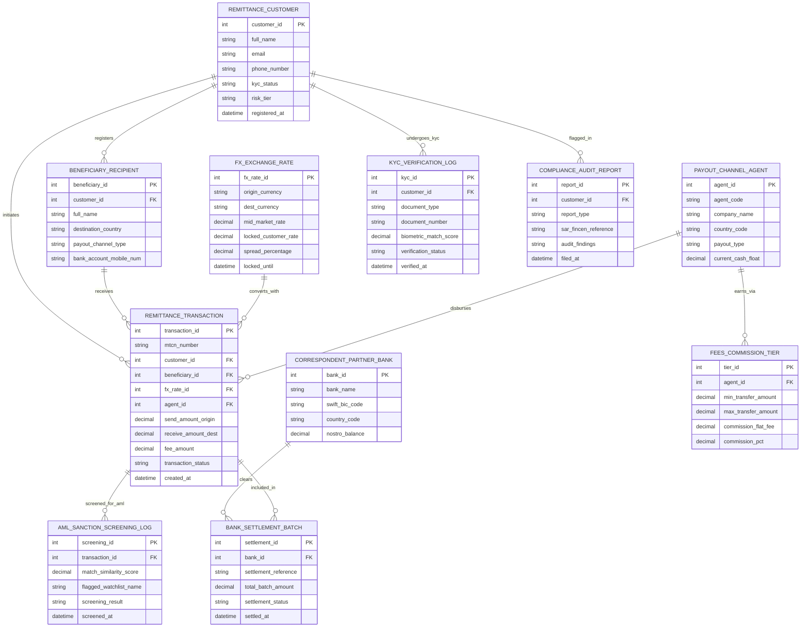

# Conceptual ERD — Global Remittance Platform

## Mermaid Code

## Entity Description Table | Bảng mô tả Entity

| # | Entity Name | Vietnamese Name | Description | Key Attributes | Main Relationships |
|---|-------------|-----------------|-------------|----------------|-------------------|
| 1 | REMITTANCE_CUSTOMER | Khách hàng Chuyển tiền | Remittance sender profile storing personal details, contact info, KYC status, and risk tier. | customer_id (PK), full_name, email, kyc_status, risk_tier | Registers Beneficiaries, initiates Transactions, undergoes KYC |
| 2 | BENEFICIARY_RECIPIENT | Người Nhận Tiền | Destination beneficiary details storing payout channel (Bank, Mobile Wallet, Cash) and account numbers. | beneficiary_id (PK), customer_id (FK), full_name, destination_country, payout_channel_type | Registered by Customer, receives Transactions |
| 3 | REMITTANCE_TRANSACTION | Giao dịch Chuyển tiền | Cross-border transfer order tracking MTCN code, origin send amount, destination payout amount, and status. | transaction_id (PK), mtcn_number, customer_id (FK), beneficiary_id (FK), transaction_status | Initiated by Customer, received by Beneficiary, converted by FX, disbursed by Agent |
| 4 | FX_EXCHANGE_RATE | Tỷ giá Hối đoái FX | Foreign exchange conversion rate record locking spot rate, customer rate, spread %, and expiration timestamp. | fx_rate_id (PK), origin_currency, dest_currency, mid_market_rate, locked_customer_rate, locked_until | Converts Remittance Transactions |
| 5 | PAYOUT_CHANNEL_AGENT | Đại lý Chi trả | Destination partner bank, retail cash agent, or mobile money operator disbursing local funds. | agent_id (PK), agent_code, company_name, country_code, payout_type, current_cash_float | Disburses Transactions, earns via Commission Tiers |
| 6 | KYC_VERIFICATION_LOG | Nhật ký Xác minh KYC | Electronic eKYC verification audit log capturing document scans, biometric scores, and status. | kyc_id (PK), customer_id (FK), document_type, document_number, biometric_match_score, verified_at | Undergone by Remittance Customer |
| 7 | AML_SANCTION_SCREENING_LOG | Nhật ký Soát xét AML | Anti-Money Laundering and sanctions screening log recording fuzzy match scores and watchlists. | screening_id (PK), transaction_id (FK), match_similarity_score, flagged_watchlist_name, screened_at | Screened for Remittance Transaction |
| 8 | CORRESPONDENT_PARTNER_BANK | Ngân hàng Đại lý | International correspondent bank managing Nostro/Vostro settlement accounts and SWIFT wires. | bank_id (PK), bank_name, swift_bic_code, country_code, nostro_balance | Clears Bank Settlement Batches |
| 9 | BANK_SETTLEMENT_BATCH | Lô Thanh toán Ngân hàng | Daily multi-currency settlement batch reconciling transactions with correspondent banks. | settlement_id (PK), bank_id (FK), settlement_reference, total_batch_amount, settlement_status | Cleared by Correspondent Bank, includes Transactions |
| 10 | FEES_COMMISSION_TIER | Biểu Phí & Hoa hồng | Fee matrix defining origin transfer fee tiers and destination payout agent commission rules. | tier_id (PK), agent_id (FK), min_transfer_amount, max_transfer_amount, commission_pct | Earned by Payout Channel Agent |
| 11 | COMPLIANCE_AUDIT_REPORT | Báo cáo Báo động SAR | Formal compliance audit report logging Suspicious Activity Reports (SAR) and regulatory filings. | report_id (PK), customer_id (FK), report_type, sar_fincen_reference, audit_findings | Flags Remittance Customer |

## Relationship Description | Mô tả Quan hệ

| # | From Entity | Cardinality | To Entity | Relationship Label | Business Explanation |
|---|-------------|-------------|-----------|-------------------|----------------------|
| 1 | REMITTANCE_CUSTOMER | one-to-many | BENEFICIARY_RECIPIENT | registers | A Remittance Customer registers multiple Beneficiary Recipients. |
| 2 | REMITTANCE_CUSTOMER | one-to-many | REMITTANCE_TRANSACTION | initiates | A Remittance Customer initiates multiple Remittance Transactions over time. |
| 3 | BENEFICIARY_RECIPIENT | one-to-many | REMITTANCE_TRANSACTION | receives | A Beneficiary Recipient receives multiple Remittance Transactions. |
| 4 | FX_EXCHANGE_RATE | one-to-many | REMITTANCE_TRANSACTION | converts_with | An FX Exchange Rate converts multiple Remittance Transactions. |
| 5 | PAYOUT_CHANNEL_AGENT | one-to-many | REMITTANCE_TRANSACTION | disburses | A Payout Channel Agent disburses multiple Remittance Transactions. |
| 6 | REMITTANCE_CUSTOMER | one-to-many | KYC_VERIFICATION_LOG | undergoes_kyc | A Remittance Customer undergoes KYC Verification Logs. |
| 7 | REMITTANCE_TRANSACTION | one-to-many | AML_SANCTION_SCREENING_LOG | screened_for_aml | A Remittance Transaction is screened for AML Sanction Screening Logs. |
| 8 | CORRESPONDENT_PARTNER_BANK | one-to-many | BANK_SETTLEMENT_BATCH | clears | A Correspondent Partner Bank clears Bank Settlement Batches. |
| 9 | REMITTANCE_TRANSACTION | many-to-many | BANK_SETTLEMENT_BATCH | included_in | Remittance Transactions are included in Bank Settlement Batches. |
| 10 | PAYOUT_CHANNEL_AGENT | one-to-many | FEES_COMMISSION_TIER | earns_via | A Payout Channel Agent earns commissions via Fees Commission Tiers. |
| 11 | REMITTANCE_CUSTOMER | one-to-many | COMPLIANCE_AUDIT_REPORT | flagged_in | A Remittance Customer may be flagged in Compliance Audit Reports. |
