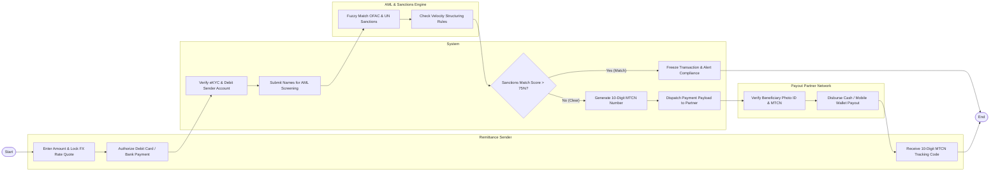

# Swimlane Diagram — Global Remittance Platform

## Mermaid Code

## Flow Description | Mô tả luồng

| Lane | Actor | Role in Flow |
|------|-------|-------------|
| 1 | Remittance Sender | Enters transfer amount, locks guaranteed FX rate quote, authorizes debit card/bank payment funding, and receives 10-digit MTCN tracking code. |
| 2 | System | Verifies eKYC identity status, debits sender's funding account, dispatches names for AML screening, handles compliance freezes, generates MTCN codes, and dispatches payment payloads. |
| 3 | AML & Sanctions Engine | Performs automated fuzzy matching against global OFAC, UN, and EU sanctions watchlists, and checks velocity transaction structuring rules. |
| 4 | Payout Partner Network | Verifies recipient photo ID and 10-digit MTCN code at retail counter (or executes automated mobile wallet deposit), disbursing local currency funds. |
